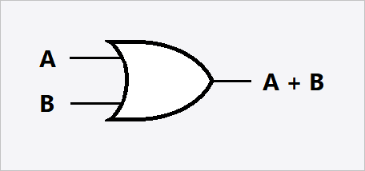
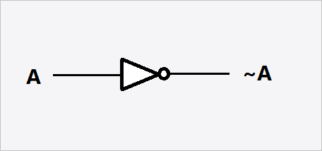

Algebra and discrete mathematics

## Addition

### Properties of Addition

| Property                    | Name             |
| --------------------------- | ---------------- |
| \\(x + 0 = x\\)                 | identity         |
| \\(x + y = y + x\\)             | commutativity    |
| \\((x + y) + z = x + (z + y)\\) | associativity    |
| \\(x + (-1) = x - 1\\)          | additive inverse |

## Subtraction

### Properties of Subtraction

| Property    | Name |
| ----------- | ---- |
| \\(x - 0 = x\\) |      |
| \\(x-x = 0\\)   |      |

## Multiplication

### Properties of Multiplication

| Property                      | Name                   |
| ----------------------------- | ---------------------- |
| \\(x * y = y * x\\)               | associativity          |
| \\(x * 0 = 0\\)                   | absorbing element      |
| \\(x * 1 = x\\)                   | identity element       |
| \\((x * y) * z = x * (y * z)\\)   | commutativity          |
| \\(x * (y * z) = x * y + x * z\\) | distributivity         |
| \\(\frac{1}{x}\\)                 | multiplicative inverse |

## Division


### Properties of Division

| Property                        | Name                                                                                                              |
| ------------------------------- | ----------------------------------------------------------------------------------------------------------------- |
|\\(6365 \equiv 5 (mod \space 20)\\) | congruency, expressing terms are categorically equivalent to one another (for example the category could be even) |

### Modulo

$$
\begin {aligned}
& n = m (mod\space k) \\
& the\space remainder \space of \space n / k \space is \space m \\
\end{aligned}
$$

### Notes

- The type of congruency to determine even or odd numbers is called parity.

## Divisibility

We say a number `k` **divides** a number `n` evenly, written `k|n` if:
$$
n \equiv 0(mod\space k)
$$
\\(2|16\\) as \\(16 \equiv 0 (mod \space 2)\\) 

- `k` is known as a `divisor` of `n`
- `n` is known as a `mulitple` of `k`

### Prime Numbers

Numbers are `prime` if the only `divisors` of `n` are 1 and `n`

> Any number `n` can be written as the product of prime numbers, known as the fundamental theorem of arithmetic.

> Euclid's Theory proves there are an infinite amount of prime numbers.

## Real Numbers

Real numbers are either rational, irrational, natural, or integers.

Sets of numbers can be closed under an operation, meaning when two numbers of the same set are operated on with said operator, they remain in that set.

### Natural Numbers

> 0,1,2,3,4...

- Natural numbers allow us to count
- We can perform 4 operations on them: `+,-,/,*`
- Natural numbers could divide another

**Natural numbers are closed under:**

- Addition
- Multiplication

**Natural numbers are not closed under:**

- Subtraction

### Integers

> Integers are all natural and negative numbers. 

**They are closed under:**

- Addition
- Subtraction

### Rational Numbers

> Rational numbers are of the form \\(\frac{x}{y}\\) where `x`and `y` are integers not equal to 0. 

**Rational numbers are closed under:**

- Division

The **greatest common divisor** of two integers `x` and `y` is denoted as `gcd(x, y)`. It is the largest number that divides both `x` and `y`. Pairs of numbers that have the same greatest common divisor are called `coprime`.

Rational numbers can be in reduced form, where both the denominator and numerator are `coprime` of the original number. \\(\frac{2}{3}\\) is the reduced form of \\(\frac{4}{6}\\). 

Expanding rational numbers results in an infinitely reoccurring decimal.

### Irrational Numbers

Numbers that can not be represented as a simple fraction. They are the last type of real numbers.

## Euclid's Algorithm

> Euclid's algorithm is an algorithm to find the reduced form of any rational number


Euclid's algorithm is based off the expression \\(x \equiv k \space mod(n)\\) which itself is based of  the expression \\(x = n(i) + k\\)

## Logic

> Logic is the art of thinking, or reasoning. It can provide mathematical rigor, or the soundness of an algorithm.

The basic principle of logic is as follows

```
if p, then q:
p;
therefore q;
```

Logic works with propositions, statements that can be `true` or `false` but not both. 

### Logical Gates

| Gate  | Symbol                        |
| ----- | ----------------------------- |
| `and` |  |
| `or`  |      |
| `not` |     |

### Logical Conjunctions

| Name        | Conjunction    | Meaning         |
| ----------- | -------------- | --------------- |
| Negation    | \\(\neg p\\)       | not `p`         |
| Conjunction | \\(q \land p\\)    | `q` and `p`     |
| Disjunction | \\(q \lor p\\)     | `q` or `p`      |
| Implication | \\(q \implies p\\) | if `p` then `q` |

When evaluating a logical formula we define tautologies, contradictions, and contingencies:

- A tautology is a formula which is true in every possible valuation. 
- A contradiction is a formula which is false in every possible valuation
- A contingency is a formula which is neither a tautology or contradiction

### Truth Tables

> Truth tables show all possible values of logical equations

A truth table for any proposition `p` is as follows.

| \\(p\\) | \\(\neg \space p\\) |
| --- | --------------- |
| T   | F               |
| F   | T               |

A truth table for propositions `q` and `p` is as follows. 

| \\(p\\) | \\(q\\) | \\(p \land q\\) |
| --- | --- | ----------- |
| T   | T   | T           |
| T   | F   | F           |
| F   | T   | F           |
| F   | F   | F           |

A truth table for propositions `q` implies `p` is as follows. 

| \\(p\\) | \\(q\\) | \\(p \implies q\\) |
| --- | --- | -------------- |
| T   | T   | T              |
| T   | F   | F              |
| F   | T   | T              |
| F   | F   | T              |

The implication operation can be represented by the function:

```C
bool implication(bool p, bool q) {
    if(p) {
        return q;
    }
    else {
        return true;
        }
}
```

- For `n` propositions  there are \\(2^n\\) rows.

### Equivelance

Equivalence is the symbol \\(P \leftrightarrow q$ and implies that `p` and `q` implie one another. This is the same as \\((p \implies q) \land (q \implies p)\\). i.e. both `p` a nd `q` are the same logical value as one another.

The following is an example truth table of \\((p \implies q) \leftrightarrow (\neg p \lor q)\\)         

| \\(p\\) | \\(q\\) | \\(\neg p\\) | \\(\neg p \lor q\\) | \\(p \implies q\\) | \\((p \implies q) \leftrightarrow (\neg p \lor q)\\) |
| --- | --- | -------- | --------------- | -------------- | ------------------------------------------------ |
| T   | T   | F        | T               | T              | T                                                |
| T   | F   | F        | F               | F              | T                                                |
| F   | T   | T        | T               | T              | T                                                |
| F   | F   | T        | T               | T              | T                                                |

- A logically equivelant formula is always a tautology 
- \\(p \leftrightarrow q \implies p \equiv q\\)

### Laws of logic

| Logical Formula                                          | Law             |
| -------------------------------------------------------- | --------------- |
| \\(p \implies q \equiv \neg p \lor q\\)                      | Implication     |
| \\(p \land p \equiv p\\)                                     | Idempotent      |
| \\(p \land q \equiv q \land p\\)                             | Commutative     |
| \\((p \land q) \land r \equiv p \land (q \land r)\\)         | Associative     |
| \\(p \land (p \lor q) \equiv p\\)                            | Absorption      |
| \\(p \land (q \lor r) \equiv (p \land q) \lor (p \land r)\\) | Distributive    |
| \\(\neg\neg p \equiv p\\)                                    | Involution      |
| \\(\neg(p \lor q) \equiv \neg p \land \neg q\\)              | De Morgan's     |
| \\(p \lor \neg p \equiv T\\)                                 | Excluded Middle |
| \\(p \land T \equiv p\\)                                     | Identity        |

### Duality

Consider any formula that contains only the binary connectives `∨` and `∧` and \\(\neg\\), the dual of the formula is found by replacing every `∨` with `∧` , `∧` with `∨`, `t` (truths) with `c` (contradictions) and `c` with `t`.

**E.g.** The dual of \\(p \land t\\) is \\(p \lor c\\)

### Contrapositive

\\(p \implies q \equiv \bar q \implies \bar p\\), if `p` is `true` then `q` is equivelant to if `!q` is `true` then `!p`

## Logical Consequences

Given a set of formulas \\(\gamma\\), and a formula \\(\psi\\), we call \\(\psi\\) the logical consequence of \\(\gamma\\), denoted as \\(\gamma\\) `|=` \\(\psi\\), if \\(\psi\\)  is true whenever all formulas in \\(\gamma\\)  are `true`.

**Example**

Show that \\(\{p \implies q, p\}  \|= q\\)

| \\(p\\)   | \\(q\\)   | \\(p\implies q\\) |
| ----- | ----- | ------------- |
| **T** | **T** | **T**         |
| T     | F     | F             |
| F     | T     | T             |
| F     | F     | T             |

Note: the bold row is all true, therefore all formula of \\(\gamma\\) is true, and so is \\(q\\), the consequence of the implication.

**It is also possible to prove \\(((p \implies q) \land p) \implies q\\) is a tautology. This will also show the logical consequence is \\(q\\).**

## Transitivity

Reasoning by transitivity denotes if one term implies another, and that other term implies `x` , then the first term implies `x`

$$
((p \implies q) \land (q \implies r))\space |= p \implies r
$$

## Proofs

> Mathematics establishes facts through logic

A proof of a statement must demonstrate the the statement holds in all cases without exception. Once proved the statement becomes a theorem, otherwise we consider it a conjecture.

### Terminology

| Symbol       | description                       |
| ------------ | --------------------------------- |
| \\(\forall\\)    | "for all positive integers"       |
| \\(\exists\\)    | "there exists a positive integer" |
| \\(\mathbb{N}\\) | "natural numbers set"             |
| \\(\mathbb{Z}\\) | "integers set"                    |
| \\(E\\)          | "program(s)"                      |

### Techniques 

#### Direct Proof

\\(\phi\\) is denoted as the hypothesis and \\(\psi\\) the conclusion. Direct proof techniques try to prove if \\(\phi\\) is true so is \\(\psi\\).
$$
\phi \implies \psi
$$
In general the process works as follows:

- Form a logical equation for \\(\phi\\) and \\(\psi\\) 
- Prove that \\(\phi \implies \psi\\) is a tautology.

#### Proof by Contrapositive

\\(\neg q \implies \neg p\\) is the **contrapositive** of \\(p \implies q\\) 

A proof by contrapositive forms logical equations for both \\(p\\) and \\(q\\), and then forms another set for the contrapositive. **Note both p and q are consequences**. From this we model them as the contrapositive hypothesis. Once we prove this we can consider the theorem proved.

#### Proof by Contradiction

If \\((p \implies q) \|= T\\) is stated to be true we could consider that \\(\neg(p \implies q)\space \|= F\\)

If we can prove this is **false** then we consider the theorem proved. 

#### Proof by Cases

To prove by using cases we try to divide the hypothesis into as little sets as possible. For instance either an even and odd case (numbers have to be under the set even or odd). Then we try to prove the hypothesis for all sets.

#### Disproof by Counter Example

Disproving by counter example attempts to prove the contradiction to \\(\phi\\) is **true** for at least one case.

#### Proof by Mathematical Induction

> Proving the function denoted by `P(n)` for all numbers in a set `n`

Written in the form of \\(\space \forall n \geq 1 : P(n)\\)

The steps to prove this are:

- Calculate a base case \\((P(base) \equiv T)\\), **Note the base case for \\(\forall n \geq 1\\) is 1.**
- Inductive Step: Take a number \\(\geq\\) 1
  - Suppose \\(P(n) \equiv T\\) prove \\(P(n + 1) \equiv T\\)
    i.e. prove (\\(P(n) \implies P(n + 1)\\))

## Sets

> A set is a collection of objects

- Objects within a set are called elements

An element inside a set is denoted as \\(x \in A\\), otherwise it is not in the set and denoted by \\(x \notin A\\).

Sets can be specified as: 

- Enumeration: [1, 2, 3 , 4] (sets are not ordered, and repetitions are not classified as separate number)
- Comprehension: propositions to describe a set such as{ \\(x\space \| \space x\\) is an even integer and \\(2 \leq x \leq 8\\) } (Note the "\|" is a separator between the element's notation and description)

### Set Notations

| Notation     | Description      |
| ------------ | ---------------- |
| \\(\emptyset\\)  | Empty Set        |
| \\(\mathbb{N}\\) | Natural Numbers  |
| \\(\mathbb{Z}\\) | Integers         |
| \\(\mathbb{Q}\\) | Rational Numbers |
| \\(\mathbb{R}\\) | Real Numbers     |

### Cardinality

> The cardinality of a set is the length of a set

The cardinality of set \\(A\\) is denoted as \\(A\\) 

### Universal Sets

> Universal sets are sets consisting of all the elements under consideration

**Example:**

$$
let \space S = \{x | x^2 = 2\}
$$

- If the universal set is \\(\mathbb{q}\\), then \\(S = \emptyset\\)
- If the universal set is \\(\mathbb{R}\\), then \\(S = {\sqrt{2}, - \sqrt{2}}\\)

### Subsets

> A set \\(A\\) is said to be a subset of \\(B\\) if every element of \\(A\\) is also an element of \\(B\\)

Subsets are denoted by \\(A \subseteq B\\)

**A proper subset is a subset where every element of \\(A\\) is in \\(B\\) and \\(A \neq B\\) denoted by \\(A \subset B\\).**

#### Subset Notation

| Notation        | Description         |
| --------------- | ------------------- |
| \\(\subset\\)       | Subset              |
| \\(\subseteq\\)     | Proper Subset       |
| \\(\not\subset\\)   | Not a Subset        |
| \\(\not\subseteq\\) | Not a Proper Subset |

### Set Operations

Operations that can be performed on sets

| Name         | Notation        | Description                            |
| ------------ | --------------- | -------------------------------------- |
| Compliment   | \\(\bar A\\)        | **everything not in \\(A\\)**              |
| Union        | \\(B \cup A\\)      | **everything in \\(A\\) or \\(B\\)**           |
| Intersection | \\(B \cap A\\)      | **everything in \\(A\\) and \\(B\\)**          |
| Difference   | \\(A \setminus B\\) | **The difference of sets \\(A\\) and \\(B\\)** |

#### Set Laws

>  Set notation can also be replaced with logical notation to use Logical laws

| Law          | Description                                                       |
| ------------ | ----------------------------------------------------------------- |
| Distributive | \\(A \cap (B \cup C) = (A \cap B) \cup (A \cap C)\\)                  |
| De Morgan's  | \\(\bar{A} \space \bar{\cap} \space \bar{B} = \bar{A} \cup \bar{B}\\) |
| Idempotent   | \\(A \cap A = A\\)                                                    |
| Commutative  | \\(A \cap B = B \cap A\\)                                             |
| Associative  | \\(A \cap (B \cap C) = (A \cap B) \cap C\\)                           |
| Absorption   | \\(A \cap (A \cup B) = A\\)                                           |
| Involution   | \\(\bar{\bar{A}} = A\\)                                               |
| Difference   | \\(A - B = A \cap \bar{B}\\)\\)                                         |

#### Set Proofs

| Operator | Proof                                       |
| -------- | ------------------------------------------- |
| \\(A = B\\)  | Prove that \\(A \subseteq B\\) and  \\(B \subseteq A\\) |

#### Families of Sets

> A set of sets.

Consider that sets can contain elements that are sets themselves, such as: \\( \\{\\{1,2,3\\}, \\{3,4,5\\}, \\{6,7,8\\}\\}\\)

If we have a large amount of these elements we can use comprehension to describe them:

$$
\{A_i \space | \space i \in \mathbb{N}\}
$$

\\(i\\) denotes an index, an index in the family of sets \\(A_0, A_1, ...\\), where each index is a set itself.

- The set `N` above is known as the indexing set.
- We can define a set using comprehension using indexing, such as: \\(A_i = \\{x \| x \in \mathbb{N}, x > i\\}\\), where each index uses the comprehension notation to define itself.
- Note that the indexing set is arbitrary, and can be any set.

We can also specify a set using set notations, such as the union or intersection of a set:


- Above we define the set of the union between \\(i \in \mathbb{I}\\) and \\(A_i\\) as well as the intersection.
- Two handy generalisations are:
  - The union of a family of sets where elements are pure subsets of one another will return the biggest set.
  - The intersection of a family of sets whose elements are pure subsets of one another will return the smallest set.

### Power Sets

> The family of sets consisting of all the subsets of a set.

The power set of a is denoted as:
$$
P(A) = \{B|B \subseteq A\}
$$
The cardinality of power sets is denoted as:
$$
n \in \mathbb{Z}, \space n \ge 0, \space |A| = n \implies |P(A)| = 2^n
$$

### Cartesian Product

> A way to produce ordered pairs

**Ordered pairs:** An ordered pair is of the form \\((x,y)\\), in which the order of elements is important, and repetition counts as separate elements.

- \\((1,2) \not= (2,1)\\)
- \\(\{1,2\} = \{2,1\}\\)
- \\((1,1) \not= (1)\\)
- \\(\{1,1\} = \{1\}\\)
- \\(\therefore (x_1, y_1) = (x_2, y_2) \iff x_1 = x_2 \land y_1 = y_2\\)

The **Cartesian product** \\(A \times B\\) is the set of all ordered pairs \\((a,b)\\) where \\(A \in A\\) and \\(B \in B\\).

$$
A \times B = \{(a,b) |a \in A, b \in B\}
$$


\\(X = \{a,b,c\}\\)

\\(X^2 = X \times X = \{(a,a),(a,b),(a,c),(b,a),(b,b),(b,a),(c,a),(c,b),(c,c)\}\\)

Ordered pairs, in relation to their size are called **n**-**tuples**. (1,2,3) is a 3-tuple for example.

**The cardinality of cartesian products is equal to the product of the cardinality of all the underlying sets:**

$$
|X_1 \times X_2 \times ... \times X_{n+1}| = |X_1| \times |X_2| \times ... \times |X_{n+1}|
$$

## Relations

### Binary relations

> A relation between two objects.

Taking a binary relation from objects in one set to those in another, makes the resultant sets a pure subset of the Cartesian product of those sets. \\(R \subseteq A \times B\\)

- If set `A` were equal to set `B` the relationships would be a subset of the Cartesian product of only `A`, and we say `R` is a binary relation on `A`. \\(R \subseteq A \times A\\)
- For an ordered pair in `R`, \\((x,y) \in R\\), we say `x` is related to `y` in `R`, sometimes denoted as \\(xRy\\)

A relationship can thus be thought of as a Cartesian product with a condition.


- The Cartesian product of `HandShape` would have a cardinality of 9, however the beats relationship specifies a condition, and we only have 3 pairs in the set.


| Property of Binary Relations                                                                                    | Name          |
| --------------------------------------------------------------------------------------------------------------- | ------------- |
| If for every \\(A \in A\\) there is an ordered pair \\((a,a) \in R$                                                   | Reflexive     |
| If for every pair \\(A,b \in A\\) there are ordered pairs \\((a,b) \in R \implies (b,a) \in R$                        | Symmetric     |
| If for every pair \\(A,b \in A\\) , \\(((a,b) \in R \land (b,a) \in R) \implies a = B\\) is true.                       | Antisymmetric |
| If for every pair \\(A,b, c \in A\\) there are ordered pairs \\(((a,b) \in R \land (b,c) \in R) \implies (a,c) \in R$ | Transitive    |

- `R is the binary relation on A`

### Equivalence Relation

> A reflexive, symmetric, and transitive relation


Equivalence relations are often noted by \\(\sim, \equiv, \cong$. 

### Partial Orders

> A reflexive, antisymmetric, and transitive relation


## Partitions

> Dividing a set into subsets which do not overlap each other, known as partitions.

Partitions are the result of an equivalence relation applied to a set. To be a partition the following rules must be satisfied:

| Name              | Equation                              | Description                                        |
| ----------------- | ------------------------------------- | -------------------------------------------------- |
| Pairwise disjoint | \\(A_i \cap A_j = \emptyset, i \not= j\\) | Each subset does not overlap with another          |
| -                 | \\(\cup_{0\leq i \leq 1} A_i = A\\)       | The union of all partitions equals the set itself. |

A set made of only one element (a singleton) has only one partition. A set that is empty also only has one partition (\\({\emptyset}\\)). These are **trivial partitions**.

-  A set with `n` elements has \\(B_n\\) possible partitions, where `B` is a **bell number**.

$$
A=\{x,y,z\}
$$

$$
P1 = \{\{x,y,z\}\}
$$

$$
P2 = \{\{x,y\}, \{z\}\}
$$

$$
P3 = \{\{y,z\}, \{x\}\}
$$

$$
P4 = \{\{x\},\{y\},\{z\}\}
$$

$$
P5 = \{\{y\},\{z,x\}\}
$$

An equivalence relation `~` defines a partition when applied to a set (e.g. `A`). For every element `x` in `A` the subset in the partition that contains `x` is called **the equivalence class** denoted by `[x]`.

- \\([X]\\) refers to the whole partition containing `x`. This is itself some class of object imposed by an equivalence relation.

## Functions

> A mapping between elements of one set to another, based on some operation.

Usually denoted as `f(x)`, the map between elements can be thought of as ordered pairs, and hence denote the function as a relation.

A function `f` from a set `A` to a set `B` is a subset of `A x B` where for every input (\\(A \in A\\)) the is one output (\\(B \in B\\)) for which \\((a,b) \in f\\).

- The output `b` is labelled `f(x)`, or as above \\(f(a) = B\\)

- The range of a function is the set of \\(\\{b \in B \| b = f(a) for\space some \space a \in A\\}\\) (the range of `B`)
- A composite function is one which can map `B` to another set `C`. Hence with the composite function `g`, \\(C_i = g(f(a_i))\\)

Functions can be categorised as:

| Name              | Description                                              | Equation                                                       |
| ----------------- | -------------------------------------------------------- | -------------------------------------------------------------- |
| 1-1               | Each element of `B` is only mapped to one element of `A` | \\(\forall x, w \in A: x\not= w \implies f(x) \not=f(w)\\)         |
| Surjective (onto) | Each element of `B` has at least one mapping in `A`      | \\(\forall y \in B: \exists x \in A \space with \space f(x) = y\\) |
| Bijection         | Both 1-1 and onto.                                       | -                                                              |

- A single element in `A` can not be mapped to more than one element in `B` to satisfy as a function.

### Inverse Functions

> The inverse of a function \\(f\\) , denoted as \\(f^{-1}\\), is a relation where \\((b,a) \in f^{-1}\\) if and only if \\(f(a) = B\\).

$$
f^{-1} = \{(b,a) \in B \times A| f(a) = b\}
$$

- Inverse functions must abide by the same rules as regular functions

Consider the following:
$$
f:A \rarr A\space defined \space as \space id_A(a) = a, \forall a \in A
$$

- This is known as the identity function, one which maps elements of the domain to themselves, hence \\(id_A(1) = 1 \implies 1 \in A\\).  

- An inverse function given the argument of it's non inverse counterpart returns it's argument:
  $$
  f^{-1}(f(a)) = a\\
  f(f^{-1}(b)) = b\\
  $$
  

## Polynomial Functions

> Functions that are defined from variables which use $+ \space and \space \times$ a fixed amount of times.

A polynomial only uses addition and multiplication. Some examples of polynomials are:
$$
f_1(x) = 3x + 5\\
f_2(x) = x^2 + 24\\
f_5(x, y) = xy + y^3 - \frac{1}{3}x^2 + 1\\
$$
Polynomials are closed under addition and multiplication. If \\(f\\) and $g$ are polynomials the following are too:
$$
f(x) + g(x)\\
f(x) \times g(x)
$$

- These are known as composite polynomials

Two polynomials are said to be equivalent if they compute the same function:
$$
f_1(x) = (x+1)^2\\
f_2(x) = x^2 + 2x + 1
$$
Assume \\(P, Q, R$ are polynomials.

| Property       | Equation                                     |
| -------------- | -------------------------------------------- |
| Commutativity  | \\(P + Q = Q + P$, \\(PQ = QP\\)                   |
| Associativity  | \\((P + Q) + R = P + (Q + R)\\), \\((PQ)R = P(QR)\\) |
| Distributivity | \\(P(Q + R) = PQ + PR\\)                         |

- Polynomials are said to be in **expanded form** if they have no brackets.
- A **term** is a product of variables or constants, e.g. \\(2x^2y\\)
- An expanded polynomial consists of the sum of a finite amount of terms.
- Every polynomial can be expanded.

Any polynomial can be written in normal form:
$$
a_1x^p + a_2x^{p-1} + ... + a_px + a_{p+1}\\
Degree \space 5: 2x^5 + 3x^4 - x^3 + 6x + 9
$$

- The degree of a polynomial is the greatest exponent of \\(x\\) when expanded.
  - Degree 0: \\(A\\)  (Constant functions)
  - Degree 1: \\(Ax + B\\)  (Linear functions)
  - Degree 2: \\(Ax^2 + bx + c\\)  (Quadratics)
  - Degree 3: \\(Ax^3 + bx^2 + cx + d\\)  (Cubics)

## Rational Functions

> Functions consisting of the division between two polynomials. They are not polynomials.

Consider the polynomials \\(P, Q\\), a rational function is written in the form:
$$
f(x_1, ..., x_n) = \frac{P(x_1, ..., x_n)}{Q(x_1,...,x_n)}
$$


Examples:
$$
f(x) = \frac{1}{x}\\
f(x) = \frac{x + 1}{x^2 + 1}
$$


- Every rational function has a **multiplicative inverse**. e,g \\(f_1(x) = 1/x\\) has the inverse \\(x\\)

## Exponential Functions

> Functions that are not polynomial and written in the following form.

An exponential function is written as:
$$
f(x) = ab^{cx+d}
$$

- \\(B\\) is known as the base of the function
- \\(A,b,c\\) are constants, where \\(B > 0\\)

$$
f(x) = 2^x (base=2)\\
f(x) = 3^{x+2} (base = 3)
$$


## Sequences & Series

> A sequence is a possibly infinite list of numbers

e.g. $1,1,1,1,1,1,1,1\\)

>  A series is the result of adding a sequence of numbers

$$
\sum\limits_{i=0}^{n}a = a_0 + a_1 + a_2 + ... + a_n
$$

### Arithmetic Progressions

> A sequence of numbers where the difference between consecutive terms is constant

$$
\begin{aligned}
1,2,3,4,5,6,...\\
a+b, a+2b, a+3b,...\\
15,20,25,30,...
\end{aligned}
$$

An **arithmetic series** is the sum of a finite arithmetic progression, written in the form:
$$
\begin{aligned} 
& \sum\limits_{i=0}^{n-1}(a +ib) = a + (a+b) + (a+2b) + ... + (a + (n-1)b)\\
& e.g. 1 + 2 + 3 + 4 + 5 + 6 = \sum\limits_{i=0}^{5}(1 + i)\\
& 15 + 25 + 35 + 45 + 55 + 65 = \sum\limits_{i=0}^{5}(15 + 10i)\\
\end{aligned}
$$

- To quickly calculate the arithmetic series we use the formula:

$$
n(a + (a + (n-1)b)) \div 2
$$

### Geometric progression

> A sequence where the ratios between consecutive terms is constant, not their difference

$$
a, a \times b, a \times b^2, ..., a \times b^n
$$

A **geometric series** is the sum of a geometric progression:
$$
\sum\limits_{i=0}^{n-1} a\times b^i = a + a\times b + a \times b^2 + ... + a \times b^{n-1}
$$

- To calculate a geometric series quickly we can use:

$$
\frac{a(b^n)-a}{b-1}
$$

### Quadratic Progression

> A sequence of numbers in the form \\(A^2, (a+1)^2, ... ,(a + (n-1))^2\\)

Again a **quadratic series** is the sum of a quadratic progression
$$
\sum\limits_{i=0}^{n} i^2 = 1 + 4 + 9 + 16 + 25 + ... + n^2
$$

- We can calculate these efficiently using:

$$
\frac{n(n+1)(2n+1)}{6}
$$

## Vectors & Coordinates

> Coordinates represent points in a space.

Coordinate systems contain:

- Points in a space
- Line segments, the space between two points
- Euclidean Metrics, the absolute difference between two points. The distance between two points.

| System            | Coordinates   |
| ----------------- | ------------- |
| One Dimensional   | Numbers       |
| Two Dimensional   | Ordered Pairs |
| Three dimensional | Vector 3      |

- The cosine of the angle between two vectors is equal to \\(Cos \theta = \frac{a \cdot b}{\|a\| \cdot \|b\|}\\)

## Two Dimensional Systems

> Two dimensional systems represent coordinates in a plane 

A `2D` system consists of a plane, origin (usually `(0,0)` ), and an axes. The coordinates in a `2D` system are represented by ordered pairs.

The origin point is denoted as \\(O\\). Line segments create vectors in a `2d` space, denoted as  \\(\overrightarrow{\text{OA}}\\). 

- The beginning of this line is called the tail \\(O\\), and the end the head \\(A\\).
- A vector has a direction and magnitude.

| Vector Operation      | Example                                          |
| --------------------- | ------------------------------------------------ |
| Addition              | \\((x, y) + (a, b) = (x + a, y + b)\\)               |
| Scalar Multiplication | \\(C(x, y) = (cx, cy)\\)                             |
| Dot Product           | \\((a_1 , b_1) \cdot (a_2, b_2) = a_1a_2 + b_1b_2\\) |

| Property of Vectors | Formula                     |
| ------------------- | --------------------------- |
| Commutativity       | \\(A + B = B + A\\)             |
| Associativity       | \\((A + B) + C = A + (B + C)\\) |
| Identity            | \\(A + 0 = A\\)                 |
| Inverse             | \\(A - A = 0\\)                 |

- Multiplying a vector by \\(-x\\) will flip it's direction

Vectors can start at any position on the plane, not just \\((0, 0)\\), these are called free vectors. Therefore the same vector can be represented at different positions on the plane.


## Decomposing a Vector

> We can break a vector into two other vectors to apply trigonometry to the vector.

Any  vector \\((a, b)\\) is equal to the sum of two other vectors \\(V_1 + V_2\\) where \\(V_1 = (a, 0), V_2 = (0, b)\\).


**Projections:** Expressing the component of a vector related to another vector.

- Projections involve decomposing a vector into its different axis, and can be projected onto another vector other than just the x and y axis.

The following shows vector `A` projected onto both axis:


The following formula can be used to project a vector onto another:
$$
\frac{a \cdot b}{b \cdot b}b
$$
Below shows vector `A` projected onto vector `B`


## Lines

> Vectors can 'link' together to create lines, which in turn can be represented by an equation.

Such lines have the following properties:

- A straight line is infinite
- Any two points themselves determine a straight line
- The part of a line that connects two points is called a line segment

**Two lines are identical if they are parallel and any point on one line is also on the other**

### Parametric Equations

Straight lines can be represented by **parametric equations**:
$$
(x,y) = (c,d) + t(a,b), t \in \mathbb{R}
$$

- \\(t\\) is known as the parameter, and \\(A, b, c, d\\) are constants.

| To populate a parametric equation going through points \\(P_1\\) and \\(P_2\\): |
| ----------------------------------------------------------------------- |
| \\(let \space a,b = p_2 - p_1\\)                                            |
| \\(let \space c,d = x_1, y_1\\)                                             |
| \\((x, y) = (x_1, y_1) + t(p_2 - p_1)\\)                                    |

A parametric equation describes a line with a scale superimposed on it. This scale is measured by \\(t\\). As there can be many scales for a line there can exist many parametric equations for a line.

| Line relationship | condition                           |
| ----------------- | ----------------------------------- |
| Parallel          | \\(C_1 = c_2 = 0\\) or $d_1 = d_2 = 0\\)  |
| Parallel          | \\(\frac{c_1}{d_1} = \frac{c_2}{d_2}\\) |
| Intersection      | not parallel                        |

- The above considers the lines \\((x,y)_1 = (a_1, b_1) + t(c_1, d_1)\\) and \\((x,y)_2 = (a_2, b_2) + t(c_2, d_2)\\)

### Non-parametric Equations

> Removing the parameters of a parametric equation

Nonparametric equations are written in the form:
$$
ax + by = c
$$

- We can remove the parameters from a parametric equation by eliminating \\(t\\).

$$
\begin{aligned}
& (x,y) = (a,b) + t(c,d) = (a,b) + (tc, td)\\
& (x,y) = (a + tc, b + td)\\
& x = a + tc\\
& y = b + td\\
& \frac{x - a}{c} = t\\
& \therefore y = b + \frac{dx-da}{c}\\
& dx - cy = da - cb
\end{aligned}
$$

- To reverse this we must find two points that satisfy the nonparametric equation, and substitute these into the parametric form.

| Line relationship | condition                           |
| ----------------- | ----------------------------------- |
| parallel          | \\(B_1 = b_2 = 0\\) or \\(A_1 = a_2 = 0\\)  |
| parallel          | \\(\frac{a_1}{b_1} = \frac{a_2}{a_2}\\) |
| intersection      | not parallel                        |

- The above considers the lines \\((x,y)_1 = (a_1, b_1) + t(c_1, d_1)\\) and \\((x,y)_2 = (a_2, b_2) + t(c_2, d_2)\\)

### Intersecting lines
> Lines are infinitely long, hence to find a single point where they intersect we can solve the equation for each axis simultaneously

e.g. We are given the lines:

$$
\begin{aligned}
& L_1 = (x,y) = (1,0) + t(2,3)\\
& L_2 = (x,y) = (3,2) + s(-2,1)\\
\end{aligned}
$$

First separate x and y coordinates:

$$
\begin{aligned}
& x_1 = x_2\\
& y_1 = y_2\\
& 1 + 2t = 3 - 2s\\
& 0 + 3t = 2 + s\\
\end{aligned}
$$

Then solve for `s`:

$$
\begin{aligned}
& 2t = 2 - 2s, t = 1-s\\
& 3(1-s) = 2 + s\\
& 3 - 3s = 2 + s\\
& 1 = 4s, s = \frac{1}{4}\\
\end{aligned}
$$

Substitute in `s` to solve for the point of intersection:

$$
\begin{aligned}
& (3,2) + 0.25(-2,1) = (3,2) + (-0.5, 0.25)\\
& (x_i, y_i) = (2.5, 2.25) 
\end{aligned}
$$

> This concept applies to non-parametric equations as well, apart from we solve for `x` instead of `s`

## 3d Planes
> A point in a 3d space is represented by a vector `(x,y,z)`

Lines on a 3 dimensional plane can be represented by parametric equations:  \\((x,y,z) = (a,b,c) + t(d,e,f)\\)
- These are solved the same way as with 2 dimensional planes, however we use a vector(3) instead of a vector(2)

In 3 dimensional spaces lines can relate to each other in one of three ways:
- They are parallel 
- They intersect
- They are not parallel but do not intersect

**Parallel 3d lines:**

Given the lines:
$$
\begin{aligned}
& L_1 = (x,y,z)_1 = (a_1,b_1,c_1) + t(d_1,e_1,f_2)\\
& L_2 = (x,y,z)_2 = (a_2, b_2, c_2) + t(d_2, e_2, f_2)\\
\end{aligned}
$$

These lines are parallel if the direction vectors are scalar multiples of one another, i.e. \\((d_1, e_1, f_1) = s(d_2, e_2, f_2), s \in \mathbb{R}\\) 

**Intersecting 3d lines**:
Lines that intersect in 3 dimensional spaces can be solved in the same way as in 2d. However we have 3 simultaneous equations.

> There are no lines in 3d which are written in non parametric form, these are known as planes.

\\(Ax + by + cz = d\\) forms a plane in a 3 dimensional space. Planes can also be represented in parametric form:

$$
(x,y,z) = (a_0, b_0, c_0) + t(a_1, b_1, c_1) + s(a_2, b_2, c_2)
$$

Planes can be parallel or they can intersect.

## Linear Systems
> simultaneous linear equations, whose solution is the solution of all these equations

A linear equation is an equation written in the form:

$$
a_1x_1 + a_2x_2 + a_3x_3 ... a_kx_k = b
$$

- \\(A_i\\) are constants, \\(x_i\\) are variables 
- The solution to a linear equation will be a vector of the form (c_1, c_2, ..., c_k)

Here the equation will hold when \\(x_1 = c_1\\) etc.

e.g.

$$
\begin{aligned}
& x - 2y = 3\\
& Solutions: \space (1,-1), (-1, -2), (3, 0), (5, 1) ...
\end{aligned}
$$

**All of the solutions are points on a straight line.** Hence a linear equation is a straight line. Note that if we had a linear equation in the form \\(Ax + by + cz = d\\) the line would be a plane in a 3 dimensional space.

The solution to a linear system will find the intersection of all given linear equations.

## Gaussian Elimination
> A formal method for solving linear systems by eliminating variables

Gaussian elimination contains two steps:

- Forward elimination: Eliminating variables line by line (top-down)
- Backward elimination: Substituting values back into equations (bottom-up)

Forward elimination permits the use of the following operations: (row = instance of equation)
- Swapping rows (equations)
- Multiply / divide rows by non-zero constants
- Add / Subtract rows

### Matrix transformation
> The terms a linear system is expressed in are not used during forward elimination, hence we can use their coefficients instead

For instance the equations:

$$
\begin{aligned}
& 2x + 3y - x = 8\\
& 4x - 2y + z = 5\\
& x + 5y - z = 9\\ 
\end{aligned}
$$

become the matrix (AKA an augmented matrix):

| x   | y   | z   | ans |
| --- | --- | --- | --- |
| 2   | 3   | -1  | 8   |
| 4   | -2  | 1   | 5   |
| 1   | 5   | -1  | 9   |

Our aim is to make one set of co-efficient(s) (e.g. x, y, or z) 0, by using any of the permitted operations in all rows except the first.

Here we can apply the following:

$$
\begin{aligned}
& r_2 - 2(r_1) = (4, -2, 1, 5) - (4, 6, -2, 16) = (0, -8, 3, -9)\\
& r_3 - 1/2(r_1) = (1, 5, -1, 9) - (1, 1.5, -.5, 4) = (0, 3.5, .5, 5)
\end{aligned}
$$

Then for each row we need to eliminate an extra co-efficient, i.e. since we eliminated `x` in row one, we need to eliminate `y` in row two.

$$
r_3 - 7/16(r_2) = (0, 0, -3/16, 3/16) 
$$

| x   | y   | z     | ans  |
| --- | --- | ----- | ---- |
| 2   | 3   | -1    | 8    |
| 0   | -8  | 3     | -9   |
| 0   | 0   | -3/16 | 3/16 |

From here we can backwards eliminate:

$$
\begin{aligned}
& 2x + 3y -z = 8 \implies 12/8 + 3y +1 = 8 \implies 3y = 7 - 12/8 = 5.5/3\\
& -8x + 3z = -9 \implies -8x -3 = -9 \implies x = 6/8\\
& -3/16(z) = 3/16 \implies z = -1 
\end{aligned}
$$

## Matrices
> A two dimensional array

A matrix has a size of \\(m \times n\\):

| 1   | 2   | 3   |
| --- | --- | --- |
| 4   | 5   | 6   |

- This matrix is $2\times3$

We can index into a matrix with \\(A_{mn}\\), for example \\(A_{1,2} = 2\\)

- Two matrices are equal when they have the same size and all entries are equal.
- Each column is called a column vector of size \\(1 \times n\\)
- Each row is a row vector of size \\(n \times 1\\)

A linear system can be characterised as one of the following:

- has a single solution
- has infinite solution
- has no solutions

## Echelon Matrices
> Matrices which exhibit a "staircase" like pattern, the result of forward elimination 

An echelon matrix is described by:

- Any rows consisting of all zero elements are at the bottom
- Any row's leftmost value above zero (AKA pivot), is to the right of any pivotd in the rows above.

| 1 (pivot) | 2         | 3         |
| --------- | --------- | --------- |
| 0         | 4 (pivot) | 5         |
| 0         | 0         | 6 (pivot) |
| 0         | 0         | 0         |

- The rank of an echelon matrix is the amount of pivots it contains.

| Solution Type      | Description                                 |
| ------------------ | ------------------------------------------- |
| No solutions       | The rank is less than the number of rows    |
| One Solution       | The rank is equal to the amount of columns  |
| Infinite solutions | The rank is less than the amount of columns |

- If there are no solutions, there can not be infinite solutions (even if the conditions are met)

An equation with infinite solutions should be expressed in parametric form, where we express every other variable in the terms of a variable without a pivot. Example:

| a   | b   | c   | ans |
| --- | --- | --- | --- |
| 1   | 2   | 3   | = 4 |
| 0   | 0   | 1   | = 2 |

- There is no pivot for `b`

$$
\begin{aligned}
& a + 2b + 3c = 4\\
& c = 2\\
& a + 2b +3(2) = 4\\
& \therefore a + 2b = -2\\
& let \space 2b = t\\
& a = -2 - t\\
& (a,b,c) = (-t -2, t, 2) \\
& (a,b,c) = (-2,0,2) + t(-1, 1, 0)\\
\end{aligned}
$$

## Matrices

| Operation             | Condition                                                             |
| --------------------- | --------------------------------------------------------------------- |
| Addition              | Matrices must be the same size                                        |
| Scalar Multiplication | Each element is multiplied by the constant                            |
| Multiplication        | The columns of one matrix is equal to the amount of rows in the other |

| Attribute    | Y/N |
| ------------ | --- |
| Associative  | Y   |
| Distributive | Y   |
| Commutative  | N   |

Examples:

$$
\begin{pmatrix}
1 & 2\\
3 & 4\\
\end{pmatrix}
+ 
\begin{pmatrix}
5 & 6\\
7 & 8\\
\end{pmatrix}
=
\begin{pmatrix}
1+5 & 2+6\\
3+7 & 4+8\\
\end{pmatrix}
$$

$$
\begin{pmatrix}
1 & 2\\
3 & 4\\
\end{pmatrix}
\times
2
\begin{pmatrix}
1(2) & 2(2)\\
3(2) & 4(2)\\
\end{pmatrix}
$$

## Matrix multiplication
> Multiplying a matrix by another matrix or vector

Vector-Matrix multiplication:
- The result is the dot product of each row with the vector 
- A vector must be as long as the number of columns in a matrix
- If `v` is a vector and `M` a matrix we can write `Mv` but not `vM`.

$$
\begin{pmatrix} 1 & 2\\ 3 & 4\\ \end{pmatrix}\times (1, 2)=
$$

$$
\begin{pmatrix} (1,2) \cdot (1,2)\\ (3,4) \cdot (1,2)\\ \end{pmatrix} = (5, 11)
$$

Matrix-Matrix multiplication:
> Calculating the dot product of a column matrix and a row matrix
- Matrix multiplication only applies when the matrices \\(A, B = m\times x, x\times n\\)
- The result is a \\(m \times n\\) matrix
- `A` is treated as a row matrix, and `b` a row column matrix
- Each row in `A` is transformed by the dot product with each row in `B`
- Matrix multiplication is associative \\((A\times B)x = A(Bx)\\)   

Example:

$$
A = \begin{pmatrix} 2 & -2 & 4\\ 1 & 3 & 5\\ \end{pmatrix}
B = \begin{pmatrix} 2 & -1\\ 4 & -2\\ 6 & 3 \\ \end{pmatrix}\\
$$

$$
A \times B = \begin{pmatrix} (2,-2,4)\cdot (2,4,6) & (2,-2,4) \cdot (-1,-2,3)\\ (1,3,5)\cdot (2,4,6) & (1,3,5) \cdot (-1,-2,3) \\ \end{pmatrix} = \\
\begin{pmatrix} 20 & 14\\ 44 & 8 \\ \end{pmatrix}
$$

### Matrix division
> Given \\(A \div B\\) find a matrix \\(x\\) such that \\(BX = A\\)

**Find the inverse of `B` then times `A` by inverse `B`**
To find the inverse of  a matrix we use gaussian elimination on an identity matrix.

$$
B = \begin{pmatrix} 1 & 2 \\ 3 & 4\end{pmatrix}
I = \begin{pmatrix} 1 & 0\\ 0 & 1\end{pmatrix}\\
$$

$$
\begin{pmatrix}
1 & 2 | 1 & 0\\ 
3 & 4 | 0 & 1
\end{pmatrix}
$$

$$
then \space r_2 - 3(r_1)\\
\begin{pmatrix}
1 & 2 | 1 & 0\\ 
0 & -2 | -3 & 1
\end{pmatrix}
$$

$$
then \space r_2 \times -1/2\\
\begin{pmatrix}
1 & 2 | 1 & 0\\ 
0 & 1 | 3/2 & -1/2
\end{pmatrix}
$$

$$
then \space r_1 - 2(r_2)\\
\begin{pmatrix}
1 & 0 | -2 & 1\\ 
0 & 1 | 3/2 & -1/2
\end{pmatrix}
$$

$$
\therefore B^{-1} = 
\begin{pmatrix}
-2 & 1\\ 
3/2 & -1/2
\end{pmatrix}
$$

- If the left hand side can not be transformed to an identity matrix there is no solution