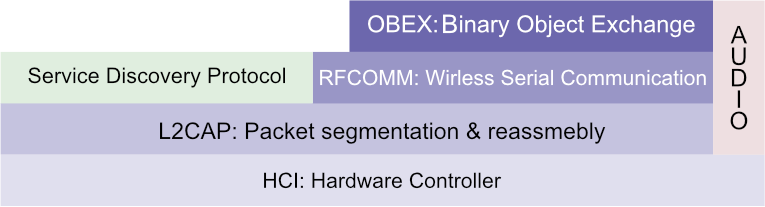

Android applications are developed with the Android API over the dalvik virtual machine (a JVM). Dalvik supports a subset of the regular Java SE API, and replaces various Java technologies such as AWT/SWING, RMI, CLC etc. The android API is identified by the top level `android` package.

Mobile applications are configured through XML files defining colours, string literals, themes etc. An android applications' main configuration file is known as the `AndroidManifest` which declares the activities and permissions an application requires amongst other things. Components used within an app such as buttons, widgets etc. are also delcared as resources in configuration files automatically as they are compiled. Android compiles the `R` class at build-time which allows a user-defined class to query resources specified in application configuration files.

## Components

Components are a high level abstraction used to describe the functionality of an application. Components are often categorized as:

|Component|Description|
|---------|-----------|
|Activity|A visible user interface presented to the user on screen|
|Service|A component with no user interface, providing bacground workers to the application|
|BroadcastReceiver|Listeners registered to events triggered by background or system services|
|ContentProvider|A data store used by the application|

## Activities

Activities are the main user-facing elements of an application. Specifically an activity is one screen of an application, which are often made of many screens. Activities can start one another, and also declare navigation between one another for use with system navigation bars. An activity can start another with `startActivity` or `startActivityForResult`. In order to pass data between actvities an `Intent` is created. A `Bundle` is used to persist information between an activity after it terminates and starts again.


Components that can be seen within an activity are types of `View`. A view can override how it is drawn on screen via its `onDraw` method. Views are redrawn by the system scheduler, which can be requested through the `invalidate` method. A `SurfaceView` is also capable of drawing itself on a seprate thread than the UI thread.

### Threading

Android discourages creating regular Java threads manually. Originally the `AsyncTask` was provided as a higher level thread capable of activating methods as it starts, updates, and finsishes. However, it has since been deprecated in favour of executors. When an `Executor` is obtained - often via a factory - a pool of threads will execute a given `Runnable` without the user provisioning threads manually.

An `AsyncTask` takes three generics: the type of inputs the task accepts when it starts, when it publishes updates, and when it finishes (the type of the result). The methods `doInBackground` and `onProgressUpdate` accept variadic arguments. `doInBackground` executes when the worker thread starts and must return the input type for `onPostExecute` which is automatically called on the UIThread when the worker thread finishes. A call to `publishProgress` will invoke `onProgessUpdate`.

## Location Based Services

Using Location Based Services a mobile client can read its current latitude, longitude, bearing, speed etc. through network providers, GPS, or wifi beacons.

Whilst connected to a cellular network providers are able to use the mobiles' signal strength to trinagulate its position between a collection of network towers. In doing so we can calculate the location of the device to a somewhat accurate degree without using as much client resources as GPS based location (which can provide hihgly accurate locations).

GPS utilises the antenna of a mobile to transmit signals to a constellation of sattelites orbitting earth. The time it takes to signal these satellites is synchronized with atomic clock providers to triangulate the position of the device between satellites to a high degree of accuracy. 

In order to use either location service an application must aqquire the correct privellages, which is either `android.permission.ACCESS_FINE_LOCATION` or `android.permission.ACCESS_COARSE_LOCATION`. The android system will continuously update the client location whilst the location service is turned on, in order to read the location an application must refister a location receiver with the system. To do so a `LocationManager` is obtained from a factory, which requires that location permissions be granted.

The location listener should be registered and deregistered appropriatley over the application lifecycle, as location based services are resource intensive and may drain the battery of a mobile client if updated in the background.

## Bluetooth

Bluetooth provides a means to crate a short range, low bandwidth, personal area network. Bluetooth operates over a client-server architecture where a client can discover and connect to a server exposing public services. Servers can be dynamically discovered, and then connected to. However, the discovery process is considered a slow operation so devices are "paired" to allow clients to connect to known servers wihtout the need to discover them first.

Bluetooth provides a traditional or low energy stack that allows communication between a client and server.



RFCOMM is used to wirelessly communicate between hosts, whilst protocols such as L2CAP and the hardware controller interface are reponsible for packet segmentation and physical tranmission. 

The bluetooth connection process requires a service to be registered in a servers public browse group with a UUID and that server to be registered for enquiry access, then a client uses the SDP to discover nearby servers. If a nearby service makes available the requested service (by searching its public browse group) the client can connect by exchanging its personal security key with the server. During the exchange a unique pairing key is generated from both the server and client key to pair the devices.

If an application wants to make use of bluetooth to communicate with nearby servers a `BluetoothAdapter` must be attained which requires the `BLUETOOTH`, `BLUETOOTH_ADMIN`, and `ACCESS_FINE_LOCATION` permissions. An adpater can discover devices with `startDiscovery` and `cancelDiscovery` or get saved pairings with `getBondedDevices`. An adapter can then create sockets connecting to an available device to open communication. 

## NFC

NFC is built atop the 14443 RFID ISO standard. NFC capable mobile devices are able to power magentic loop antenna through neraby magnetic fields created between close contact with an NFC reader. Fluctuating the field between the reader and receiver allows bits to be transferred over the field. NFC combines the role of an RFID tag (receiver) and reader.

The NDEF (NFC data exchange format) is a standrdized format used to communicate messages over NFC, which consists of multiple NDEF records. A record stores header information on the type of data (MIME type) and length of the record along with the body - which has a theoretical range between 255 bytes upto 4 GB.

NFC interfaces are provided by `android.nfc`, as with bluetooth an `NfcAdapter` provides methods to communicate with NFC enabled devices. If the device adapter is null the client does not support NFC. Through the application manifest an activity can be associated to an intent filter for any of `NfcAdapter.ACTION_NDEF_DISCOVERED`, `NfcAdapter.ACTION_TAG_DISCOVERED`, or `NfcAdapter.ACTION_TECH_DISCOVERED`. When an NFC event is triggered the system will broadcast the action, and open any activities registered. The opened activity contains the read NDEF records in its intent via:

``` java
getIntent().getParceableArrayExtra(NfcAdapter.EXTRA_NDEF_MESSAGES);
```