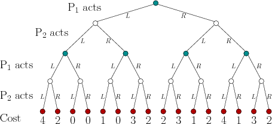
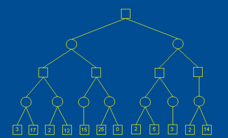
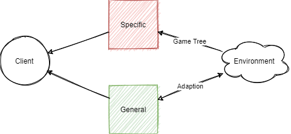
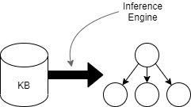
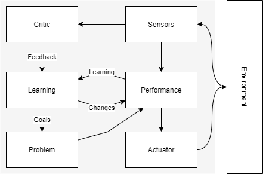

At the time of writing AI is a "buzzword", and is often thought identical to Machine Learning and Deep Learning. In reality these are subsets of the AI field, specifically the application of models and in the later case models designed after the neural networks found in the human brain. So what is AI?

- Systems that act like a human
- Systems that think like a human
- Systems that act rationally
- Systems that think rationally

## Game Theory

> One intersection of mathematics and artificial intelligence. The study of mathematical models of conflict and cooperation between rational decision makers known as agents.

In game theory agents make perceptions about their environment, which results in said agents taking actions. A game(situation) is won based on the actions of all participating agents, not by an overarching judge.

- Agents do not necessarilly take the action they consider suitable, but a response to what they consider the most popular action will be.

Generally agents within games are known as self-interested agents, defined by:

- An agent with it's own description of the world (preferences). It acts based on the preferences. 
- An action results in some payoff (feedback) to the agent called utility. **Rationality means to maximize utility.**

Games are therefore made of:

- Agents (players) - which artificial intelligence attempts to replicate.
- Actions which define the capabilities of agents. Aritificial intelligence tries to decide when to perform which action.
- Utilities - the motivation of the agent.

Game theory is often used to create agent desgins and tune or construct rules.

|Types of game|Description|Antonym|
|-------------|-----------|-------|
|Perfect information|Access to the complete game state|Imperfect information|
|Games of chance|Aspect of randomness|Deterministic Games|
|Zero sum|Games of pure competition|General Sum Games|

> Games simulate autonomous interactions between agents, whilst having simplistic mathematical data structures. Yet they still provide complex state spaces to develop and test intelligent algorithms.

### Normal Form Games

> A game where all agents perform their actions, recorded in a matrix, simultaneously. Utilities are calculated as a function of their actions.

Utility functions map an agents actions, known as a profile, to the set of all actions to a quantity. This is typically expressed by \\(u_i\\).

- An agents actions is usually expressed as \\(s_i\\), and alternatives as \\(s_i\prime\\)
- An action set, that is all possible actions for an agent are usually expressed as \\(A_i\\)

Normal form games are often expressed as matrices, where each cell describes agents utilities. Each column or row represents an action - the intersection of multiple actions forms a profile. Generally the first player is listed on the left.

Example:

| |\\(i\\) *(p2 actions)*|\\(j\\) *(p2 actions)*|
|-|-------|-------|
|\\(x\\) *(p1 actions)*|-1 *(p1 utility)*,-1 *(p2 utility)*|-4,0|
|\\(y\\) *(p1 actions)*|0,-4|-3,-3|

- Games are considered games of pure competition when two players have opposite intersts: \\(\forall a \in A, u_1(a) + u_2(a) = 0\\).

- Games are considered games of cooperation when players have the same interests: \\(\forall a \in A, \forall(i, j) \in N, u_i(a) = u_j(a)\\).

#### Solving Normal Form Games

If the actions of other agents are known, any agent should choose the action set that yields the highest utility. However if other agents actions are unknown the best action for each agent maximizes the utility of the other agents. This is known as a **nash equilibrium**. 

- In a nash equilibrium all agents yield the highest utility possible given the other agents actions.

Knowing that each agent knows each other agent wants to maximize their utitlity we can use an iterated elimonation algorithm to find a games nash eqiuilibrium (their could be more than one). This involves iteratively removing all non-dominating strategies.

Domination can be either stirct or week:

- Stirctly dominating strategies always yield the highest utility for one agent whenever the other perfoms a specific action. \\(s_1 \space dominates \space s_1\prime \implies \forall s_2 \in A_2, u_1(s_1, s_2) \gt u_1(s_1\prime, s_2)\\)

- Weekly dominating strategies always yield the highest utility for one agent wheneve the other performs a specific action. However other actions may also yield an equal utility. \\(s_1 \space dominates \space s_1\prime \implies \forall s_2 \in A_2, u_1(s_1, s_2) \geq u_1(s_1\prime, s_2)\\)

## Extensive form games

> When a game incorporates sequence, whereby there are turns, it can be modelled by extenive form and not normal form games.

Extensive form games model the turns of each player in a game tree.

* A game tree is a tree data structure, or more specifically a directed graph. 
* A tree has a set of nodes \\(T\\) and a function \\(F\\) that given a node in set \\(T\\) returns the next sequence (level) of nodes in the tree.
* There is always a root node with a direct path to any other node - there are no loops.
* The terminal (leaf) nodes return agent utilities.



A pure strategy for an agent is one that gives a possible action for each node under that agents control. For example {L, R} for player 1. 

* An extensive from game cane be converted to a normal form game by creating a matrix of all pure strategies.
* A subset perfect equilibrium is a nash equilibrium for any subset of the game.
* The utility of any node in the tree can be found with **backwards induction**. Where the utility at the terminal nodes is propagated up the tree by taking into consideration what the agent in control will choose at each node.

## Minimax

> An algorithm to solve what action an agent should take in an extensive form game when we know the other rational agent understands we are rational in a game of pure competition.

Minimax (minimize the maximum payoff) became renowned in the deep blue super computer. We give two agents a role. The player in our favour is the max player, and the other a min player. The max player always tries to maximise the utility whilst the min always tries to minimise it. As the utilities are exactly opposite by minimising player 1 player 2 is maximizing their return.

* Minimax is only applicable in games of pure competition.
* Utilties for each node are found using backwords induction.

As game trees grow extremely large they grow enourmous algorithm complexity. The complexity of minimax is \\(O(b^m)\\) where b is the average number of children nodes, and m the depth of the tree.

## Alpha Beta Pruning

> A method to eliminate insignificant branches of a game tree to reduce minimax complexity.

Alpha beta pruning revolves around the philosiphy that an agent will never take certain actions, and those branches in a tree can be pruned and do not need to be searched. Two values are stored, alpha and beta, and if at any point \\(\alpha \geq \beta\\) any sibling nodes on the current level are pruned. The alpha and beta values are always inherited by chidlren nodes but never propagated to their parents.

* An alpha value is updated on max nodes - hence alpha is the largest utility for the current node in the search. 
* A beta value is updated on min nodes - hence beta is the smallest utility for the current node in the search.
* When nodes are in *optimal order* we can prune the most branches, minimizing the complexity of minimax algorithms. Optimal order occurs when for each node the best move for the player in control appears first.



## General Game Playing

> Alogrithms applicable to multiple games.

General game playing is an effort to move from weak (intelligence for a specific task) to strong AI, although not yet fully realized. General game playing agents are systems that:

- Understand the rules of unknown games
- Learn to play without human interaction (unsupervised)

In general game playing the rules of a game are unkown until the game starts. As such there are no algorithms designed in advance for that specific game.



Game trees are replaced by syllogisms - logical statements used to derivve understanding.

```
man(socrates)
human(x) <= man(x)
mortal(x) <= human(x)
mortal(socrates)
---
predicates: man, human, mortal
constants: socrates
variables: x
output: mortal(socrates) TRUE
```
- Predicate: `is` e.g. `human(x) => x is human`
- Function: `map` e.g. `mother(x) => y`

General games must define:

- The players of the game
- The initial game state
- Which moves are possible (move generator)
- The effects of the moves (game physics)
- Terminal conditions and utilities

## Logical Agents

Logical agents are game playing agents that use an inference engine to infer legal moves from a knowledge base. This is known as a declerative approach to building agents.

- Knowledge base: set of sentences in formal language, using logic to represent information such that conclusions can be drawn.
- Inference engine: domain independent algorithms

A logical agent must:
- Represent states and actions to incoporate new perceptions.
- Update intenral representations of the world.
- Deduce hidden properties of the world.
- Deduce appropriate actions.

A knowledge base is formed from sentences. These sentences use some defined syntax to convey the semantics ("meaning") of a rule/condition they represent. An inference engine turns a knowledge base into a game tree.



A knowledge base logically infers some sentence if when all other sentences are true that sentence os true as well. An inference engine enumerates all the states to understand what other conditions are true when siad state is true. For instance all terminal states are infered to reveal what conditions are true when the game is terminal. By recursively applying inference to each state we can populate the branches of a game tree.

### First Order Resolution
 
An algorihtm to derive knowledge from other knowledge used by an inference engine to build a game tree. By using forms of pattern matching we can derive logical consequences from the semantics of a knowledge base. i.e if this then that.

Identifying logical consequences requires:
- Unification (using substitutions to match two queries)
- Resolution steps (resolving terms)
- derivations (recursive resolution)

A substitution is a finite set of terms to replace a variable with, a term could be anything apart from a constant.

```
sub({X/a, Y/f(b)}, P(X,X,Y)) = P(a,a,f(b))
```

A substitution $\theta$ is said to be a unifier if given two expressions \\(P,Q\\) \\(sub(\theta,P) = sub(\theta,Q)\\). When two expressions have a unifier they are "unifiable", doing so is the process of "unification".

A substitution is more general than another if it imposes less restrictions (substitutes less terms). In general we always want to operate with the most general unifier for two expressions.

Resolution involves unifying a query (some proposed state by an agent) with the rules in a knowledge base. Doing so involves matching the query with the head of a rule and finding the most general unifier between the query and the body of that rule. Resolution aims to resolve all terms of a query with a given unifier, by doing so we can infer what state each term can be in to be legal in the game tree.

Derivations recusively reolve a query until all terms in the query have been resolved. At each step we identify a head matching the query, and then unificate the query and rule body. This unifier is chached for later use. Any resolved terms of the query are removed, the result is logically conjucted with any unresolved terms of the body resulting in the new query. We recursively apply this method until the query becomes empty. The combination of all most general unifiers allows us to resolve each term to their legal state given the query.

## Learning Agents

Machine learning is a field of study that gives a computer the ability to learn without being explicitly programmed. A comuter is said to learn from experience \\(E\\) at some task \\(T\\) if the programs performance \\(P\\) increases at \\(T\\) as \\(E\\) increases.

