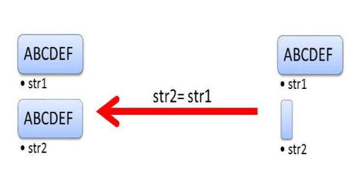

C++ Language reference

## Types

### Type Information

> Ways to obtain the type of something.

To retrieve the type of a variable we can use the `typeid` operator, from the `<typeinfo>` header. This returns a `type_info` object.

```C++
Circle c(5.0);
const std::type_info& t = typeid(Circle);
const std::type_info& v = typeid(c);
```

Each type has a single `type_info` instance associated with it. The returned object is also a reference. **`type_info` objects can be compared.** We can also get the name of the type id with `name()`.

```C++
if (typeid(a) == typeid(b)) {
  //a and b are the same type
}
std::cout << typeid(a).name() << std::endl;
```

## Literals

> Literals are explicit values

Literals can be a value of any basic data type. Literal values are fixed and referred to as **constants**. They are not limited to simple values however, and can be lambda functions called **function literals**.

### Raw String literals

Raw string literals are literal `strings` that are not interpreted (escape characters are not processed etc.).

```C++
R"(Text)";
```

Raw strings can place separators either side of `( or )`, these are a maximum of 16 characters long without whitespace, backslashes, or colons.

```C++
R"Sep(Text)Sep";
```

**Raw strings are important in expressing paths or regular expressions as they are not interpreted.**

```C++
R"(C:\temp.txt)"; //path
R"(c\+\+)"; //regular expression
```

---

### User Defined Literals

With `C++11` we can define our own literals by adding a suffix to built-in literals for `integers`, `floats`, `characters`, or `c strings`. Their syntax is as follows:

```
<built-in literal> + _ + <suffix>
```

In general we use a unit as the suffix:

| Line            | Built-in literal | Suffix      |
| --------------- | ---------------- | ----------- |
| `1010_b`        | `1010`           | `b`         |
| `123.45_km`     | `123.45`         | `km`        |
| `'1'_character` | `'1'`            | `character` |

The `C++ runtime` maps literals to `literal operators`:

- `1_m` = `operator"" _m(1)`
- `"hello"_i18n` = `operator"" _i18n("hello", 5)` 

For example `0101_b` is mapped to the operator `operator"" _n(long long int bin) `,  **the rules this follows are:**

- The variable `bin` must be of the type `long long int` 
- There must be a space between `""` and `_`. 

 In the case where the compiler can not find the corresponding `literal operator` compilation fails. With the introduction of `C++14` the space is not required and allows us to define literals with **reserved keywords** such as `_C`. In `C++14` the simple rule is that we can use suffixes that start with a cpatial letter.

**User defined literals are important as they allow us to perform type safe arithmetic, ensuring we cannot add apples to pears.**

---

### Built-in Literals

There are some built-in literals for binary numbers, c-strings etc.

| Type                        | Suffix | Example  |
| --------------------------- | ------ | -------- |
| Binary Number               | 0b     | 0b1010   |
| `std::string`               | s      | "Hello"s |
| `complex<double>`           | i      | 5i       |
| `complex<long double>`      | il     | 5il      |
| `complex<float>`            | if     | 5if      |
| `std::chrono::hours`        | h      | 5h       |
| `std::chrono::minutes`      | min    | 5min     |
| `std::chrono::seconds`      | s      | 5s       |
| `std::chrono::milliseconds` | ms     | 5ms      |
| `std::chrono::microseconds` | us     | 5us      |
| `std::chrono::nanoseconds`  | ns     | 5ns      |

Built-in literals do not use an underscore and in `C++14` for the fist time we are able to us string literals, meaning we can initialize a string without using a `c-string`.

---

### Raw and Cooked

> The literal operator comes in the raw type, or cooked type.

### Raw

Raw literal operators accept arguments as either `(const char*, size_t)`, `(const char*)`, or `(const char)`.

```C++
1.45_km => operator"" _km("1.45");
```

`Raw strings` fall under this category.

### Cooked

Cooked literal operators accept arguments as either `(long double)` or `(unsigned long long int)`.

```C++
1.45_km => operator"" _km(1.45);
```

> It is important to add an "_" in front of the suffix to distinguish user defined literals from built-ins

**Raw form can be used for number types or string types, whereas cooked can only be used for number types.**

## [Enumeration](https://en.cppreference.com/w/cpp/language/enum)

> Defining custom data types containing constant integer values

These constant integer values are known as enumerators. 

```C++
enum Classic { //unscoped enumeration
  red,
  green,
  blue = 3
};
```

```C++
std::cout << red << std::endl //0
std::cout << green << std::endl //1  
std::cout << blue << std::endl //3  
```

### Statically Typed Enumerations (Scoped Enumerations)

With the introduction of `C++11` enumerations can only be accessed within the scope of the `enum` (i.e. we have to access enumerators from the namespace of the `enum`) and are not imported to the enclosing scope. By default the type of an `enum` is an `int` in `C++11` and later, which allows us to forward declare them. **These `enums` are called statically-typed**. 

```C++
enum struct Statically {
  red,
  green,
  blue = 3
};
```

- We must use the `static` or `class` keyword to define a statically typed `enum`
- We must use a `static cast` to access a statically-typed `enum` as an `int`

```C++
std::cout << static_cast<int>(Statically::red) << std::endl //0
std::cout << static_cast<int>(Statically::green) << std::endl //1  
std::cout << static_cast<int>(Statically::blue) << std::endl //3  
```

These `enums` do not have to be of the `int` type however. We can use  all [integral types](https://docs.microsoft.com/en-us/cpp/cpp/fundamental-types-cpp?view=vs-2019) such as `bool`, `char`, and `long long int`.

The type of the enumerators is implicit based on the value of the number (0-255 would be a `char` for example). In addition as scoped `enums` are not implicitly converted to `int` the following is valid:

```C++
void enumType(Satically e) {
  switch(e) {
    case Statically::red:
      std::cout << "Statically::red" << std::endl;
   		break;
    case Statically::green:
      std::cout << "Statically::green" << std::endl;
      break; 
    default:
      std::cout << "Statically::blue" << std::endl;
  }
}
```

## Pointers

> A pointer holds the memory address of a value

A pointer can be created using the `*` operator, and the address of a value can be accessed by the `&` operand.

```C++
int i = 10;
int* iptr = &i;

std::cout << i << "is at address: " << iptr << std::endl;
```

Accessing the value of pointed to by a pointer is called **dereferencing**.

```C++
std::cout << "i = " << *iptr << std::endl; //dereferencing
```

Pointers store data in heap memory, hence we can modify them  regardless of scope.

---

### Pointer Arithmetic

Pointer arithmetic allows us to change the address we use to access a value, and is the same process as `indexing`.

```C++
intArray[i];
*(intArray + i); //equivelant
```

Adding a value to a pointer moves the address pointed to by the pointer, and then dereferencing this pointer retrieves this new value. This is how the compiler treats `[]` .

### Dynamic memory

> Creating new data in memory is done with the `new` keyword

 ```C++
int* intArray = new int[10];
 ```

### Null Pointers

>  Before C++11, `0` was often used to represent an empty or null value when the `NULL` macro was not applicable. The issue with the literal `0` is that it can be the null pointer `(void*)0` or the number `0`. This is defined by the context.

Often we may accidentally apply pointer arithmetic to a value we thought was just an integer. An alternative to this is to use the `NULL` macro, which helps readability, but functionally is equivalent.

The new standard is to use `nullptr`, which is a type by itself `std::nullptr_t`, and does not evaluate to 0.

- You cannot dereference a `nullptr`
- Any pointer can be assigned `nullptr`
- A `nullptr` can be compared and converted to all types of pointer

We cannot compare or convert a `nullptr` to an integral type, except for `bools`, allowing us to use `nullptr` in logical expressions.

---

### Function Pointers

Creating a pointer to a function follows the following syntax: 

```
<return type> (*<pointer name>)(<arg 1>, ...<arg n>) = <function name>
```

Calling the function from the pointer is as you would expect:

```C++
fptr(a);
```

### Member Pointers

> We can make pointers to class or struct members as well

```C++
struct X{
  int data;
};

int X:: * p = &X::data; //pointer to member
X object;
object.data = 2011; //set instance memeber
X* objptr = new object;
objptr->data = 2014; //set instance member

std::cout << object.*p << std::endl; //dereferencing
std::cout << objptr->*p << std::endl; //dereferencing
```

## References

> A reference is an alias for an existing variable, created with the `&` operator

Once created a reference can be used instead of the original variable, changes made to either one are reflected in the other.

```C++
int i = 30;
int& iref = i;

std::cout << i << std::endl; //30
std::cout << iref << std::endl; //30
```

### References vs Pointers

- References can never be `NULL`, it must always be initialized with an existing variable.
- References can not be assigned to another variable, acting like a `constant` pointer.

### References as Parameters

> References allow functions to modify the value of a variable

References are not copied, they are not passed by value.

> This functionality is also very useful when dealing with a large argument. Passing it by value would mean that a copy has to be made in the function. This is memory-intensive.

---

## Type Deduction

>  The `auto` keyword can be used to let the compiler decide the data type itself

`auto` determines a type from an initializer, all variables therefore need an initializer. By using `auto` the compiler ensures that all types is initialized. 

- Non-constant members of a class should not be initialized with an `auto` type
- Using `auto` allows us to easily refactor our code, as we can change the value of variables from `int` to `double` without changing the types of expressions and other variables.
- To force an `auto` deduction to become a pointer use `auto*`, and `auto&` for references.

```C++
auto i = 5; //int
auto* iptr = &i; //int*
auto& iref = i; //int&

int func(){return 2011;}

auto fptr = func; //int (* < fptr >)()
```

### `decltype`

> `decltype` returns the type of an expression or entity, i.e. `decltype(expression)`

- If the expression is an `lvalue` a reference to the data type is returned
- If the expression is an `rvalue` the data type is returned

```C++
int i = 2011;
decltype(i) i2 = i; //int i2 = i; (rvalue)

decltype((i)) iref = i2; //int& iref = i2; (lvalue)
```

### Automatic Return Types

To deduce the return type of a function automatically we need to do two things, delay the declaration of the functions return type, and include a trailing return type.

- Declaring a functions return type as `auto` in it's signature delays the return type declaration
- Using the `decltype()` keyword in the trailing return type will let the automatic type deduction recognise the correct data type.
- We must use the trailing return type syntax as our method signature:

```C++
template <typename T1, typename T2>	
auto add(T1 a, T2 b) -> decltype(a + b) {	//before "->" = signature, after "->" = trailing type
  return a + b;
}
```

**With the introduction of `C++14` `auto` does not require a trailing type**

```C++
template <typename T1, typename T2>	
auto add(T1 a, T2 b) {
  return a + b;
}
```

## Casting

There are four different types of cast operators:

- `dynamic_cast`
- `static_cast`
- `const_cast`
- `reinterperet_cast`

Explicit casting requires the type we want to cast our data to.

```C++
int i = static_cast<int>(5.5);
```

We can also use the C syntax, known as a c-cast:

```C
int i = (int) 5.5;
```

**It is not encouraged to use c-casts as we do not know which type of cast occurs, and usually follows multiple casts.**

---

### `dynamic_cast`

> `dynamic_cast` only deals with references or pointers

A dynamic cast converts a pointer or reference of a class to a pointer or reference in the same inheritance hierarchy. It can only be used with polymorphic classes, allowing us to cast up, down, and across. This cast's validity is determined at runtime, and if it is not possible we will receive  a `nullptr` or `std::bad_cast-exception` for a reference.

```C++
class Account{
public:
  virtual ~Account() = default;
};

class BankAccount: virtual public Account{};

Account* a = nullptr;
BankAccount* b = nullptr;

BankAccount c;

a = dynamic_cast<Account*>(&c); //upcast
b = dynamic_cast<BankAccount*>(a) //downcast
```

### `static_cast`

Static casts only perform conversions well-defined by the compiler, e.g. not a string to integer. It allows bidirectional conversion between related data types and cannot be used with polymorphic types. The `static_cast` is performed at compile time.

```C++
class Account{};
class BankAccount: public Account{};

enum Color{
  red,
  blue,
  green
};

Account * a = nullptr;
BankAccount * b = nullptr;

a = static_cast<Account*>(b); //upcast
b = static_cast<BankAccount*>(a); //downcast

int i{2};
Color col = static_cast<Color>(i); //green
```

### `const_cast`

> `const_cast` allows us to add or remove the `const` or `volatile` property from a variable

`const_cast` is rarely used because removing `const` or `volatile` from a variable declared as such in the first place is undefined behaviour.

```C++
int i{2011};
const int* constI = const_cast<const int*>(&i);//make constant pointer
int* nonConstI = const_cast<int*>(constI);//remove constant pointer
```

### `reinterpret_cast`

> `reinterpret_cast` allows us to convert a pointer of a particular type to another type, whether or not the types are related.

A `reinterpret_cast` also allows the conversion between an integral and pointer. The cast guarantees that is a pointer is canst into another type casting it back would return the original value. **Using this cast is not recommended as it does not take any safety measures.**

 ```C++
double * aDouble = 3.14;
void * aVoid = reinterpret_cast<void*>(aDouble);
double * doubleAgain = reinterpret_cast<double*>(aVoid); //3.14
 ```

## Unified Initialization

> In `C++11` initialization became uniform, uniform initialization uses `{}`.

Uniform initialization is always applicable by the `C++` standard. Variables can be initialized in this way with or without assignment:

```C++
int i{2011};
std::string j = {"my string"};
```

When using assignment the value is first created, and then implicitly converted to the correct type. Without initialization the type's constructor is directly called.

When using unified initialization we **cannot overflow** the size of a type.

```C++
char a = 999; //999 does not fit into a char type. We loose the extra data.
char b{999}; //Error compiler will not allow overflow. No data loss.
```

### Calling the Constructor

When using a `{}` initialiser we call the types constructor with `(std::initializer_list<T>)` as arguments. Hence to work we can define a constructor in a class as such:

 ```C++
 class MyData {
   public:
   	MyData(std::initializer_list<int> data) {
      for (auto i : data) std::cout << i << std::endl;
    }
 }
 ```

- `{...}` is of the type `std::initializer_list<T>` and therefore `auto i {42}` is of the type `std::initializer_list<int>`. *Specify a type to call a specific constructor.*
- As of `C++17` `{}` initialization without assignment resolves to the type of the element inside the provided list, there can only be one element.

```C++
//C++ 14
auto a {42}; //std::initializer_list<int>
auto b {42, 43}; //std::initializer_list<int>
auto c = {42}; //std::initializer_list<int>
auto d = {42, 43}; //std::initializer_list<int>

//C++ 17
auto a {42}; //int
auto b {42, 43}; //Error: too many values
auto c = {42}; //std::initializer_list<int>
auto d = {42, 43}; //std::initializer_list<int>
```

## Variable Modifiers

> Modifiers change the properties of a variable

### `Const`

> Any variable marked with `const` can not be modified later on.

- Class methods can also be marked as `const`, and only `const` instances can call them. 
- In a `const` pointer both the data and pointer can be  `const`. Read these from  right to left.

```C++
int i = 10; //normal variable
int const* ip = &i; //constant pointer, ip is a pointer to a const int. ip is not constant.

*ip = 11; //error
ip = ip + 1; //error: non-const pointer

int* const ip1 = &i; // ip1 is a constant pointer to an int.

*ip1 = 11; //error: pointer being non-constant
ip1 = ip1 + 1; //error

int const* const ip2 = &i; //ip2 is a constant pointer to a constant int. 
//We can modify i, but not through ip2.

*ip2 = 11; //error
ip2 = ip2 + 1; //error
```

### `Constexpr`

> Defines an expression evaluated at compile time

Can be used for functions, variables, and user-defined types. A constant expression variable can be used anywhere that requires a truly constant value, like an array size.

```C++
constexpr double a = 3.14;
```

A `constexpr` value is automatically `const`, has to be initialized, and this initialization must also be a constant expression.

> "The rules make sense. If we evaluate a variable at compile-time, the variable can only depend on values that can be evaluated at compile time."

#### Constant Expression User Defined Types

When using a constant expression with a user defined type there are some restrictions:

- A `constexpt` constructor can only:
  - be invoked by a constant expression
  - cannot use exceptions
  - has to be declared as `default` or `delete`, or the body must be empty
- Each base object and non-static member must be initialized in the constructors initializer list (see later) or directly.
- The constructor body must be empty.
- Methods within the class do not have to be constant expressions.

#### Constant Expression Functions

>  Constant expression functions can be run at compile time, and the results instantly available at runtime. 

These functions are implicitly `inline`. Their restrictions:

- Non-virtual
- Arguments and return values are `literal types`. So are function variables.
- Only one return statement
- Must return a value
- Executed at runtime when invoked by a constant expression.
- Can only have a body consisting of a return statement.
- Must have a constant return value.

```C++
constexpr int gcd(int a, int b) {
  return (b == 0) ? a : gcd(b, a % b)
}
```

As of `C++14` there were changes made, when using `C++14` we only have to remember we cannot use `static` or `thread_local` data.

```C++
constexpr auto gcd(int a, int b){
  while (b != 0){
    auto t= b;
    b= a % b;
    a= t;
  }
  return a;
}
```

**constant expression functions do not rely on the state of the program, even if executed at run time. This means they are always pure functions (always return the same value). **

### Volatile
> The volatile variable is one who's value may change due to an external event. 

We usually only change the value of a variable within our code, and an external I/O call which tries to do so would not be allowed for example.
This would be possible if the variable was marked `volatile`. 

```C++
volatile int i{2011};
```

Compared to the same modifier in Java or C# there is no multithreading semantics involve with `volatile` in C++.

`volatile` is usually used in embedded programming to denote an object that can change independently of the regular program flow.

Hence we can modify and read variables in separate threads marked `volatile`. If we do this we can not guarantee the values of these variable in either thread.   

## Rvalues and Lvalues
Rvalues are temporary objects without a name. We can no get an address from them, and are always on the right hand sie of assignment.

All others are Lvalues, these can only be on the left hand side.

```C++
int lvalue = 2011 // 2011 is an rvalue
```

### References
Lvalue references have a single `&` , whilst rvalue references have two `&&`.

Lvalues can only be bound to Lvalue references, whilst rvalues can als be bound to constant lvalue references as well as rvlaue references.

```C++
MyData a;
MyData& lvalRef(a); //lvalue ref
MyData&& rvalRef(MyData()); //rvalue ref
const MyData& rvalRef2(MyData()); //rvalue ref
```

Rvalues are very efficient when moving objects, as we dont have to copy them. They also require no memory allocation or de-allocation.

## Move and Copy
> Move and copy are operations we can perform on memory.

Copying duplicates the elements of ne object into another and is considered expensive. If we do not have enough memory we could get a `std::bad_alloc` exception.

Moving takes the elements from one element and puts them in another, it is however not guaranteed to leave the source object empty. This means we have valid but unspecified behavior.

| copy | move |
|------|------|
|||

- An object supports copying if it has a copy constructor and operator, and supports moving if it has a moving constructor and operator.
- Copy operations use constant `lvalue` references, whilst move uses `rvalue` references.

Remember the point of a move operation is to set the new values and erase the old ones, while copy is just to set the new ones.

```C++
class MyData{
  public:
    //move constructor 
    MyData(MyData&& m): i(std::move(m.i)), j(std::move(m.j)) {
      m.i = 0;
      m.j = ""s;
    };
  	
  	//move operator
    MyData& operator = (MyData&& m) {
      i = std::move(m.i);
      j = std::move(m.j);
      m.i = 0;
      m.j = ""s;
    }
  
  	//copy constructor
    MyData(const MyData& m): i(m.i), j(m.j) {};
  
  	//copy operator
    MyData& operator = (const myData& m) {
      i = m.i;
      j = m.j;
    }
  
  private:
  int i;
  std::string j;
};
```

### Move

> Requires the `<utility>` header

`std::move`  converts its argument to an `rvalue` by a `static_cast`, if we try to move a non-moveable object the compiler will fall back to a copy operation.

*Moving is very fast.*

## Forwarding

> The act of a function forwarding its arguments without changing their properties (`lvalue` or `rvalue`), known as perfect forwarding

Such methods are known as perfect factory methods. They:

- accept any number of lvalues and rvalues as arguments.
- forwards its arguments the same way as the underlying constructor.

**In essence a perfect factory method is a way of constructing a type which maintains whether the value is an rvalue or lvalue**

```C++
//the perfect factory method will be called create

template <typename T, typename Arg>
T create(Arg&& a) {
  return T(std::forward<Arg>(a));
}
```

- Above we take a `universal reference` as `Arg&&`, this is a special reference that can take both r and l values.
- note the `return` statement can be replaced with any function call as needed for the function, the idea is that we can do something whilst moving and rvalue or copying an lvalue automatically by using `std::forward`.

```C++
//variadic function to work with any number of arguments

template <typename T, typename ... Args>
T create(Args&& ... args) {
  return T(std::forward<Args>(args)...);
}
```

Above we can call `create` with 0 to n number of arguments. 

## Functions

There are two style of syntax to write functions in `c++`, the newer of which is compulsory when using the `auto` keyword as a return type.

Old:

```
<return type> <name>(<params>) { <body> }
```

`C++11` and above:

```
auto <name>(<params>) -> <return type> { <body> }
```

### Default Arguments

> Values to be used for parameters when none are specified

```C++
int func(int x, int y = 0, bool t = false) {
  return x + y;
}
```

- Default arguments use an `=` inside the parameter list
- The arguments must com after all non default arguments

---

### Overloading

> Changing function behaviour by changing the signature of a method of the same name as another

We can provide alternate behaviour for functions using overloads, where two functions have the same name but different signature. **Note** that overloading disregards references `int x` is treated the same as `int& x` when determining the signature of the method.

---

### Lambda Functions

> Functions without a name

Lambdas can be treated as data values, allowing them to be assigned to variables etc.

```
[<used variables>] (<params>) -> { <function body> }
```

- Lambda's have a constant function body unless they are specified by the `mutable` keyword 
  `[...] (...) mutable -> {...}`
- The `->` is optional

Lambdas are called function operators, classes that have their call operator (`operator ()`) overloaded. **A function object can then have a state.**  

- All variables in the `[...] ` are initialized in the function objects constructor. Known as binding.

---

### Closures

The act of binding variables accessible from the current scope (discussed above) to the function is called closure. Below are some types  of closure.

| Binding                 | Description                                                  |
| ----------------------- | ------------------------------------------------------------ |
| `[]`                    | No Binding                                                   |
| `a`                     | Copy `a`                                                     |
| `&a`                    | Take a reference of `a`                                      |
| `[=]`                   | All used variables accessible in this scope should be taken as a copy |
| `[&]`                   | All used variables accessible in this scope should be taken as a reference |
| `[=,&a]`                | Take all used variables by copy, and a by reference          |
| `[&,a]`                 | Take all used variables by reference, and a by copy          |
| `[this]`                | Copy the data and members of the enclosing scope (the current object etc.) |
| `[l = std::move(lock)]` | L becomes lock by moving (see Move and Copy)                 |

As variable bindings are initialized in a constructor there value will remain whatever it was when defining the function unless it is a reference.

```C++
auto copy = "original"s;
auto refer = "original"s;
auto lambda = [copy, &refer] () -> {std::cout << copy << ", " << refer << std::endl};
lambda(); //original, original
copy = "new";
refer = "new";
lambda(); //original, new
```

### Generic Lambda's

> As of `c++14`Lambda functions can take generics just as normal functions

```C++
[](auto a, auto b) -> { return a + b; }
```

- Both `a` and `b` are automatically deducted, as well as the return type. We could add any two compatible types wiht the above function.

**Remember generics allow us to pass any type of data to a function or class enabling us to provide functionality for many types from one function or class body. **

## Memory Allocation

> Heap memory, or dynamic memory, must be explicitly requested and released 
in C++

`new` and `new[]` can be used to allocate memory, whilst `delete` and
`delete[]` can be used to deallocate memory. **The compiler will
automatically manage memory on the stack**

- Note that `smart pointers` manage memory automatically

An important idiom in C++ is that resources required should be
acquired in an objects constructor, and released in it's destructor.

- An objects destructor is called automatically called when it goes
out of scope.

### Memory Allocation
```C++
int* i = new int;
double* d = new double(10.0);
```

The `new` operator dynamically allocates memory for the instance type.
Parameters in brackets are passe to the object constructor.

- Note that `new` returns a pointer to the object.

We can also use `new[]` to allocate memory to a C array. 
Each object in the array must have a default constructor, 
which will be called for each element of the array.

```C++
double* d = new double[5];
Point* p = new Point[10];
```

- Note STL containers and C++ strings automatically manage their memory.

### Memory Placement
> defined in <new>

We can instantiate objects or arrays in a specific area of memory.
We can also overload the `placement new` operator.

```C++
char* memory = new char[sizeof(Account)]; //allocates std::size_t
Account* acc = new(memory) Account; //instantiates acc in memory
```

### Memory Failure

If `new` or `new[]` fail we will raise a `std::bad_alloc`, however we 
can use the placement new operator with `std::nothrow` to return
a `nullptr` instead. 

```C++
char* c = new(std::nothrow) char[10]

if(c) {
	//success
}
else {
	//failure
}
```

In the case of a failed allocation, we can use `std::set_new_handler` with our 
own handler. `std::set_new_handler` returns the older handler and 
needs a callable unit. A callable unit is typically a function, 
a function object, or a lambda-function. The callable unit should 
take no arguments and return nothing. We can get the handler 
currently being used by invoking the function `std::get_new_handler`.

Our own handler allows us to implement special strategies for 
failed allocations:

- request more memory
- terminate the program with `std::terminate`
- throw an exception of type `std::bad_alloc`


### Memory deallocation
> `delete` and `delete[]`

```C++
Poin* p = new Point(10,2);
delete p;
```

If the destructor of the base class is `virtual` we can destroy the 
object with a pointer or reference to the base class. Once deleted
we must point the old pointer to a different object.

- Note `delete[]` is used to deallocate `new[]`, and `delete` 
deallocates `new`.

```C++
Point* p = new Point[10];
delete[] p;
```

The `delete[]` operator calls the destructor of a C array rather than
the objects destructor as opposed to `delete`.

## Classes
> Data types encapsulating attributes and methods

Instantiating a class, or creating an object, is done by invoking the constructor.

```C++
Account a(100); //creates an account object
account b = new Account(100); //creates another account object
```

Accessing attributes r methods from an bject is done with the `.` operator, or the `->` operator the pointers.

### Constructors
> Methods used hen initalizing an object

In C++ a cmpiler needs the default constructor of an object to automatically make an object. When a object is instantiated
all base classes used inisde the object are also called.

Parameters in constructors do not need names if they are not used.

Copy constructors allow an object to be instantiated by copying another:
- They tak a constant reference to the object to copy
- They do not require a body to copy values
```C++
public:
    Example(const Account& other);
```

Move constructors can instantiate an object by moving the values from another:
- They take a r value reference to the bject to move
- The do not rquire a body
```C++
public:
    Example(Account&& other);
```

Objects can be instantiate implicitly:
```C++
Example e = {1, 2, 3}; //implicit
```

To prevent this we can use the keyword `explicit`:
```C++
public:
    explicit Example(double b) { balance = b; } //explicit
    Example(st::string c) { name = c; } //implicit

//...
Example e = {"Test"}; //works
Example f = {100.0}; //error 
```

### Accessors
In C++ accessors are used as such:

```C++
class Example{
    public:
        //...
    private:
        //...
}
```

### Initializer lists
> A list of values to initalize an object with before the body of a constructor

Initializer lists make constructors more readable:
```C++
public:
    Example(int num): val(num), valb(1){ }
```
They also allow us to initalize const members to a specific value when the object is created.
- We know we must initialize a const value to something as we can not write to it
- As members are initiallized when an object is created, which happens before the constructor is called, **we can't set a 
constant member in a constructor body** 
- Since an initializer list is used by the compiler at object creation, we cna initalize a constant member with an
initializer list

```C++
public:
    Example(int var) { 
        //val = var; ERROR
    }

    Example(int var): val(var) {
        //WORKS
    } 
private:
    const int val;
```

- Varaibles can be initalized outside the constructor aswell.