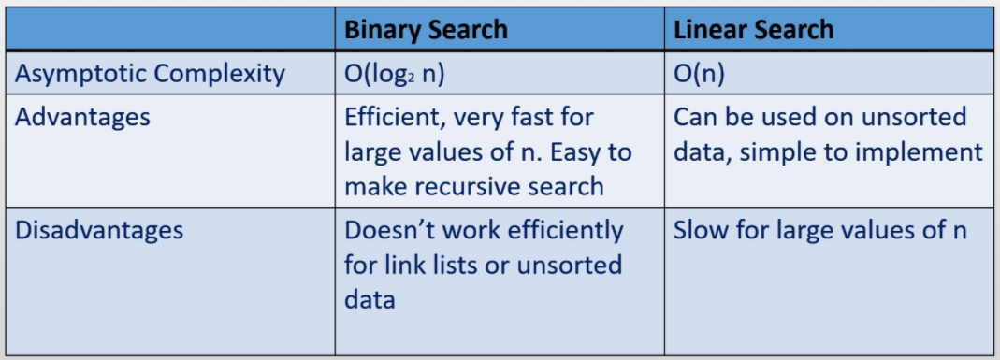

Optimising program runtime using algorithms and data structures.

## Efficiency
> Optimised use of CPU, memory, and network resources.

**Data Structures**
> Storing an organizing data efficiently.

**Algorithm:**
> A procedure that terminates in a finite number of steps.

## Analysis of Algorithms
> Comparing algorithms without implementing them, to determine a faster runtime.

To decide on which algorithm or data structure is faster we may have to profile (implement and measure) each option, which presents some problems:

- You have to implement both algorithms
- The results might depend on the computer
- The results might depend on the test data

Analysis of algorithms addresses some of these issues by:
- Identifying the basic operations an algorithm consists of.
- Analysing the average performance of an algorithm
- Focussing on large datasets, as the difference on small datasets is most likely negligible.

When analysing algorithms we must consider the advantages and disadvantages of an algorithm in the context of the problem.

## Big O notation
> Set notation to denote the runtime of algorithms.

| Set | Runtime | Description |
|---|---|---|
| constant time | $O(1)$ | The runtime of an algorithm is constant |
| linear | $O(n)$ | The runtime of an algorithm is proportional to `n` - the size of the data |
| Quadratic | $O(n^2)$ | The runtime is proportional to the square of the data size|
| logarithmic | $O(\log_2 n)$ | The runtime is proportional to the log of the dataset |
| linearithmic | $O(n \log_2 n)$ | ... |
| cubic | $O(n^3)$ | ... |
| exponential | $O(2^n)$ | ... |
| factorial | $O(n!)$ | ... | 

Big O notation provides set notation to categorize these algorithms. This is limited, because it can not compare algorithms of the same set.  And in cases where `n` is small a worse algorithm may be better.

| Notation | Set |
|---|---|
| $O(1)$ | constant time |
| $O(n)$ | linear |
| $O(n^2)$ | quadratic |

- Performing $k (k \not{=} n)$ linear operations is still linear

$$
f \in O(n) \implies kf \in O(n)
$$

- Performing a linear operation $n$ times is quadratic

$$
f \in O(n) \implies nf \in O(n^2)
$$

## Asymptotic Complexity
> Taking the largest term to determine the order (Big O set) of an algorithm.

Given $f(n)=\frac{2}{3}n^3$ the coefficient is not useful for large values of n, hence we only consider $n^3$. This growth function is cubic, and known as the asymptotic complexity, also known as the order which is the dominant term minus it's coefficient.

## Lists

Constant time operations:
|Operation|List|
|---|---|
|Add/remove to end| `ArrayList` |
|Add/remove to beginning|  `LinkedList` |

## Threads
> The smallest unit of processing that can be scheduled by an operating system within a project

A process is an instance of a computer program that is being executed. A multi-threaded process is a program that has several threads of execution that it performs at one time within a process.

The main entry point of a program, event dispatcher in a GUI program, and the garbage collector in the JVM are all executed on different threads.

When a CPU does not possess enough cores to handle the number of execution threads time slicing is used to control the amount of time each thread is spent executing. A priority is assigned to a thread to determine which threads are run, and for how long. Time slicing runs a thread for a small period, and then runs another on so on, until all threads complete executing. 

- Threads can be created by extending the `Thread` class an overriding the `run` method.
- An arguably better way is to implement the `runnable` method, and define the `run` method. Then pass the runnable class to a new `Thread`. 

Calling a `run` method directly is a **blocking** operation, to execute a `Thread` concurrently call the `start` method.

A program will only exit when all threads die, even if the main thread dies whilst others run.

Threads can exist in four states:
- New
- Runnable
- Terminated
- Blocked

## Thread Variations

`java.util.Timer`

A `Timer` can be used to schedule a thread to execute repeatedly. A `Timer` takes a `TimerTask`, in which the run method is overridden. Then a delay and repeat is specified. 'Delay' is the start delay.

```
Timer({TimerTask}, {delay}, {repeat});
```

`javax.swing.Timer`

A `swing Timer` approximatley dispatches a `ActionEvent` every x milliseconds. Then a listener can react to the event.

```
//swing timer
Timer({x}, {listener});
```

## Thread Blocking
> Making a thread not eligible for processor time

Threads can be blocked manually using `wait` or `sleep`. We can unblock a thread by calling the `notify` or `notifyAll` methods.

### Race Conditions
> Multiple threads accessing or changing a resources state at one time.

Race conditions can corrupt data, or crash programs. Removing race conditions is known as synchronisation. 

A section of code where something may be accessed or modified at the same time are known as critical sections. A critical section that is synchronised is called thread safe.

We can accomplish this using the `synchronsized` keyword. **Only one thread can run** in a block of code marked as such at any one time.

- If an object monitors multiple synchronized blocks only one thread can run in any one of the blocks at any one time.

A thread can access a synchronized block when given the key. The key is stored by the monitor object which is usually the containing object of the threads.

```
// a synchronized method
public void synchronized mymethod() {}
```

```
//a synchronized block
synchronsized(this) {
    //code here...
}
```

## Stacks
> Last In First Out linear collection

A linear collection is a collection in which elements are placed in a sequence. 

Typically a stack pushes elements onto a stack, and pops them off. Peek looks but does not pop an element.

### Stacks with Arrays

If we were to keep the top of the stack at index 0 we would have to shift all the trailing elements and have a complexity of O(n).

Instead we can keep a reference to the next available location in the physical data structure which prevents the shift and creates a complexity of O(1).

Pushing with arrays:

```
if no available space:
    expand capacity
array[head++] = element
```

Popping with arrays:

```
if numberElements > 0:
    e -> copy array[--head]
    return e
```
 
As always arrays need to occasionally expand capacity but is faster at pushing and popping as memory is sequential.

### Stacks with linked lists

When using a linked list to keep a complexity of O(1) wee keep a reference to the last node in the stack.

Pushing with linked lists:

```
newNode.next = tail
tail = newNode
numElements++
```

Popping with linked lists:

```
if tail is not null:
    node = tail
    tail = tail.next
    return tail
```

Linked lists will never need to expand memory but are slower at pushing and popping.

## Queues
> First in first out linear collection

Typically queues offer elements onto the queue, poll elements off the queue, and we can use head to peek at the first element. Noting we need to offer to the end of the queue, but poll from the beginning we can keep a reference to the head and tail of the data structure. Both operations are O(1) complexity.

### Queues with Linked Lists
Offer:

```
if tail is null:
    head -> newNode
    rail -> newNode
else:
    tail.next = newNode
    tail = newNode
++numberElements
```

Poll:

```
if head is not null:
    e -> head.element
    head = head.next
    --numberElements
    if numberElements is 0:
        tail -> null
    return e
```

### Queues with Arrays
When using a traditional array every time we poll the head of the queue we will permanently loose access to the beginning of our array memory as we cant move backwards, wasting space. Instead we can make a circular array where when we hit the end of the array we loop back to any open space.

Note that if there is no open space at the beginning of the array we still need to expand.


## Lists
> A linear collection of elements with an associated index.

Lists are most useful to get an element from a specific position, each time the list is modified the indexes must be updated. Every list requires a counter for the number of elements it has.

Lists provide two main functions: add and remove, in particular lists are O(1) at the end of the list but O(n) anywhere else. Lists can provide better adding runtimes as they permit duplicates.

### Lists using Arrays

Remember that the defining trait of an array backed data structure is that it must resize when it is full. Therefore on average the end of our array list is O(1) but it will be O(n) exactly when we expand.

Add:

```
if array.length = numElements:
    expand
array[numElements++] = newElement
```

### Lists using Doubly Linked Elements

Using elements with references to the previous and next elements creates a doubly linked list.  If we then keep reference to the head and tail of our list both adding elements to the beginning and end is O(1). Adding an element in the middle is still O(n), but is optimised by checking if the node is on the bottom or top half of the list.

Getting an element in a linked list is O(n) as opposed to O(1) in an array as we have to traverse the links.

## Searching
> Finding an item if it exists within a search pool. 

There are two main types of search linear and binary. Linear search is O(n) and binary O(log n). 

- Linear search iterates through an unsorted collection of elements until the target is found. When using a linked list iterators will be more efficient, but within array backed data structures indexing would be just as efficient.

Binary searches are much faster with large search pools. Using this technique we will compare a target and the current element, if it is greater we remove all elements lower than the current element from the pool, otherwise we do the opposite. This is very efficient within a **sorted collection of elements**, but will be a lot slower (than with a sorted collection) in an unsorted collection.  

Knowing that our elements should be sorted for the fastest search times, within a binary search the most efficient sorting is with a tree. Where in we start with the middle element, and on each side of every element in the tree lies the element smaller than it and the element larger than it. Hence every comparison we make we will **half our search pool**.

Binary searching does not require a tree however, and can just as effectively be applied to any sorted data structure. Even better this process can easily be implemented recursively.



## Sorting
> Sorting is the process of arranging a linear collection in order

Given a linear collection of non-primitive elements it is the element's responsibility to define how it should be ordered. Popular sorting algorithms include:

- Selection sort
- Insertion sort
- Bubble sort
- Merge sort
- Quick Sort
- Heap Sort
- Radix Sort
- Bin Sort

### Selection sort
> Looping through each element in a linear collection swap the current element with the smallest element after it.

A selection sort is $O(n^2)$. In order to find the smallest element after the current iteration we must store the index, this **prevents** us from finding the first smaller element.

```
for every element i in list[0 : length - 1]:
    smallest <- i
    for evert element j in list[i: length]:
        if elements[smallest] > elements[j]
            smallest <- j

    swap <- elements[i]
    elements[i] <- elements[smallest]
    elements[smallest] <- swap
```

### Insertion Sort
> Inserting each element in a collection into the correct position in a new collection.

It can be helpful to think of this algorithm as sorting a hand of cards. An insertion sort is $O(n^2)$.

### Bubble Sort
> Repeatedly iterating through a collection and sorting adjacent elements.

Each iteration the largest element has bubbled to the end of the collection, whilst other elements have been partly sorted. **Bubble sort is ideal for partially ordered collections but very slow otherwise.** 

Bubble sorts are $O(n^2)$

### Quick Sort
> Partitioning a collection, and concatenating each partition.

Quick sort algorithms arbitrarily choose a pivot, which is used to split the original collection into elements greater than the pivot and elements less than the pivot. Recursively we split each partition until we only have one or no elements in each partition.

Quick sort is a $O(n\log_2{n})$. A quick sort relies on choosing an element that equally divides a collection, at worst it may become $O(n^2)$.

### Merge sort
> Merging sorted collections into one. 

Merge sorts recursively create n length 1 collections, and then merge the sets together. Merge sorts are $O(n\log_2{n})$

### Radix Sort
> An efficient algorithm applicable to fixed length sequences such as same-length words or digital codes with a rang of possible values.

Radix sort compares individual digits n times where n is the number of digits in an element. We start with the least significant digit. Radix sort is $O(kn)$. Radix Sort will sort using k queues where k is the number of possible values any one digit could be. Hence radix sort is not memory efficient.

### Bin Sort
> An efficient algorithm applicable to collections of elements where each element has a small range of possible values.

Bin sort first allocates an m integer array where m is the number of possible values each element could be. Then we sweep through the collection once, incrementing the integer at the index of the current element in the m array. Then we iterate through this array and append an integer of the current index to the sorted list and decrement this index until it is zero. Bin sort is $O(m)$

Bin sort is not suitable for a small collection with a large range of values.

## Trees
> A hierarchal, non-linear collection consisting of nodes.

A trees nodes stem from it's root. This is the only node on level 0 of the tree. Each node has only one parent, apart from the root which has none. A node with no children is called a `leaf`. A tree is balanced if all leaf nodes are within one level of one another.

There are two main typed of tree, mutable and immutable. Mutable trees hold elements in nodes and provide methods so that the controlling program can fully manipulate the structure of the tree. An immutable tree holds all nodes in a tree class and the tree data structure is in control over the structure, and only exposes add, remove etc.

A `K-ary` tree only allows nodes to have `k` children. When `k` is 2 this is called a **binary tree**. Binary trees are efficient at adding, removing, and searching trees. `K-ary` trees are full if every node has `k` children. They are complete if all levels are full, except the last which is allowed to not be full if all elements are on the left hand side of any empty nodes.

When a tree is array backed it's root is at 0. 

- If a node is at index `i` it's children are at index `k * i + 1`. 
- If a child is at index `j` it's parent is at index `(j - 1) / k`

If a tree is not perfectly balanced in an array they are very memory inefficient.

When a tree is linked-list backed each node contains a link to it's parent, and `k` links to children.

## Binary Search Trees
> All nodes satisfy $left < parent < right$

Binary search trees do not sore a reference to parents, but do store on to the root. It is easy to remove a node from a BST when the node has only one child, or is a leaf. However if we have two children we need to ensure we promote the correct one. To find the successor to the node we are removing we follow the tree right once, and then follow the tree left until we can no longer go left. We can then promote the right child of the successor, and replace the removed node with the successor.

We can traverse a tree in order, post order, pre order, or level order.

###  Pre-order Traversal (NLR)

- Access the data part of the current node.
- Traverse the left subtree by recursively calling the pre-order function.
- Traverse the right subtree by recursively calling the pre-order function.

The pre-order traversal is a topologically sorted one, because a parent node is processed before any of its child nodes is done.

### In-order Traversal (LNR)

- Traverse the left subtree by recursively calling the in-order function.
- Access the data part of the current node.
- Traverse the right subtree by recursively calling the in-order function.

In a binary search tree ordered such that in each node the key is greater than all keys in its left subtree and less than all keys in its right subtree, in-order traversal retrieves the keys in ascending sorted order.

### Post-order Traversal (LRN)

- Traverse the left subtree by recursively calling the post-order function.
- Traverse the right subtree by recursively calling the post-order function.
- Access the data part of the current node.

The trace of a traversal is called a sequentialisation of the tree. The traversal trace is a list of each visited root. No one sequentialization according to pre-, in- or post-order describes the underlying tree uniquely. Given a tree with distinct elements, either pre-order or post-order paired with in-order is sufficient to describe the tree uniquely. However, pre-order with post-order leaves some ambiguity in the tree structure.

### Level-order Traversal / Breadth-first Search

Trees can also be traversed in level-order, where we visit every node on a level before going to a lower level. This search is referred to as breadth-first search (BFS), as the search tree is broadened as much as possible on each depth before going to the next depth. This is not recursive.

## Balancing Binary Trees
> Ensuring the structure of a tree maintains a complexity of $\log_2 n$

Balancing binary trees uses a concept of rotations, ideally trees should be perfect, complete, or full.

**Left rotation:** Promoting a right child and demoting a left to balance a tree when the tree is skewed to the right.

```
new_root <- right_child
root.right <- new_root.left
new_root.left <- root
```

**Right rotation**: Promoting a left child and demoting a right parent to balance a tree skewed left.

```
new_root <- left_child
```

**Right-left rotation:** Performing a right then left rotation to balance child branches that are skewed on the right side, and stems from the left child.


**Left-right rotation:** Performing a left then right rotation to balance child branches that are skewed on the left side, and stems from the right child.

To determine if a tree needs rebalancing we can use the AVL algorithm. Using this each node is assigned a numeric value equal to the number of left children minus the number of right children. If at any point a AVL value is above 2 we rotate that node. We need to consider the parent node of the node we add to a tree, as well as the parent-parent node (this determines if we perform a left, right, leftright, or rightleft rotation).  

## Heaps
> Non-linear collection where each node has at most 2 children (binary tree). Where `left > parent < right` or `left < parent > right`. 

An ascending or min heap follows `left > parent < right`, whereas a descending or max heap follows `left < parent > right`. within a heap there is no guarantee of a relationship between children, only a relationship between the parent and children. **A heap must be complete and full, or perfect.**

When adding an element to a heap it must be added as far lest as possible. A heap provides a comparator, as it can balance based on the natural ordering of each node. Additionally as heaps must be complete and full there can be no gaps in an array based heap (hence arrays are preferable to links).   

Adding an element will only compare the element to it's parent after it has been added to the end. It will "bubble" this comparison until it is at the correct position. Alternatively when we remove we do the opposite (replace the element with the rightmost element and then find the correct place comparing it to it's children).

|Operation|Complexity|
|---------|----------|
|Add|$O(\log n)$|
|Remove|$O(\log{n})$|
|Contains|$O(n)$|
|min or max|$O(1)$|

## Hash Tables
> A data structure containing an array of elements where an element is stored in a bin (like bin sort) to provide constant time searching.

Hashing is a function that converts input to an integer value known as the `hashcode` (or `hashsum`). A `hashcode` is usually supplied the attributes of an object as input so that the hash function always produces the same `hashcode`

Hashes should be unique, but in practice hashes are functional (but not perfect) as long as they are evenly distributed. 

In a hash table, to prevent too much memory being wasted due to long `hashcodes`, we can take the absolute value for the `hashcode` and modulo divide by the capacity of the table.

Hash tables provide constant time adding, removing, and searching. However hash tables can be very memory inefficient. Additionally every time the capacity expands each `hashcode` needs to be recalculated which is expensive.

We should not only expand the table when it is full. We should expand when the load factor is met (user defined such as 75%). Bear in mind if the capacity is too small (or we have a bad has function) we will get lots of collisions (elements stored at the same index) which creates $O(n)$ operations. 

### Removing collisions

One wat to avoid collisions is to use chaining, where each index is a linked list of elements. Alternatively we can use overflow where we maintain a secondary array that contains all collisions (and the main array element contains a reference to the element it collided with)

## Maps
> A function that creates a relation between a set of keys and collection of values.

- No two keys can have the same value
- No key can be mapped to null

A map is a generalization of a list where the keys do not have to be integers. Hash maps calculate the key of an entry based off its `hashcode`, which is implemented with a hash table. A hash map stores the key in the hash table as a entry structure that contains a reference to the mapped element. Hash maps have $O(1)$ add, remove, contains (key) etc, but $O(m)$ for contains (value) where `m` is the capacity of the hash table. 

## Graphs
> A non-linear collection consisting of a set of vertices and edges (links between vertices)

A vertex in a graph usually stores an element, as well as something additional. A vertex may have one or more edges connecting other vertices. A graph usually has no direction within edges, however a graph can be *directed* (where it does), and it can be weighted at the same time (where an edge has a numeric value). **A path is a sequence of unique vertices connected by edges**, when a path begins and ends at the same vertex it is called closed.

A walk is any route through a graph from vertex to vertex along edges. When the vertices are unique (not vertex appears twice) this is called a path. A trail is a walk in which no edge is crossed more than once (but may visit the same vertex twice), when this trail is closed it is known as a circuit.

When each vertex is able to follow a path to any other the graph is connected, if any one vertex can not travel to another the graph becomes disconnected (e.g. no way to get to a from b).

A graph is made of vertices, edges, and a graph structure itself. The adjacent edges related to a vertex are commonly stored as adjacency lists or adjacency matrices (constant time).

### Searching a graph
> Ways in which to traverse a graph.

**Breadth-first search**
---

To search a graph using bfs we must have a connected graph.

A breadth first search follows:

- Start off at an initial vertex and mark it as visited
- Visit all neighbours
- Repeat the process if we have not visited a vertex. 

**Depth-first search**
---

To search a graph using dfs we must have a connected graph.

A depth first search follows:

- Start at an initial vertex and mark it as visited
- Visit an adjacent vertex that has not been visited
- repeat unitl there is no adjacent vertex
- take the last visited vertex and repeat the process until there are no more previous vertices