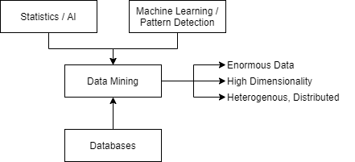
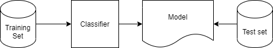

Extracting knowledge from data, especially "Big Data" - large amounts of data, from various sources, in various formats. The availability of data causes issues in our ability to process it, with our current capacity to process data vastly smaller than the amount of data being generated. Raw data is useless, data mining concerns techniques to automatically extract knowledge from it.

Information is implicit and hidden within data, it is previously unknown and potentially useful. In order to extract it algorithms need to automatically detect and extract patterns in data, strong patterns can be used to make predictions. Patterns may be obvious, or they may be spurious/imprecise in noisy/corrupted/incomplete data.

## Machine Learning Techniques

- Algorithms to automatically acquire patterns within data.
- Patterns can be used to predict.
- Can explain how a prediction is made.
- Originates from AI, statistics, and nature inspired computing.

In any machine learning algorithm bias is introduced either by the heuristics of the algorithm or by the dataset. Every algorithm use some type of heurisitcs to search for patterns. Biases are intorduced from data with imperfect training sets. Biases usually cayse smae patterns in trainign data to not manifest in future data.

### Classification

Given a collection of records (attributes, which may be class attributes) as a training set a model is found that maps attributes to a class. Previously unseen records are assigned a class as accurately as possible (from the creates model). A dataset is often divided into training (e.g. 80%) sets and testing (e.g. 20%) sets. Testing records are not used to fins a model, and do not provide their class (unlabelled). Attributes are also known as features.

Testing sets are used to measure metrics such as accuracy and recall.

## Regression

When prediciting a value we call this regression. Linear regression - a common type of regression that can predict a numerical value.
