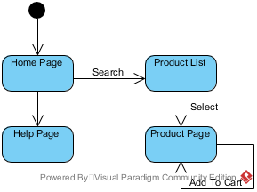

A collection of notes concerning data and process modelling

## Data process modelling

Data process modelling is a techniques to display the requirements of software to all its stakeholders.

This is done through a UML (Unified modelling language) and allows us to visualize the idea. 

- **Models** are abstract representations of a system that enables us to answer questions about the system. 
  - Models can view systems from different perspectives.
  - Models can discover causes and effects
  - Models can uncover errors and reduce defects
- **Representations** are words, pictures, formulae, simulation, data collections, or physical diagrams.

## UML

UML is an industry standard for OO design. 

UML diagrams are broken into two parts:

- Structure diagram
   - Class Diagram
- Behaviour diagram
   - Use Case Diagram
   - Activity Diagram
   - State Machine Diagram

## Stakeholders

> An entity with interests in the system, but does not necessarily use it

At the beginning of a project we must identify the stakeholders of a new system. We then must identify the context of the new system, proceeding to extract the requirements for the system. Following this models are produced.

The context in which we can extract requirements is called a scenario:

> A description of an imagined sequence of events that includes the interaction of the product or service with its environment and users, as well as interaction among its product or service components

## Writing Requirements

> A statement which translates or expresses a need.

Writing software is **iterative**, requirements should contain conditions and constraints.

- Condition: measurable qualitative or quantitative attribute that is stipulated for a requirement
- Constraint:  externally imposed limitation on system requirements, design, or implementation or on the process used to develop or modify a system

Requirement generation should follow the following steps:

- Discovery
  - Iterative elicitation, information exchange, and recording of the agreement between stakeholder and developer.
- Analysis
  - Modeling and analyzing the system. Identifying dependencies and forecasting.
- Verification
  - Frequent face-to-face meetings, product increments, reviews, and prototyping.

All requirements must meet the following criteria:

| Attribute           | Description                                                                                               |
| ------------------- | --------------------------------------------------------------------------------------------------------- |
| Necessary           | The requirement is essential, without it a defficieny will exist. It has not been made obselet over time. |
| Implementation free | The requirement avoids placing unnecessary constraints on the architectural design.                       |
| Unambiguous         | Stated in a way that it can only mean one thing.                                                          |
| Consistent          | Does not conflict with other requirements                                                                 |
| Complete            | Needs no further amplification because it is measurable.                                                  |
| Singular            | Avoid compound requirements                                                                               |
| Feasible            | Technology is capable of fulfilling the requirement                                                       |
| Traceable           | The source of the requirement is identifiable, who needs the requirement?                                 |
| Verifiable          | Can be proven                                                                                             |

Additionally requirements can be categorized as:

| Requirement   | Description                                                                   |
| ------------- | ----------------------------------------------------------------------------- |
| Functional    | Describes system functions, what does the system do?                          |
| Nonfunctional | Specifies conditions or properties the system should run under, human factors |
| Performance   | Defines the parameters under which a function should be executed under        |
| Interface     | Defines how the system should interact with external systems or users         |

## Scenarios

> A specific sequence of actions and interactions between actors and the system

- A scenario is one particular story of using a system 
- We can construct scenarios for instances of a class of actors.

A scenario shows how each actor interacts with the system to provide functional capabilities. They provide operational details for the proposed system and are a basis for developing requirement tests. 

## Actors

> An entity that interacts with the system

| Actor      | Description                                |
| ---------- | ------------------------------------------ |
| Primary    | Requires assistance of the system, a user. |
| Supporting | Provides a service to the system           |
| Offstage   | A stakeholder not using the system         |

## Use Cases

> A collection of scenarios that describe an actor using a system to support their goal

- Use cases can contain successful or unsuccessful scenarios (for example system exception handling) 

To create a use case (often a diagram):

- Identify all actors
- Identify the goals for each actor
- Describe the use case for the actors goal

This can be summarized as either:

- Top Down: Creating scenarios for instances of an actor
- Bottom up: Identifying small chunks of functionality for an actor and combining them together

Use cases must pass certain quality tests:

| Test | Description                                                                                                                       |
| ---- | --------------------------------------------------------------------------------------------------------------------------------- |
| Boss | The use case must strongly be related to achieving measurable value.                                                              |
| EBP  | Elementary business process. The use case must provide one case of value to a business, when performed by one person at one time. |
| Size | The use case must provide enough specifications to develop properly.                                                              |

**When describing use cases preconditions and alterative flows must be noted.**

## Diagrams

### Use Case Diagrams

- Show a visual context of the system
- Show the relationships between actors and the systems
- Shows the boundary of the system and what lies beyond it

Actors in a use case diagram should show inheritance with a inheritance arrow. The actions they can perform can either `<<extend>>`, or `<<include>>` another. 

| Relation | Description                                                                     |
| -------- | ------------------------------------------------------------------------------- |
| Include  | one action completely encompasses the functionality of another                  |
| Extend   | a specialisation of another action, i.e. a specific variant of another function |

### Activity Diagram

> Provides a way to describe logical sequences of activities for a particular use case.

Activity models show:

- activities
- processes
- data flows
- use cases or scenarios

Activity models are similar to a flow chart. They are used to represent **detailed user interactions**. They extend upon the use cases presented in a fully dressed use case diagram by representing **all flows in a scenario at once**.

Diagrams are usually made of the following components:

| Component             | Example                                                                  | Description                                                                                                                                                                                                                                                    |
| --------------------- | ------------------------------------------------------------------------ | -------------------------------------------------------------------------------------------------------------------------------------------------------------------------------------------------------------------------------------------------------------- |
| Initial & Field Nodes |  |                                                                                                                                                                                                                                                                |
| Actions               |                                     | Can be a task, process, sub process, or invocation of a operation.  They must have **input and output transitions**, and start with a **verb**. They can include multiple tasks (**complex**) or represent just one (**atomic**).                         |
| Transitions           |                                      |                                                                                                                                                                                                                                                                |
| Decisions             |                                   | Branches the flow of control. Branches include **guards** that prevent the transition from occurring unless the guard is met. (`"[yes]"`, `"[no]"`, `"[x > y]"` etc.) They must be **exclusive** from one another                                              |
| Synchronization Bars  |                                       | A synchronization can **fork** (split a transition), or **join** (collect two transitions). Forking represents a concurrent process. Every fork must have a join as an action requires **all** previous actions to completely execute before executing itself. |

- You a **join** should be used to synchronize concurrent processes, if no concurrency is present transitions can be **merged** instead. Which is a condition-less decision.

## Domain Model

>  Visual representations of classes in a domain

Consider that data process modelling can be used to abstract anything, from enterprise to mathematical systems. When modelling our programs we only include the relevant details, and do not abstract everything.

This is closely related to OOP, where we use objects to form the abstraction of our system, and are how we can conceptualize a system. 

Domain models:

- Illustrate relevant classes in a domain
- They do not show software classes, or include any implementation details (such as types etc.)

**Note: software class diagrams are not the same as class domain models**

Example domain model:

A domain models can contain:

| Component        | Description                  |
| ---------------- | ---------------------------- |
| Domain class     | A type of object             |
| Class attributes | A property of a class        |
| Associations     | Relationship between classes |
| Additional rules | Notes attached to a model    |

-  Attributes are seen to be rare in domain models, if the data is not directly textual or numerical data it should probably be a class
  - It will most likely be an attribute if it is a simple value

### Techniques to discover classes

**Linguistic analysis**:

Analysing the description of a situation to discover classes:

- Nouns are usually mapped to classes or attributes
  - Proper nouns are most likely instances
  - Common nouns are usually classes or attributes
- Verbs are usually mapped to associations
  - Doing verb is usually an operation (method)
  - Being verb such as "is", could be inheritance
  - Adjective can be attributes ("blue car" > colour)

### CRC

> A tool for collaborative OOP class design and identification within a team

A CRC (Class Responsibility and collaborator) card is a table showing what a class does, as well as what other classes it must use to get this job done.

| Class Name          |                                                           |
| ------------------- | --------------------------------------------------------- |
| Responsibilities    | Collaborators                                             |
| What the class does | What other classes this cc lass needs to communicate with |

An example is as follows:

| Gym Admin      |                  |
| -------------- | ---------------- |
| Add service    | Service Provider |
| Delete service | Member           |
| Book service   | Service          |

 

## Class Diagrams

> Static diagrams used to describe the structure of a system

Class diagrams show classes and their attributes, including their relationships between other classes. Class diagrams are closer to software documentation the conceptual models. Hence they provide more technical details that we exclude in other diagrams.

- Class diagrams include implementation details such as methods and attributes

| Relationship                    | Description                                                                                                                                                    | Notation                                                                              |
| ------------------------------- | -------------------------------------------------------------------------------------------------------------------------------------------------------------- | ------------------------------------------------------------------------------------- |
| Association                     | Two classes are related in a meaningful way. Often one class will provide something to another class with this type of relationship.                           |                                             |
| Generalization & Specialization | Inherits another object                                                                                                                                        |                                              |
| Aggregation & Composition       | Is made of / contains, another object. In a composition the absence of one class means the other can not exist. However with aggregation this is not the case. |    |

| Multiplicity | Description                                     |
| ------------ | ----------------------------------------------- |
| 2            | Two and only two                                |
| 0 ... 1      | Zero or one                                     |
| 0 ... *      | Zero to many                                    |
| 1 ... *      | One to many                                     |
| n            | `n` and only `n`, where `n` is greater than one |
| 0 ... n      | Zero to `n`, where `n` is greater than one      |

Class diagrams model all structures, not just classes. This includes interfaces.

## Sequence Diagrams
> A sequence diagrams is a UML diagram that depicts
interactions among various application components or participants over time, including but not limited to system objects, actors, and other systems or services, in order to accomplish a task.

 A sequence diagram is a type of interaction diagram, such diagrams:

 - Form a graphical representation of how objects communicate between and relate to one another
 - Illustrate interactions between objects in a **scenario**
 - Allow illustration of the flow of logic between system components during a scenario

An interaction diagram is static, it contains no dynamic information. It is often considered hard to move from an initial class model to modelling the behaviour of a system.
As such interaction diagrams can **identify new responsibilities** and **test use cases**.

A sequence diagram is a specific type of interaction diagram, that **is dynamic**.

- They show the time ordered sequence of messages sent between objects
- They are **real time** interactions
- They **do not** show structural relationships between objects

Sequence diagram types:
| Type                    | Description                                                                                |
| ----------------------- | ------------------------------------------------------------------------------------------ |
| System Sequence Diagram | An early stage scenario that depicts the interaction between actors and the entire system  |
| Sequence Diagram        | A later stage diagram that explores the logic and complex operations we need to understand |

### SSDs
A system Sequence diagram:

- Shows a particular course of actions in a use case
- Shows what messages are sent and when
- Shows the interaction between actors and systems (this can be multiple external systems)
- Shows the system as a **black-box**
- There are no objects etc. depicted in a SSD. As such only self messages, call messages, return messages are included (concurrency can still be used). 

> A black box specifies outputs and inputs without the internal operations used to generate and process them

| Component     | Description                                                                                                                                           |
| ------------- | ----------------------------------------------------------------------------------------------------------------------------------------------------- |
| Participant   | A system, class, object, or external actor positioned at the top of the diagram                                                                       |
| Lifeline      | Each participant has a lifeline (vertical, dashed, line) representing the time the participant exists in the scenario                                 |
| Execution Bar | A vertical bar located on a lifeline showing that during this period the participant is active                                                        |
| Messages      | Objects communicate through sending messages (invoking methods). These can be between objects, or within one object. A message results in an activity |
| Activity      | The result of a message, consisting of one or more action, either calling another method or returning something                                       |

Messages have many types:

| Message Type | Description                                                                                                                                              |
| ------------ | -------------------------------------------------------------------------------------------------------------------------------------------------------- |
| Call         | A horizontal arrow to a receiving object, including a name and any parameters to needed. These can be synchronous or asynchronous                        |
| Return       | A dashed horizontal arrow to a receiving object, including a name and names of any values returned                                                       |
| Synchronous  | The default message type, where a sender waits for processing to finish. Signified by a solid arrow head (filled 3 sided triangle)                       |
| Asynchronous | A message where the sender proceeds without waiting for processing to finish - showing concurrency. Signified by a pointed arrow head (2 sided triangle) |
| Create       | A message from a sender object that creates a new participant (object). Conditions can be included within `[...constraint here...]`                      |

An example create message in a SD not SSD:

And another example showing many principles listed above:

## State Diagrams
> State machine diagrams are a dynamic model of how an objects state changes over it's lifetime

State diagrams:
- Define complex objects
- Help define a class when modelling software
- Are useful for showing a single object's behaviour over multiple use cases
- Are not useful for showing multiple object's behaviour over multiple use cases (this is for an activity diagram)

State diagrams are used only to provide more detail of complex objects, they are made of the following:

| Component   | Description                                                           |
| ----------- | --------------------------------------------------------------------- |
| States      | Condition of an object at one moment in time                          |
| Events      | a significant occurrence                                              |
| Transitions | A relationship between two states that indicates when an event occurs |
| Actions     | -                                                                     |
| Guards      | A condition that must be met for a transition to occur                |

- Objects can be viewed as moving between states

States can be:

| Type      |
| --------- |
| Simple    | 
| Composite | 
| Start     | 
| End       | 

Events are atomic occurrences at a single point in time:
- They can be internal or external
- They label a transition, indicating that this event causes the state to change

Transitions are the response to an event:
- They represent a change from one state to another in the same object
- They can be a change to a new state, the same state, or an action
- A state change to the same state indicates that there **was no change in state**. This is known as a self transition.
- Transitions are arrows relating states

Guards specify conditions which must be true to perform a transition:
- They are evaluated prior to an action
- They can be ranges e.g. `[x < 100]`
- The state machine must already be in a state

Actions are tasks to perform in a state, they must be one of the following types:
- On entry
- Do
- On event
- On exit
- Include
**Actions can be interrupted by events**

