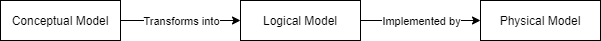
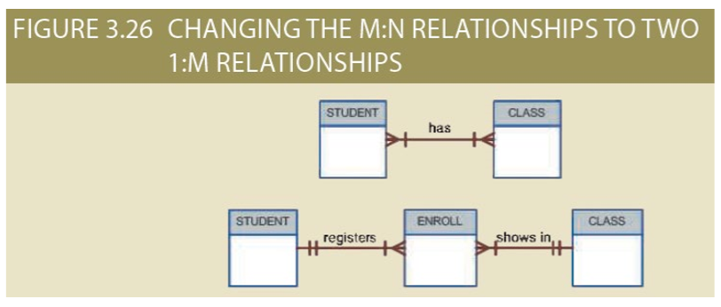
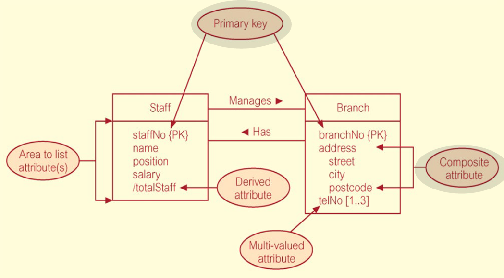
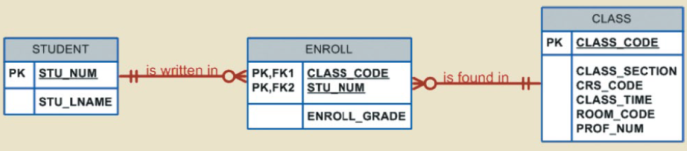
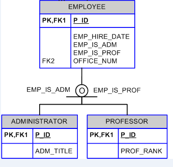
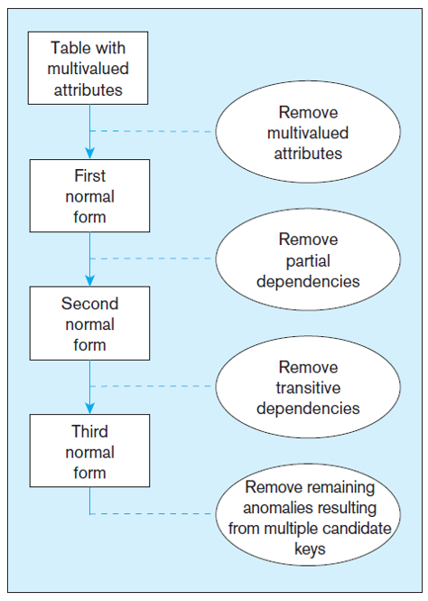

Database design, implementation, and modelling using [SQL](SQL.md).

## Databases
> An organized collection of data stored an accessed electronically.

Databases evolved from file systems. Access to data is handled through a [DBMS](#DBMS).

Databases contain two fundamental types of data:
- **End-User:** raw data of interest to the user
- **Metadata:** data that provides information about other data

Databases can be centralized, distributed, or cloud-based. Additionally they can be operational (day-to-day operations) or analytical (archiving and analysis needs)

### File Systems
> A collection of files managed by an agent and an associated program

File systems were the fundamental means to store data, and were prone to data redundancy. This then leads to updating multiple files to update data and is prone to error.

- File systems do not contain relationships between records.
- File systems struggle to maintain concurrent file manipulation. This is a write not a read issue.
- File systems require multiple programs to manage data.

## DBMS
> A collection of software that manages the database structure and controls access to the stored data.

What is a DBMS? 

- Set of software to access/manage data inside a database
- A collection of interrelated data held by an entity

|Function|Description|
|---|---|
|Data dictionary management| Definitions of data elements and their relationships|
|Data storage management| Ensuring efficient performance of the database in terms of storage and access speed|
|Data transformation and presentation| Transforming data to conform to required data structures|
|Security management| Enforces user and data security|
|Concurrency| Managing multiple users accessing the database simultaneously without compromising integrity|
|Data backup| enabling the recovery of data after a failure|
|Data integrity management|Minimizing redundancy and maximizing consistency|

A database system is made of a DBMS and database.

## Data Models
> An abstraction of a collection of related concepts used to describe the structure of a database.

Data modelling is the process of creating a data model for a problem domain. There are three categories of data models:

|Model|Description|
|---|---|
|Conceptual|**Relationships between tables** close to how the user perceives tables|
|Logical|A design implementable in a database, **a technical design of the database**|
|Internal/Physical|**The implementation of the logical model**, how the data is stored |

- The internal model contains the implementation of a logical model, in a SQL database this would be the SQL used to create the database.



### Schemas
> A schema used to describe a database

A database consists of the following schema under the three level architecture:

- External (an instance of a conceptual model similar to a use case) 
- Conceptual
- Internal/Physical

### Three Level Architecture
> Changes made at different levels of a database (conceptual, logical, physical) should nor impact one another.

The three level architecture defines that:

- All users should be able to access same data. 
- Users need not know how the database is implemented.
- changes to a schema does not affect any other.

Mappings between schemas are required so that a query at the highest level can be retrieved by the database at the lowest level. These mappings are what allows a schema to be independently changed, known as **data independence**

## Data Independence
> Isolating changes to database schemas


|Independence Level| Description | Example|
|---|---|---|
|Logical independence| Changes to the conceptual schema do not impact external views| An application or query is based off an external view, hence changing the conceptual schema do not break applications or queries already accessing the database|
|Physical independence| Changes to the internal schema have no impact on conceptual models | The application does not need to know how or where the database has stored the data, but just how to ask for it. For example changing between a DBMS does not break the database|

## Relational models
> A relational model is a logical rather than physical model of a database

A relational model will model tables, which:

- Is a 2d structure containing rows and columns
- Resembles a file conceptually

**Although 1:1 and 1:Many relationships can be implemented in a relational model, a Many:Many can not**. To get around this we use tow 1:Many relationships between a bridging table.



Within a relational model keys are used to ensure each row is uniquely identifiable. Keys are based on the concept of determination, where I can determine the value of another attribute based on another. For example if I know an ID I can determine the name of the person who has that ID, this means the name is functionally dependant on the ID.

- One attribute can be dependent on multiple other attributes (e.g. ID, CourseID -> Grade), hence a key can consist of more than one attribute.

## Keys

|Key|Description|
|---|---|
|Primary|One or more attributes used to uniquely identify a row|
|Secondary Key|An attribute used in queries that is guaranteed to be unique|
|Foreign key|An attribute in one table who's value matches the primary key in a related table, or is NULL|


**Entity integrity:**
- Primary keys can not be NULL
- Each primary key must be unique

**Referential Integrity:**

- A foreign key ensures there is a machine record stored somewhere else in the database. (e.g. If a grade is added to a student ID that does not exist there is an error)
- A foreign key can not be deleted unless there are no records that depend on it.

**Determination:** The state of knowing an attribute based on another.

## Relational Operations

|Name|Set Operation|SQL|
|---|---|---|
|Selection| - |`SELECT * WHERE ...`|
|Projection| - |`SELECT a, b, c ...`|
|Union| $\cup$ |`SELECT a, b ,c ... FROM a SELECT a, b, c ... FROM b`|
|Intersect| $\cap$ |`SELECT * FROM tablea, tableb WHERE tablea.a = tableb.b`|
|Intersect Compliment| $\bar\cap$ |`SELECT * FROM tablea, tableb WHERE NOT tablea.a = tableb.b`|
|Cartesian Product| $\times$ |`Select a, b, c FROM tablea, tableb`|

### Joins
> Types of intersection operations

- Equijoin: Find two common columns between tables `SELECT * FROM tablea, tableb WHERE tablea.a = tableb.b;` **Uses an equality operator**
- Outer join: Include values which are not present in both tables as well `SELECT * FROM tablea, tableb WHERE tablea.a(+) = tableb.missing_attribute;`
    - Include a `(+)` on the side where the value is missing
- Self join: Joining a table to itself to use a foreign key as a primary key present in the same table. 

## Entity Relationship Diagrams
> Expresses the logical structure of a database by the relationship between entities

- An ERD communicates the requirements of a database between different users (end users, developers etc.).
- An ERD communicates the domain of a database.
- Nouns are used to identify entities and verbs identify relationships.

Entities are distinguishable between each other, and can be described by a set of attributes which are either required or optional. The domain refers to the possible values these attributes can be. 

- **Identifiers** refer to attributes that can identify an instance of an entity.
- Composite attributes can be divided into multiple simple attributes (e.g. a phone number has an area code, exchange number, and a four digit number).
- Simple attributes can not be subdivided.
- Attributes which can have multiple values are called multi-value. (E.g. an employee can have many phone numbers)



### ERD Relationships

Entities also contain relationships between one another. Each relationship has a connectivity (multiplicity). This can be 1:1, 1:Many, or Many:Many. A cardinality may also specify the maximum number of relationships an entity can have (e.g. `(1,4)` describes 1 entity `a` can have a relation with 4 `b` entities). 

- A relationship **has** to be bidirectional
- The participation of a relationship specifies whether an entity must have a relationship of this type.
- A relationship can involve multiple entities, this is called the relationship degree

|Degree|Number of Entities|Description|
|---|---|---|
|Unary|1|Self-relation|
|Binary|2|One entity relates to another|
|Ternary|3|One entity relates to two others|

A relationship is specified by the following syntax:

```
{Entity_1} {Participation} {Verb} {Multiplicity} {Entity_2} where {Query}
```

For example: `STUDENT may have many ENROLLMENT` or `STUDENT must have at least one LECTURER`

Participation and cardinality is visualized with the following symbols.


### Dependency
> Entities that only exist when another entity exists in a database are dependent.

Dependency describes the conditions for an entity to exist in a database, this can be:

- Existence Dependant: The entity only exists when it is associated with another entity that also exists within the database, known as weak existence. 
- Existence Independent: The entity exists regardless of if it's related entities exist in the database. Known as a strong entity.

A **weak** relation is said to occur when the primary key of the related entity does not contain a component (a part of a value) from the parents primary key. When the related key does contain a component of the parents primary key this is called a **strong** relationship.

**A weak entity must be existence dependant and have a strong relation to the other entity**. A strong entity must be existence independent and have a weak relation.

### Associative Entities
> AKA bridge entity, associative entities are used to create Many:Many relationships.

An associative entity creates a M:M relation by being in a 1:M relation with both parents. It must contain the primary key of both parents.



## Extended Entity Relationships
> Adding additional semantics such as sub and super types to an ERD is called an EER (Extended Entity Relationship)

EERDs are conceptual models.

- Subtype: A specialization of a supertype that provides additional attributes or relationships.
- Supertype: A generic entity type that has a relationship with one or more subtypes

Attribute Inheritance:
- Subtype entities inherit values of all attributes of the supertype
- An instance of a subtype is also an instance of the supertype
- Relationships are also inherited from supertypes

### Completeness Constraints
> Completeness constraints specify whether an instance of a supertype must be an instance of a subtype as well. (The subtype eg. student must be a specific type of student as well)

Partial completeness

- Symbolized by a circle over a single line
- An instance of the supertype does NOT have to be a member of a subtype

Total completeness

- Symbolized by a circle over a double line
- Every supertype occurrence must be member of at least one subtype

### Disjoint Constraints
> Disjoint constraints specify whether a supertype instance can be an instance of more than one subtype.

- Disjoint rule: A supertype must be an instance of only one subtype. This is indicated by a `d` inside the circle of a completeness constraint.
- Overlap rule: A supertype may be an instance of more than one subtype. This is indicated by a `o` inside the circle of a completeness constraint.

|Disjoint|Overlap|
|---|---|
|||

## Normalisation
> A tool to validate and improve a logical design so that it meets certain requirements without duplicating data, such as CRUD.

Often a design may contain anomalies that cause CRUD functions to cause inconsistency in data. Anomalies can be:

- Insertion Anomaly: adding new rows forces user to create duplicate data. For instance if to add a new product I had to add a new order.
- Deletion Anomaly: deleting rows may cause a loss of data that would be needed for other future rows
- Modification Anomaly: changing data in a row forces changes to other rows because of duplication

Normalisation goes through forms to remove these issues. Generally 1st, 2cnd, and 3rd normal forms are performed.



## Transaction Management
> Managing units of work inside a database

A transaction changes the contents of a database, they must be either committed (applied), or rolled back (aborted). A transaction can consist of many statements, a transaction ends when it is committed. 

- Transactions must be atomic, all operations in a transaction must be able to be completed (or none of them will be applied).
- A transaction must maintain all the integrity rules of a database, known as consistency.
- Transaction data must be isolated, data used during one transaction cannot be used by a second until the first is committed.
- **Once transactions are committed they can not be undone**, this is called durability.

A DBMS stores all transactions into a transaction log.

## Concurrency
> Controlling multiple users requesting the same resource at the same time.

Concurrency control ensures users can not impact each other. Each transaction should be **serializable**, a property allowing concurrent transactions to produce the same final state. This presents some challenges:

- Lost updates: one concurrent transaction is lost, and the final state only reflects the other transaction.
- Uncommitted data: one transaction rolling back after another concurrent transaction has accessed the uncommitted data.
- Inconsistent retrieval: transactions reading data at different times allowing one transaction to "miss" changes to data as they happen.

A DBMS has a scheduler to execute transactions at different time to ensure serializability and isolation. Using `locks` we can guarantee exclusive access to an item within a concurrent transaction. A `lock manager` is responsible to assign the properties of each lock. Locks can be applied to a database, table, page, row, or field.

- Locks are only unlocked once a transaction is finished (committed or rolled back)
- Page locks' lock partitions of a database that are stored in disk blocks. Many disk blocks (of a physical disk) may be used to store a table, when one transaction accesses information in a block the entire block is locked until the transaction is finished.
- When two transactions try to access a locked resource by one another we get a deadlock, where both transactions infinitely wait for each other to unlock the resource.  


[Top](#Database-Design)