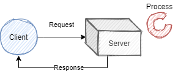
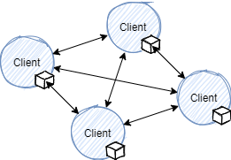
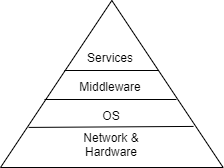
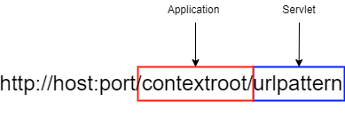

A distributed system is one in which components at networked computers coordinate their actions only by passing messages.

## Characteristics of Distributed Systems

> Distributed systems want to share resources.

- **Concurrency**: distributed systems are highly concurrent, and share each other's resources. "I can do my work, and you can do yours. We can share each others resources when needed.".
- **Global Clocks**: distributed systems rely on close cooridnation to efficiently send and respond to messaging between components. This depends on a shared understanding of time in which there are limits to the accuracy of clock synchronization. 
- **Independent failures**: distibuted systems may fail in a way not immediately knwon to the rest of the system, failing independantly. It is important to for such systems to be "fault tolerant".
- **Transparency**: although made of many shared resources a distributed system must interact with other systems as one computer, and appear as so to external clients.
- **Scaling**: the architecture of distributed systems should respond as well as possible to new nodes and components. Introducing new clusters et al. should not slow down the system.
- **Heterogeneous**: Components are not all the same, and vary in many ways - including vendors.

## Internet Protocols

> Distributed systems use internet protocols to coordinate messages. The protocols used are independant on the OSI model, and often send via IP through a secondary protocol, such as TCP.

**Internet Protocol**: Repsonsible for routing packets and is limited in length. Additionally the IP v4 protocol resevres 64 bits for addresses, whilst v6 reserves 128.

**Transmission Control Protocol**: Sits a layer above IP, Capable of subdividing data into packets and reassembling them in order. The extra reliability measures introduce overhead to TCP.

- Establishes bidirectional connections
- Includes packet checksums
- Controls transmission rate

**User Datagram Protocol**: Encapsulares data into IP packets called datagrams. There is no connection established, and this is why UDP is known as connectionless, meaning that packets are sent to the destination whether it is open or not. This is the main reason UDP has negligable overhead and is a "fast" communication.

Note that IP can only route between computers, and inter-process communciation requires TCP or UDP. All communication needs to be sent to a port, so that the client (and host) can maintain multiple streams of communcation at once. Applications use a socket construct to attain a port, and bind a data stream to it. Hence a port exists within the host os whilst a socket is an abstraction allowing interfaces.

In general a server and a client will open a socket. The client will connect to the port of the server socket, whilst the server socket will actively listen for any incoming requests (TCP) or accept data on the sockets input stream (UDP). When running via the TCP protocol the server will track each connected socket, and respond individually (bi-directional communication).

```
(server)
socket <- create socket
loop:
    if socket.listen:
        thread <- create thread
        thread.run:
            obtain streams from client socket
            read/write to streams
            close streams
            close client socket

(client)
socket <- create socket
obtain streams from socket
read/write to streams
close streams
close socket
```

## Architectures

...topic reserved for future... 

### Client-Server



### Peer to Peer

In a peer to peer architecture clients are also servers, any node can request a service from another, which can then do the same (aka proxy).



## System Models

> Models describing the design of and implementation of distributed systems

|Model|Description|
|Physical|Representation of hardware elements that abstract away specific details of the computer and network technologies used within the system|
|Architectural|The sturcture of the system in terms of seperated components and their inetrrelationships|

### Architectural Models

Architectural Models answer:

- What entities exist in the system?
- What communication paradigm is used?
- What roles do they have in the overall architecture?
-  What is their placement?

From a systems-level perspective all coounicating entities are processes, however from a programming persepective these could be ojects, software components, or web services. The communication between these is supported by a paradigm, which could include:

- Interprocess communication
- Remote Invocation
- Remote Procedure Calls
- Remote Method Invocation

Paradigms that do not require a sender to know of the receiver exist to decouple systems. This is known as third party communication and include publish-subscribe and message queue systems.

## Architectural Patterns

> Design patterns used in architectural models reffered to as architectural patterns. 

### Layering

> Partitioning a system into layers where each layer can interact with the layer below it (without knowing it's implementation) but none further beneathe - offering software abstraction.



## Hypertext Transfer Protocol

Http is a request-reply protocl on the application layer. Sitting atop TCP it can reuse TCP connections over multiple requests to a server.

- HTTP is stateless, no client information is saved between requests and each request is independent. All client information is setn with each request.
- As it is stateless sessions are not stored *in the protocol*

Requests appear in the form (all `{xxx}` are fields replaced by an appropriate type):

```
{METHOD} {URI} HTTP/{VERSION}
HOST: {DNS NAME}
{HEADERS}

{BODY}

```

- Within a URI parameters can be sent following a `?` as key-value pairs. They can not contain special HTTP characters, and must be url-encoded.

Responses appear in the form:

```
HTTP/{VERSION} {STATUS CODE(3 digits)} {STATUS MESSAGE(string equivelant)}
{HEADERS}

{BODY}

```

Headers are written in the form:

```
{HEADER NAME}: {VALUE 1}, {VALUE 2}, {...}
```

### Session Tracking

Web servers employ various techniques to track sessions as a result of HTTP being stateless. This invovles including session IDs with client requests which map to a session stored on the server. This can be done using many techniques

|Session Tracking|Description|
|----------------|-----------|
|Cookies|Persistent storage placed on the client containing the session ID, as instructued by a server's response|
|URL rewriting|Server responses re-write all URLs to include the session ID as a parameter|
|Hidden form fields|Hiding (making invisible) form fields that send the session ID as a field when submitted. Although this is rather unorthodox nowadays.|

## Web Servers

Web servers are generally used to support the OSI layers underneathe applications and services. Handling protocols such as TCP and HTTP for developers.

> Java EE uses servlets to respond to requests handled by a server. In general a servlet is responsible for one resource. Web servers implementing Java EE manage containers, which in turn manage servelts. Destroying and instantiating servlets as requestes are made - and often offer a load balancer - known as managed code.



Web servers will often implement session tracking, allowing services and applications atop to querry HTTP sessions without manually implementing session tracking techniques. Forwarding requests once inside the server (by a server resource etc.) is known as dispatching. This allows us to store state in the request and send this to another resource. 

> Java Beans are java objects that allow a request to store state when dispatched. They have no paramters in the constructor and provide methods to get and set fields within themselves. Beans are limited to per request, session, and application scopes. 