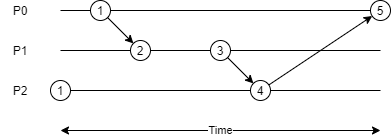
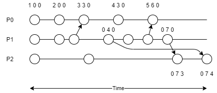
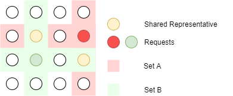

A distributed system is one in which components at networked computers coordinate their actions only by passing messages.

## Characteristics of Distributed Systems

> Distributed systems want to share resources.

- **Concurrency**: distributed systems are highly concurrent, and share each other's resources. "I can do my work, and you can do yours. We can share each others resources when needed.".
- **Global Clocks**: distributed systems rely on close cooridnation to efficiently send and respond to messaging between components. This depends on a shared understanding of time in which there are limits to the accuracy of clock synchronization. 
- **Independent failures**: distibuted systems may fail in a way not immediately knwon to the rest of the system, failing independantly. It is important to for such systems to be "fault tolerant".
- **Transparency**: although made of many shared resources a distributed system must interact with other systems as one computer, and appear as so to external clients.
- **Scaling**: the architecture of distributed systems should respond as well as possible to new nodes and components. Introducing new clusters et al. should not slow down the system.
- **Heterogeneous**: Components are not all the same, and vary in many ways - including vendors.

## Internet Protocols

> Distributed systems use internet protocols to coordinate messages. The protocols used are independant on the OSI model, and often send via IP through a secondary protocol, such as TCP.

**Internet Protocol**: Repsonsible for routing packets and is limited in length. Additionally the IP v4 protocol resevres 64 bits for addresses, whilst v6 reserves 128.

**Transmission Control Protocol**: Sits a layer above IP, Capable of subdividing data into packets and reassembling them in order. The extra reliability measures introduce overhead to TCP.

- Establishes bidirectional connections
- Includes packet checksums
- Controls transmission rate

**User Datagram Protocol**: Encapsulares data into IP packets called datagrams. There is no connection established, and this is why UDP is known as connectionless, meaning that packets are sent to the destination whether it is open or not. This is the main reason UDP has negligable overhead and is a "fast" communication.

Note that IP can only route between computers, and inter-process communciation requires TCP or UDP. All communication needs to be sent to a port, so that the client (and host) can maintain multiple streams of communcation at once. Applications use a socket construct to attain a port, and bind a data stream to it. Hence a port exists within the host os whilst a socket is an abstraction allowing interfaces.

In general a server and a client will open a socket. The client will connect to the port of the server socket, whilst the server socket will actively listen for any incoming requests (TCP) or accept data on the sockets input stream (UDP). When running via the TCP protocol the server will track each connected socket, and respond individually (bi-directional communication).

```
(server)
socket <- create socket
loop:
    if socket.listen:
        thread <- create thread
        thread.run:
            obtain streams from client socket
            read/write to streams
            close streams
            close client socket

(client)
socket <- create socket
obtain streams from socket
read/write to streams
close streams
close socket
```

## Architectures

...topic reserved for future... 

### Client-Server


### Peer to Peer

In a peer to peer architecture clients are also servers, any node can request a service from another, which can then do the same (aka proxy).


## System Models

> Models describing the design of and implementation of distributed systems

|Model|Description|
|Physical|Representation of hardware elements that abstract away specific details of the computer and network technologies used within the system|
|Architectural|The sturcture of the system in terms of seperated components and their inetrrelationships|

### Architectural Models

Architectural Models answer:

- What entities exist in the system?
- What communication paradigm is used?
- What roles do they have in the overall architecture?
-  What is their placement?

From a systems-level perspective all coounicating entities are processes, however from a programming persepective these could be ojects, software components, or web services. The communication between these is supported by a paradigm, which could include:

- Interprocess communication
- Remote Invocation
- Remote Procedure Calls
- Remote Method Invocation

Paradigms that do not require a sender to know of the receiver exist to decouple systems. This is known as third party communication and include publish-subscribe and message queue systems.

## Architectural Patterns

> Design patterns used in architectural models reffered to as architectural patterns. 

### Layering

> Partitioning a system into layers where each layer can interact with the layer below it (without knowing it's implementation) but none further beneathe - offering software abstraction.


## Hypertext Transfer Protocol

Http is a request-reply protocl on the application layer. Sitting atop TCP it can reuse TCP connections over multiple requests to a server.

- HTTP is stateless, no client information is saved between requests and each request is independent. All client information is setn with each request.
- As it is stateless sessions are not stored *in the protocol*

Requests appear in the form (all `{xxx}` are fields replaced by an appropriate type):

```
{METHOD} {URI} HTTP/{VERSION}
HOST: {DNS NAME}
{HEADERS}

{BODY}

```

- Within a URI parameters can be sent following a `?` as key-value pairs. They can not contain special HTTP characters, and must be url-encoded.

Responses appear in the form:

```
HTTP/{VERSION} {STATUS CODE(3 digits)} {STATUS MESSAGE(string equivelant)}
{HEADERS}

{BODY}

```

Headers are written in the form:

```
{HEADER NAME}: {VALUE 1}, {VALUE 2}, {...}
```

### Session Tracking

Web servers employ various techniques to track sessions as a result of HTTP being stateless. This invovles including session IDs with client requests which map to a session stored on the server. This can be done using many techniques

|Session Tracking|Description|
|----------------|-----------|
|Cookies|Persistent storage placed on the client containing the session ID, as instructued by a server's response|
|URL rewriting|Server responses re-write all URLs to include the session ID as a parameter|
|Hidden form fields|Hiding (making invisible) form fields that send the session ID as a field when submitted. Although this is rather unorthodox nowadays.|

## Web Servers

Web servers are generally used to support the OSI layers underneathe applications and services. Handling protocols such as TCP and HTTP for developers.

> Java EE uses servlets to respond to requests handled by a server. In general a servlet is responsible for one resource. Web servers implementing Java EE manage containers, which in turn manage servelts. Destroying and instantiating servlets as requestes are made - and often offer a load balancer - known as managed code.


Web servers will often implement session tracking, allowing services and applications atop to querry HTTP sessions without manually implementing session tracking techniques. Forwarding requests once inside the server (by a server resource etc.) is known as dispatching. This allows us to store state in the request and send this to another resource. 

> Java Beans are java objects that allow a request to store state when dispatched. They have no paramters in the constructor and provide methods to get and set fields within themselves. Beans are limited to per request, session, and application scopes. 

## Server Pages

Server pages are static HTML documents containing special elements capable of calling dynamic code.

> Java EE uses JSP (java server pages), whilst other popular frameworks include ASP for .NET core.

Server pages allow servers to repond with dynamic content to a client, without manually writing HTTP responses. Server pages are translated and compiled into servlets during the build process - which means server pages are compiled into servlets (they have access to beans etc.).

- Server pages generally provide annotations or other language consturcts to define constants for the page to use. However an older pattern is to provide an external configuration file that the page reads.

Server pages are written as static HTML documents which are compiled into servlets, allowing code to be included in the source HTML, which is executed as code. Java EE calls their version of server pages JSP (Java server pages) but other popular frameworks exist. For example in .NET ASP & ASP core exist.

## JSPs

JSPs use a variety of tags to perform certain actions. Server pages can use beans and request objects just as a servlet could.

|JSP Element|JSP Syntax|
|-----------|----------|
|Comment|`<%-- --%>`|
|Directive|`<%@ page ... %>` `<%@ include ... %>` etc.|
|Declaration|`<%! ... %>`|
|Expression|`<%= %>`|
|Scriptlet|`<% ... %>`|

They also have access to in built servlet objects:

* request
* response
* out (JspWriter)
* session (HttpSession)
* application (ServletContext)
* config (ServletConfig)
* pageContext
* page (reference to compiled servlet)

Server pages can access beans using the following tags:

```
<jsp:useBean id="beanName" class="beanPackage.beanClass" scope="beanScope"/>
<jsp:setProperty id="beanName" property="propName" value="value"/>
<jsp:getProperty id="beanName" property="propName"/>
```

Furthermore custom tags can be defined, the JSTL (JSP standard tag library) includes many. These tags are associated with a prefix (a prefix appears where jsp was written above), and the page must declare the location of each tags definition.

|Library|Prefix|URI|
|-------|------|---|
|Core|`c`|http://java.sun.com/jsp/jstl/core|
|XML|`x`|http://java.sun.com/jsp/jstl/xml|
|Format|`fmt`|http://java.sun.com/jsp/jstl/fmt|
|SQL|`sql`|http://java.sun.com/jsp/jstl/sql|
|Functions|`fn`|http://java.sun.com/jsp/jstl/functions|

```
# use core JSTL directive
<%@taglib prefix="c" uri="http://java.sun.com/jsp/jstl/core"%> 
```

## Databases
> Scaled applications look to highly optimise the application models.

Databases are teh defacto means to store an applications model, they may be relational, time-series, noSQL, or even maps/memory databases. Connecting to a database is resource intensive, hence in scaled applications we **do not want to create a connection to the database manually**. Instead we use a connection pool, which are collections of connections allocated to a database on a server which we can open and close without creating or destroying a new connection. As such connection pools have a limited number of connections.

* Pools create connections when a server starts up
* Application servers generally include a connection pool and pool managers

Furthermore we can utilise naming services to directly inject (resource injection) connections as data sources into distributed objects. Naming services allow connection pools to be named on disk, and can inject a data source (connection) directly into an object. 

Further optimisations can even be made to SQL or other database queries. Prepared statements allow us to construct queries with wild cards and optimise the resources used to access said tables etc. on the database at compile time. Wildcards can then be replaced at runtime.

## ORM
> Object relational mapping

Instead of directly executing queries it is common to map the relationships between entities in a databse to objects, and then use a persitence service to serialize and deserialize objects to the database. 

Java EE incorporates an ORM and persistence API by default, called the JPA. 

## Time

> Synchronising clocks and identifying the system state with time inconsistencies.

Every processor has an internal clock which is not guaranteed to be synchronised with others in the system. For processors running at high speeds this can cause wasted clock cycles. Clocks can not be perfectly synchronised but their are algorithms that can give the system one representation of a plausible time between all computers. Timestamps can be coordinated within 10ms of UTC using the network time protocol.

As such distributed systems have no absolute time, instead time is used as a logical sequence. An order in which events occurred.

### Christians' Algorithm

> Incorporating a time server

One computer acts as a time server, when each other processor wants to query the time they send a request to this server. The round trip time is measured from the point the request is sent to the time when the response is received. One leg (half) of this trip time is added to the returned time to account for how long the time query took. Using this method time should be consistent to the time servers clock.

### Berkley Algorithm

> Time servers using averaging techniques between all times to form an expected real time.

The time server is called a "time master" in such the Berkley algorithm. This processor sends a broadcast to all processors, querying their time. One leg of the round trip adjusts the returned times for each processor and the average of all times is calculated (including the masters' time). This is the "expected real time". Each request from other processors send their own timestamp and is checked against this time, it is then adjusted if it is faster or slower than the average time.

### Happened-Before Diagrams

A happened before diagram can map events on each processor and messages sent between processors on a timeline. This creates an order of events, even though the exact time is unknown. 

- Any event that sends a message must happen before the event receiving it.
- This order of events is only a **partial order**.


### Lamport Timestamps

> A timestamp used to count events, attempting to create an order of events over multiple processes

A lamport timestamp counts events on each process, when a timestamp is received with a message that process ensures it's counter is greater than the received counter.



## Vector Timestamps

> A multi-dimensional lamport timestamp

Vector timestamps keep a lamport timestamp for each process in a vector. When a vector is smaller in all dimensions than another it is guaranteed to have happened before the other.

- Lamport timestamps are updated independent of one another, as shown below.



## Global Snapshots

> The state of all processes at some point in time including any messages in transit.

A snapshot shows a plausible state of the system at some point in time, it is not guranteed to have occurred. But based on the messages and events between processes it is vaible that it was.

- Used for logging
- Capable of restoring a system
- Increases in reliability

A snapshot can be taken via a cut. A cut partitions events (as seen in a happened-before diagram) into two sets, those that happened after the cut and those before the cut. A cut is called consistent if \\(\forall (e \rightarrow e\prime) \implies (e \land e\prime) \in S\\) (the receive event and request event belong in the same partition).

### Chandey Lamport Algorithm

> An algorithm to take a global snapshot.

Every process maintains a list of messages for each neighbour. When a marker message is recieved from a neighbour a process captures it's state, and continues to populate each list every time a message is sent to that process. When it's own state hase been captured a marker message is broadcast to all neighbours. Once a marker message is received from a neighbour whilst the given process is recording, that neighbour is said to be complete and the given processor stops capturing messages sent to that neighbour. Once a process stops monitoring messages to all neigbours it sends back it's local snapshot to the intiator.

- A neighbour is a process able to directly communicate with another.
- The initiator is the first process to broadcast a marker message.
- This assumes messages arrive in FIFO order
- This also assumes every processes is a neighbour of every other.

As a result the Chandey Lamport algorithm can list all messages in transit during a snapshot.

```
if m is marker:
    if not selfComplete:
        capture current state
        selfComplete <- TRUE
        broadcast marker to each neighbour
    neigbourComplete[sender] <- TRUE
    if selfComplete and every neighbourComplete:
        send snapshot to initiator
else:
    if selfComplete and not neighbourComplete[sender]:
        neigbours[sender] append m
    process m
```

## Global State Predicates

> Assertions made about the state of a system.

Predicates are statements made about a system, which we assert to be true or false. Some examples include:

- Has algorithm `x` finished?
- Is system `x` in a deadlock?
- Does object `x` have any references?

Predicates can be either stable or unstable. Stable predicates can never change back to false once being asserted as true, but unstable predicates can fluctuate between true and false at any time.

An important algorithm in global state predicates are diffusion algorithms.

|Diffusion Algorithms|
|--------------------|
|Algorithms that start on one process and start jobs on many other processes. When a job is active it can send outbound messages, when a job finishes it becomes passive. Once all jobs are passive the algorithm terminates.|

### Dijkstra-Scholten Algorithm

> An algorithm to determine if a diffusion algorithm is complete.

A Dijkstra-Scholten algorithm builds a tree of all active processes in an algorithm where the root node is the first active process. When a process activates another process it adds it as a child node if it does not already exist in the tree. Nodes are removed once they have only passive children and once the tree is empty the algorithm is said to be complete.

### Detecting Deadlocks

Deadlocks occur when a process depends on another process to finsih, yet that process has either a trasnitive or direct dependency on the initial process. Hence the process, and any others involved, perpetually wait on each other to finish.

A wait-for graph can be built to model the dependencies between processes. If the graph becomes closed a system is possibly in deadlock. One algorithm to detect this is the Marzullo-Neiger algorithm.

### Marzullo-Neiger algorithm.

> An algorithm to assert unstable predicates. 

Whenever a processes state changes in a way that may affect a predicate a message is sent to amonitoring process. This message only includes relevant state information and a vector timestamp. This monitoring process keeps a list of messages for each process - ordered by timestamp.

A monitoring process calculatess all possible consistent cuts in chronological order. From any given cut the proceeding cut is found by advancing through the list of messages.

If the predicate is true in any cut it is said to be possibly true. When a cut where the predicate is true is found recursive back-tracking allows the monitoring process to determine if teh sequence of all reachable states result in the predicate being true at some cut. In such a case the predicate is said to be definitely true.

## Resource Coordination

> Controlling concurrent access to shared resources.

A resource coordination algorithm is mutually exclusive:

- Only one process at a time is granted access.
- Every request is eventually granted access.
- Requests are granted access in chronological order.

### Central-Server Algorithms

A single server is elected to cooridnate resourcce access. Requests are sent to this server where they are added to a queue, which are sent a granted response when they are given access to the resource in question. Once a resource has been used a completion message is sent back to the server, unlocking the resource.

Cental-Server algorithms are not fault-tolerant. Failures to the server can cripple a system and poor performance can bottleneck the entire system.

### Token Ring Algorithms

Given a network of nodes arranged in a ring topology a token is passed around the ring. Whilst a node holds the token for a given resources they aree granted permission to access it. Any node must wait for the token to arrive, and as such there is no gaurantee that access is granted in chronological order.

- In a situation where no node is accessing the resource redundant messages are used to pass the token arounf the ring continuously.
- Binary variants arrange nodes in a binary tree, causing access to change from O(n) complexity to O(log n)

### Ricart-Agrawala Algorithm

The Ricart-Agrawala algorithm relies on broadcast messages to each node in a network and an instance is run on each node. When a node wants access to a resource it broadcasts a request message and awaits a granted response from each peer in the network (every other node must grant access). Each node must maintain a queue of incoming requests in order to respond to each request chronologically. 

- Central-Server algorithms are variants of Ricart-Agrawala Algorithms
- O(n) complexity
- Concurrent requests are reolved through chronological priority, however if two requests are considered chronologically equal MAC or IP addresses as an unbiased way to assign access (where the biggest address has priority).

### Makawa's Voting Algorithm

In Makawa's voting algorithm each process is assigned a representative. When a process requests access it sends a request to it's representative. If two processes request access to the same resource they must share a common representative amongst their voting sets (A process may have many representatives known as a set).

- Ricart-Agrawala is a variation of a voting algorithm where every node has n-1 representatives.
- By assigning representatives it is possible to reduce the complexity of O(n) resource coordination algorithms.



## Leader Election

Throughout a distributed system many servers will have to perform a specific operation. Leader elections execute algorihtms that select one algorithm to perform a given operation, which could be to cooridnate a larger distributed algorithm as well. This relies on some wat to distringuish between nodes, especially in peer to peer systems.

### Chang-Roberts Leader Algorithm

Given a topological ring of processes each node is given a UUID, of which any can start an election. An election passes an election message around the ring containing the proposed leaders ID (the initiator must propose itself). If a receiving node has a greater ID it will replace the proposed leader with itself, then the message is forwarded to its successor. Once a node receives an election message with it's own ID the process terminates and that node is said to be "elected".

- Once a node has voted (by forwarding the message) it's participant flag on that election is set, preventing it from voting twice on one election (critical for the algorithm to terminate).
- Only one election can run for each task concurrently. Many elections can run on one system.
- Once a leader is elected a leader message is broadcast to all nodes.

### Bully Algorithms

Bully algorithms are a form of leader elections designed to be crash tolerant. In ring based elections if a process crashes it's leader is lost forever.

A bully algorithm broadcats one election message to all nodes with a greater UUID. Once the max node recieves the election messsage it broadcasts a leader message.

By assuming the system is synchronous an upper time limit is impose on the leader response. If the most recent node to broadcast an election message does not recieve a response within this time it assumes it is the node with the biggest UUID - which hasn't crashed. It then assumes the role of the leader.

## Consensus Problems

When multiple processes propose a given value a system must be abke to come to a consensus on what value to use. This is described by:

- Termination: each non-faluty process does eventually decide on a value to use.
- Agreement: all non-crashed processes agree on the same value
- Validity: if all processes propose the same value then that is the decided value.

### Crash Consensus Algorithms 

Crash consesus algorithms are distributed algorithms which assume the system is synchronous. Given this assumption we can give an estimate of the maximum number of processes which may crash during the algorithm - let this be \\(f\\). Subsequently we perform \\(f+1\\) round of broadcasting where:

- Each process broadcasts a proposed value - which initially is the value it proposes.
- Every round nodes will receive peers' proposed values - these are added to a list of known values.
- Each round any value that was received but has not yet been broadcast does so.

After \\(f+1\\) rounds all nodes will contain a list of the same known values, then an auxillary algorithm can use this state to come to a consensus by calculating a resulting value.

## Remote Method Invocation

Remote method invocation (and RPC - remote procedure calls) are common middleware that allow objects/methods to be called on a process on a different machine in a native way. Underneathe these protocols use network messaging to route messages between processes.

RMI enables an isntance to point to an object on a remote process. Note that the instance on the local process is not a pointer to memory on a remote machine, but a reference to a local object who forwards calls to it's interface to an object on a remote machine. To do so RMI maintians a registry. Instances can be registered in a registry, which other clients can lookup via some ID.

A registry is responsible for returning a proxy (as described above) when an object is looked up. This proxy (AKA stub) imitates the remote object and implements all methods defined by an objects remote interface with TCP messaging. When invoked parameters are serialized, as are objects returned by the remote instance. 

*In Java a remote interface must extend `java.rmi.Remote` and methods must throw a `RemoteException`.*

## Enterprise Java Beans

EJBs (or enterprise java beans) are reusable server-side units of logic. Although EJBs are a Java technology they implement many distributed concepts which are agnostic. Specifically EJBs simplify the salability of an application and run inside an EJB container on an application server. 

EJBs typically provide a service or funtion to the rest of the system and are provisioned by the application server enterprise bean container. As such they are managed code which benefit from injection, load balancing, multithreading etc.

There are two types of EJB, session and message driven beans.

### Session Beans

Session beans handle one session with a client. This is client is almost never the user, but another part of the system. Sessions can be:

|Type|Description|
|----|-----------|
|Stateful|Instantiated for a client specifically, and it's state holds infomration for that client. This could be confidential, hence the application server needs to gaurantee the bean is never given to the wrong client session.|
|Stateless|A reusable bean instantiated from a pool of beans. A stateless bean contains no state about the client it is serving and is atomic. As such an application server can perform many operations on them to increase performance, throughput, and scalability.|
|Singleton|A bean with at most one instance at all times. These are often used to provide some kind of configuration service.|

- A stateful session bean always points to the same object. When memory is running low an application server will passify (serialize) the bean to disk.
- Stateless session beans can point to any bean available in a stateless pool. As soon as the been has been invoked and finished executing it can be garbage collected to conserve memory. A reference is gauranteed to always point to a reference in the pool.
- EJBs can be injected from a pool using dependecy injection (annotate reference with `@EJB`)
- EJBs are often used as DAOs (data access objects) which wrap calls to the application model (JDBC, JPA etc.).  

## SOAP Web Services

A web service provides remote functionality through loosely coupled machine-to-machine communication hosted on a web server, where its clients will be other applications. Web services are almost exclusively HTTP based and as such are much slower than RPC based communication. 

SOAP (Simple Object Access Protocol) is a widely used standard describing web service messages in XML. SOAP messages are one-way tranmsissions of XML encoded data defining the name of a web service function and the data it requires. 

Java EE provides the `javax.jws` package to create and interact with SOAP services. Classes annotated with `@WebService` become managed code on an application server, methods exposed over the service via `@WebMethod` annotations serialize the inputs and outputs of the function via the JAXB API.

A SOAP service is described by a WSDL (web service description language) XML document which defines the ...

- types
- types of messages
- faults (exceptions)
- operations (methods)
- network protocols
- URI locations

... visible to clients.

A WSDL is often imported to Java clients with the wsimport tool - which creates class definitions from the declarations within a WSDL. Java EE Clients will often use dependecy injection to obtain defintions from a WSDL via an application server.

SOAP is particularly suitable to implement complex or asynchronous, stateful services. Or where transactional, security, or reliability measures are important.

## REST Web Services

REST is an architectural pattern which views web services as a resource identified via a URL, which runs on **stateless** servers. REST services use HTTP methods to describe operations to perform at a given URI. 

|Method|Intent|
|------|------|
|GET   |Read a resource|
|PUT   |Create a resource|
|POST  |Update a resource|
|DELETE|Delete a resource|

Restful web services transmit data in any format supported by HTTP, such as: JSON, XML, Plain Text etc. Because REST APIs are stateless they are seen as simpler and cheaper to implement than SOAP APIs. REST services are particularly suitable in request-reply designs, situations where requests can be cached, or in highly scalable services.

Java EE REST services are created through annotaions in the `javax.ws.rs` package to design REST Servlets.

|Annotation|Description|
|----------|-----------|
|`@path`|Specify the path of the servlet, and relative path of a method|
|`@GET`|Specify a method responds to the GET (or other) HTTP method|
|`@consumes`|Specify the content type of the request body|
|`@produces`|Specify the content type of the response body|

## Enterprise Messaging

A form of middleware, enterprise messaging systems allow components of a distributed application to send messages between each other asynchronously. Each component does not need to be aware of the other, nor of the protocol used to send messages. Such systems are responsible for routing messages between components, as well as reliability and security measures (transactions etc.).

Messaging systems often allow the use of two design patters: point-to-point and publish/subscribe. Point-to-point messaging describes a means to send messages to a destination queue, this queue is attached to a consumer who consumes messages in the order they appear in the queue. Multiple producers (sender) can send a message to a queue, but a message can only be read by one consumer. 

The publish/subscribe pattern describes a destination as a topic. Producers can attach to a topic, and publish messages to it. Unlike point-to-point messaging all consumers subscribed to the topic are notified of the message, and multiple consumers can read the same message.

A message header holds the destination, delivery mode, expiration, priority, message ID, timestamp, correlation ID (the ID this message is associated with), and a reply destination.

### JMS

The Java Messaging System is a messaging provider within Java EE. The JMS allows messages to be sent as maos, byte streams, serialized objects, or text. A JMS provider needs to be provisioned on an application server, which can then be injected via a JNDI lookup as a `ConnectionFactory`.

Sessions allow producers, consumers, and messages to be consturcted - a session is created from a `ConnectionFactory` and are **not thread safe**. Destination topics or queues are also created on an application server and injected into a managed bean. For a consumer to recieve messages it must set its own connection to the "started" state, and manually close the connection. Instead, message driven beans are often used to automatically handle connections and sessions within the application server. A message driven bean is annotated with `@MessageDriven(name = "attached queue/topic")` and implements the `MessageListener` interface, which invokes `onMessage` when a message is sent to the beans queue or topic.

Message driven beans are stateless and stored within the EJB pool. As a destination accumulates more and more messages the application server is able to provision more consumers to it, and balance the load between all active destinations.