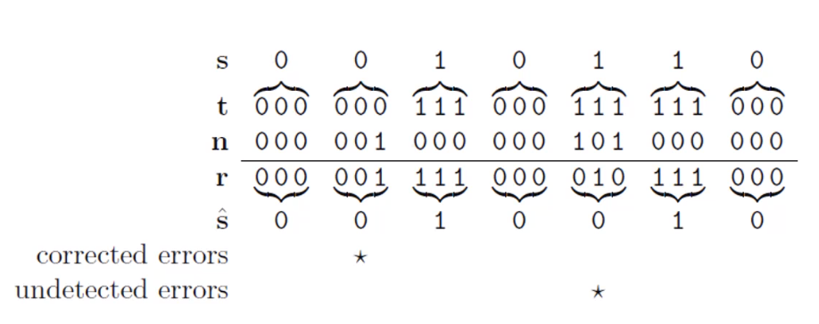

Concepts related to the discipline of information science, covering data mining, classification, inference, GIS, and semantic web systems.

## Data mining

> Non-trivial extraction of implicit, previously unknown and potentially useful information from data.

- Data is any set of characters gathered and translated for some purpose. A collection of objects and their attributes. 

Data mining allows the extraction of data's value. It facilitates the classification and segmentation of data. It is characterized by the enormity, and high dimensionality of data.

Two of the most significant tasks in data mining are:

- Prediction methods
  - Looking to predict future variables in data
- Descriptive methods
  - Looking to describe traits or details in data already present

### Attributes

An attribute is a property or characteristic of an object. A collection of attributes is called an object. Attributes contain values, a number of symbols assigned to an attribute.

| Attribute | Data Type                   | Examples                          |
| --------- | --------------------------- | --------------------------------- |
| Nominal   | Discrete / Distinct         | ID, numbers, zip codes, eye color |
| Ordinal   | Ordered                     | Rankings, grades, height          |
| Interval  | Differential / additive     | Dates, temperature                |
| Ratio     | Difference / multiplicative | Ages, mass, electrical current    |

- Interval data types can be added or subtracted but not multiplied or divided
- Ratio data can be multiplied or divided to become relative to an origin point. And can not be negative.

### Data sets

| Name    | Description                                   | Possible sources                                      |
| ------- | --------------------------------------------- | ----------------------------------------------------- |
| Record  | A collection of attributes                    | Matrix, documents, transactions                       |
| Graph   | A visualization of data                       | molecular structures, networks (such as the internet) |
| Ordered | Collections of attributes on an ordinal scale | Spatial data, temporal data, sequential data          |

Structured data contains:

- Dimensionality
  - Number of attributes each object is described with
- Sparsity
  - Attributes may not contain values
- Resolution

The similarity or dissimilarity (the measure of proximity) between attributes is significant to identify patterns.

### Data Quality

Factors that effect data quality are:

- noise (incorrect values) and outliers
  - Faulty data collection instruments
  - Data entry errors
  - Faulty data transmission
  - Differing sources
  - Modifying linked data
- missing values
- duplicates

## Classification

> Supervised learning is known as classification. Given a collection of records we find a model for class attributes as a function of the values of other attributes

Predicting categorical labels for databased on the training set and values in a classifying attribute. This facilitated numeric prediction and can model continuous-valued functions (predicting missing values).

A model is used to classify and analyse data, this requires two sets of data. Training (development) and testing (operational) sets.

**Previously unseen records should be assigned a class as accurately as possible.**

Providing data to a model and is **given** the classification label indicating the category of observations. New data is then classified based on this data set.

- Classification is categorized as supervised learning

##### Decision Trees

> An algorithm providing the means to classify data


- At the end of a tree lies a classification for a record.
- Decision trees split data into subsets
  - The data only stops being split if the subset is pure (all of the same value)
  - Efficient subsets are based in the **node impurity**
- Decision trees are fast, accurate at low sample sizes, robust to noise, and can handle redundant data.
- Decision trees can get very large, without accounting relations between attributes, and can only classify based off one attribute.

##### Node Impurity

> How clear the set of data is

Node impurity checks the clarity of a set. If a set is skewed towards a value it is said to be pure (i.e. if 9/10 results were true). The more spread the results the less pure the set (if 5/10 results were true).

| Impurity Measurement | Description | Formula                       |
| -------------------- | ----------- | ----------------------------- |
| Classification error |             | $Error(t) = 1 - max\space P(i | t)$             |
| Entropy              |             | $Entropy(t) = -\sum p(j       | t)log\space p(j | t)$ |
| Gini index           |             | $GINI(t) = 1 - \sum[p(j       | t)]^2$          |

Impurity suggests that we are unable to make an accurate classification.

#### Generalization

- Underfitting: Underfitting occurs when a model is too simple and generalizes a trend which incorrectly classifies data.
- Overfitting: Overfitting occurs when a model is too complex that it is too specific to the training data and fails to correctly classify test sets.

When we have missing attributes we must come up with methods to generate reliable values to create an accurate generalization.

#### Confusion Matrices & Performance Metrics

Note: The row and column labels are usually determined by the software you use, and are not always the same

|                    | actually positive  | actually negative |
| ------------------ | ------------------ | ----------------- |
| predicted positive | TP                 | FP (Type I error) |
| predicted negative | FN (Type II error) | TN                |

Confusion matrices map positive and negative classifications, these can be any class and the value associated with positive or negative is arbitrary. 

The value associated with `t` or `f` is not arbitrary though, a true negative or positive classification is correct, whilst false true or negative classifications are incorrect. 

- true positive results are positively classified, and in reality are still positive
- false positive results are positively classified, and in reality are negative
- false negative results are negatively classified, and in reality are positive
- true negative results are negatively classified, and in reality are still negative

There are three measurements we can use to quantify how well our classifications reflect reality. They are:
- Recall: $\frac{tp}{tp+fn}$ - The percentage of positive samples in reality that  we classified correctly.
- Precision: $\frac{tp}{tp+fp}$ - The percentage of our positive classifications that are correct.
- Accuracy: $\frac{tp + tn}{\sum tp,fp,tn,fn}$ - The overall accuracy of our classifications.

**Multiclass Matrices:**

> To calculate the recall and precision of a multiclass matrix follow the definitions of what each measurement is.

|             | actually 1 | actually 2 | actually 3 |
| ----------- | ---------- | ---------- | ---------- |
| predicted 1 | ***86***   | *1*        | *1*        |
| predicted 2 | **0**      | 88         | 0          |
| predicted 3 | **1**      | 0          | 87         |

- **1 recall: 86/87**
- *1 precision: 86/88*
- 2 recall: 88/89
- 2 precision: 1/1
- 3 recall: 87/88
- 3 precision: 87/88

## KNN Classification

> Classifying data by the classification of objects around it based on a distance metric. The distance metric is a measure of proximity to other data points in an `n` dimensional space.

KNN classification is:

- Hard to scale: Due to the scales of certain attributes being much larger (height in cm vs m) sometimes values have to be normalized.
- A lazy learner (classifies on request as opposed to actively predicting data)
- Relatively computationally expensive 

##### Distance metric

There exist three means to calculate the distance metric. Euclidean, Manhattan, and "Q Norm" distance. 

##### The k-value

> The distance to accept other data points informing the classification

A k-value may specify the amount of neighbours used to classify data, if this number is to great then we run the risk of using the wrong classification.

## Bayes Classification

Bayes theorem is a way to combine probabilities.

Naïve Bayes is a popular classification algorithm, it assumes all the predictors are independent of one another, used for binary classification.

- Independence asserts there is no relationship between the probabilities of two events, that if it is likely that a will occur, b is no more or less likely to occur.

A naïve Bayes classifier will calculate the probability of an object's attribute value given it is of a certain class. 
$$
P_i = \frac{P(X|C) \times P(C)}{P(X)}
$$
It does this for all possible classes and is then repeated for all attributes. This results in a table like so:

|             | Class 1 | Class 2 | Class 3 |
| ----------- | ------- | ------- | ------- |
| Attribute 1 | .4      | .1      | .5      |
| Attribute 2 | .2      | .1      | .7      |
| Attribute 3 | .1      | .05     | .85     |

- We can put different weights on certain attributes as well

|             | Weight | Class 1      | Class 2      | Class 3       |
| ----------- | ------ | ------------ | ------------ | ------------- |
| Attribute 1 | 3      | .4 * 3 = 1.2 | .1 * 3 = .3  | .5 * 3 = 1.5  |
| Attribute 2 | 2      | .2 * 2 = .4  | .1 * 2 = .2  | .7 * 2 = 1.4  |
| Attribute 3 | 2      | .1 * 2 = .2  | .05 * 2 = .1 | .85 * 2 = 1.7 |
| Total       | -      | 1.8          | .6           | **4.6**       |

- Above the object is most likely of class 3, then 1, then 2.

## Information Theory

> Achieving transmission over a noisy communication channel

Sending data over a channel can arrive at the destination with errors introduced from noise. Information theory dictates  the necessity to decrease the probability of this (noise level). There are two solutions:

- Improving the physical characteristics of the physical medium.
- Building systems to detect and correct errors introduced by the channel.

When transmitting bits we refer to this transmission as a binary symmetric channel. The probability of receiving a flipped bit is known as the noise level.

- The ultimate goal is to reduce this noise level using an encoding system. We use the process of decoding an encoded channel to detect and correct errors.
- Information theory is concerned with the practical limitations of such systems, and coding theory is concerned with building them.

| Characteristic of Encoding | Application                                    |
| -------------------------- | ---------------------------------------------- |
| Compression                | Removing redundancy to decrease amount of data |
| Encoding                   | Adding redundancy to ensure accuracy           |

### Repetition Encoding (Majority Vote Decoding)

> For every bit we repeat it `n` times, creating redundancy per bit. This is decoded using Majority Vote decoding where the most common value per 3 bits is used as the decoded value.

If we add noise to a Rx encoded stream it is less likely all `x` bits flip, hence we accept the most frequent bit per `x` bits as the original signal. AKA majority vote decoding. An example of R3 decoding:

$t = original, n = noise, r = received, \hat{s} = decoded$



- One problem with repetition encoding is a drastically increased transmission size

### 7; 4 Hamming Code

> Applying repetition encoding to blocks of data as opposed to bit by bit, by introducing parity bits.

Hamming encoding is able to tell us if an error occurred, and if only one bit is flipped where the error is as well. Hamming encoding specifies the length of the transmitted stream, and the length of the original stream. In the case of 7,4 hamming codes, the transmitted length is 7 bits long, whilst the original is 4.

- Hamming code will add 3 check-bits to the beginning of the message to be transmitted: `[p1, p2, p3, b1, b2, b3, b4]`

| Parity Bit | Calculates Bits |
| ---------- | --------------- |
| 1          | 1, 2, 3         |
| 2          | 1, 3, 4         |
| 3          | 2, 3, 4         |

- Each parity bit will  be either 1 (if paired bits have an odd amount of on bits ) or 0 (if the paired bits have an even amount of on bits)

```matlab
# 1011 --> 0101011
encode("1011", 7, 4, "hamming/binary")
## 0101011
decode("0101011" 7, 4, "hamming/binary")
## 1011
```

### Information Entropy

> A mathematical concept introduced by Claude Shannon by sending all data as 1 or 0 (bits).


We can use information entropy to find the smallest amount of bits we can represent information within, hence by reducing the amount of bits we reduce the probability of a bit flip due to noise.

- This is calculated by considering the probability of each value, i.e. if you want to send the values of either A, B, C, or D and they are each as likely to be sent as the other they have a probability of 0.25.

Hence the entropy is:
$$
-1/4 \times log_2(1/4)-1/4 \times log_2(1/4) -1/4 \times log_2(1/4) -1/4 \times log_2(1/4) = \\
2/4 + 2/4 + 2/4 + 2/4 = 2bits
$$


This makes sense as we want to send one of 4 values, and it takes 2 bits to represent 4 number in binary (2^2)

## Information Gain

> A measure of a reduction in entropy

To calculate the reduction in entropy you need to consider the entropy of the overall set you are drawing from. You can then subtract the weighted average of all it's children (their entropy times their probability n the parent set): 
$$
H(p) - \sum H(c) \times P(c)
$$

## Clustering

> Unsupervised learning is known as clustering.

Providing data without labels, with the goal of establishing classes, categories, or clusters of data.

- Clustering is categorized as unsupervised learning


## Fuzzy Logic

> The logic applied to vague set membership

Fuzzy logic is a way to use natural language in logic, a way to represent imprecise logic.

- Often this logic deals with linguistic variables: `temperaure = {cold, warm, hot}`. These are known as **fuzzy sets**.
- Variables using precise quantities (not fuzzy sets) are known as **crisp sets**
- Linguistic variables group a **spectrum of quantities**, a certain value is mapped to a fuzz set using a **membership function**.

Fuzzy sets usually place edge values in two sets, or the intersection of sets. We say it belongs to one set to a **certain degree**.

| Degree      | Description                                                                        |
| ----------- | ---------------------------------------------------------------------------------- |
| 0           | `x` does not belong to set `y`                                                     |
| 1           | `x` belongs to set `y`                                                             |
| 0 < `z` < 1 | `x` somewhat belongs to set `y`, the higher the degree, the more `x` belongs to y. |

When a two elements have different degrees we can perform two operations:

| Term                                | Description                                                         |
| ----------------------------------- | ------------------------------------------------------------------- |
| Disjunction $A \lor B = MAX(A, B)$  | Take the maximum degree between `A` and `B` e.g. $.1 \lor .2 = .2$  |
| Disjunction $A \land B = MIN(A, B)$ | Take the minimum degree between `A` and `B` e.g. $.1 \land .2 = .1$ |

To control an output using fuzzy logic we follow a general approach:

- Fuzzification: Determine the degree of inputs and outputs in overlapping sets
- Rules: Determine the rules to generate an output based on a certain input
- Defuzzification: Combine all rules into one algorithm, and then turn this into a crisp set to produce an output.

**Fuzzy logic allows smooth transitions between inputs and outputs (gradual changes)**

## Decision Making & Support
> Techniques for narrowing choices and optimising outcomes

Theoretically a decision is the choice between two alternatives. The process of this involves assessing all the possibilities and choosing the appropriate action. 

DSS (Decision Support Systems) exist to provide computational aid to this process.

The process of making a decision could be broken into three parts:
- Intelligence activity, identifying a problem that requires a decision, and collecting relevant information
- Design Activity, creating, developing, and analysing of alternative actions
- Choice activity, choosing a resultant action

Intelligence:
- Observing and collecting quantitative data relevant to the domain
- Defining the objective through analysing quantitative data

Design:
- Forming a model through choice actions and outcome criteria, to manage uncontrolled variables.
- Analysing model performance through testing and using the model, to reduce error.

Choice:
- Evaluating the outcomes of the model using `what-if` and `goal-seeking` analysis.
- Selection through suggesting the best course of action.

This is modelled by Mintzberg's model:

| Phase          | Steps                                          |
| -------------- | ---------------------------------------------- |
| Identification | Recognition, Diagnosis                         |
| Development    | Search, Design                                 |
| Selection      | Judgement, analysis, Bargaining, Authorization |

There is an inherent uncertainty with any decision, and hence many different consequences of any decision made. This provides decision support systems quite a lot of value.

Simply put, a good decision gives a good outcome. We are in the business of optimising this outcome to be the best outcome possible. The outcome therefore needs to be numerically measured. i.e. we want to measure the cost or number of deaths for each decision. This is known as the utility. We then multiply the likelihood of each outcome with there utility, to weight each outcome.

## Semantic Web and XML

Originally the world wide web was focussed on becoming a "mesh" of computers, linking information to one another. Today the protocols and standards used  to deliver and link this information is mostly governed by W3C, or the world wide web consortium. 

Information retrieval on the internet today can be characterized as:
- High recall, low precision
- Highly sensitive to vocabulary

The two original protocols used to support this were:
- Hyper Text Markup Language: HTML
- Uniform Resource Identifiers: URIs

Today the world wide web exists with an extension, known as the "semantic web" which operates to provide meaning to information. This meaning is defined as the logical ability for system inter-operability.

The first obstacle in this regard is:
- Web documents do not distinguish between information and presentation: solved by HTML and XML separating stylesheets.

In it's current state the semantic web is presented by machines and interpreted by humans. This means the internet is mainly focussed on machine-human interaction Currently machine-machine interactions are not well supported by protocols. 

- Machines are limited at retrieving useful information for the user from text.

One approach to remedy this is providing structure to data, which is a key focus for XML. As such XML is a foundation for passing data between machines.

Other than this the semantic web looks to overcome:
- Different websites do not share the same structure 

The introduction of a semantic structure involves:

| Layer                     | Description                                                               |
| ------------------------- | ------------------------------------------------------------------------- |
| Content Layer (XML layer) | Storing data in XML and providing universal links (URIs) for resources    |
| RDF Layer                 | see below                                                                 |
| Ontologies                | A conceptual model of a topic, specifying the relationships between data  |

**Resource description frameworks** map information by providing objects (a subject) with predicates (property) and values (data). They provide a schema not associated with a domain like XML.

### XML
> User defined and domain specific mark-up

- XML does not have predefined tags
- XML is made of many nodes: a label and it's content
- The structure of an XML document is defined by a DTD, document type definition 

## Geographic Information System
> A computer system to aid in the collection, maintenance, storage, analysis, and output of spatial data.

This includes absolute and relative location. A GNSS (global navigation satellite system) allows small electronic receivers to determine the longitude, latitude, and altitude.
Because of the curvature of the earth we can not determine the shortest distance between two points by drawing a straight line on a map. We can use a datum, which is a model of the earths ellipsoid surface, that describes the positions on the earths curved surface. 

- Datums exist for local areas (e.g. countries), and the coordinates do not change
- Datums exist for global areas, where the coordinates are not fixed as countries can move.

A common geographic coordinate system allows any point on the earth to be expressed b latitude, longitude, and elevation. This allows us to use maps in conjunction with one another.

The process of flattening a datum onto a map (cartesian coordinate system) is called projection. There are three types:
- Conical
- Cylindrical 
- Orthographic

At the center of all spatial analysis lies a place, made of a size and space. All spaces are linked to a coordinate system and are named.
Geographic data consists of:
- Spatial data (viuslazation of places)
- Attribute data (Measures and classifications of a coordinate system or place)

Maps are a means to display spatial data. A place can consist of many objects, known as layers. For example a river can pass through a forest, spatial objects can be superimposed upon one another (e.g. a road onto land).

A map has two important attributes:
- Resolution - the distance threshold which defines when something is relevant vs irrelevant
- Scale

Maps contain a topology, limits which allow a map to be distributed in different shapes. (e.g. a boundary between two countries can not overlap)

Spatial data can be raster or vector data. 
- Rasterization can be used in one of two ways: central point rule, or largest share rule.
- Vector data can be points, polygons, or lines. 