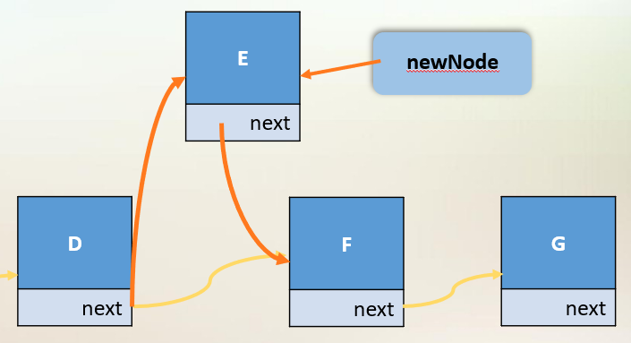

Simple Data structures provided by the java collections framework.

Part of `java.util`, provides classes and interfaces to manage dynamic collections of objects. 

All collections implement the `Collection<E>` interface.

## Collections
> A collection is an object that gathers and organizes a group of objects. 

A collection is composed of:

- An abstract data type (ADT), which describes the methods used to access / manipulate objects in the collection. This is usually specified by an interface.
- A data structure, the physical code used to store and manipulate objects in the collection and the algorithms to handle operations.

## Arrays
> Fixed length data structure

```
int[] array;
int[] array2 = new int[5];
int[] array3 = new int[] {1,2,3}; 
```

- Enhanced for loop: supported

Advantages:
- Very efficient, constant time get and set
- Type-safe

Disadvantages:
- Fixed-size, overhead in copying and then resizing
- Limited functionality, interfaces must be implemented manually

## Interfaces
> Interfaces provided by the JCF

The JCF contains two types of interfaces: `Collections` & `Maps`

## Sets
> An unordered collection of unique objects.

Sets include but are not limited to `HashSets` and `LinkedHashSet`

Sets do not permit duplicate elements. A `HashSet` computes a unique hash code for each element. Calling `add()` on a hashed set will check that the hash code does not already exist.

To compare two objects which are not primitive we must override both the `hashcode` and `equals` methods to allow a hashed set to check for duplicated.

- `==` compares hash codes and locations between objects
- `equals()` compares states between objects

## Lists
> Ordered collections of objects 

Lists include but are not limited to `ArrayList` and `LinkedList`. 

### ArrayList

`ArrayList`(s) implement algorithms to resize arrays and provide dynamic functionality. They are constant time at the end of the array, but linear elsewhere.

### LinkedList

`LinkedList`(s) store references to the previous and next elements in a list. This requires more memory but provides constant time operations at the beginning and end of the list. 

### Maps
> Key-value mapping between unique keys.

- `Hashtable`
- `HashMap`

Maps map keys to values, and provide constant time searching, which is not provided by lists.

- Keys are stored in a `Set`.
- Values are stored as a `Collection`.
- `Entry<K, V>`(s) are stored in a `Set`.

The `Map` interface provides but is not limited to:

- `get`
- `put`
- `remove`
- `keySet()`
- `values()`
- `entrySet()`

## Iterators
> An interface allowing the enumeration of an object provided by `iterable<E>`

```
public interface Collection<E> extends Iterable<E> 
```

`Iterable<E>` provides the `add` and `iterator` methods. `iterator()` returns an iterator over the elements in the underlying collection.

An iterator provides the following methods:
- `next()` – gets the next item in the collection
- `hasNext()` – tests whether it has reached the end
- `remove()` – removes the item just returned

## Generics
> Specifying a type parameter for an object that ensures type safety.

If you were to use a list without a generic you could add any type, and as such is not safe as it requires type casting between elements.

Generics require a **reference type** and not a primitive type.

Generics check types at compile time, hence not allowing you to type cast to the wrong type.

Generics can not be static. And you can not call a generics constructor (`E(); //Error`). Additionally inheritance is not preserved.

A wildcard (`?`) can be passed to a generic to allow multiple types to be used that fulfil the condition.

```
... Box<?>() ... //box of anything
... Box<? extends MyClass>() ... //box of objects that extend MyClass
```

## A Note on Resizing Arrays

```
resize:
    newArray = e[size * 2] //multiplying size by 2 prevents constant resizing on every addition
    copy array
    array = newArray
```

## Dynamic Data Structures
> Dynamic data structures use references to use memory space directly proportional to the size of data, without the need to reallocate.

The most common type of dynamic data structures are linked list (singular and double). 



- Linked lists use references to the proceeding and preceding object to form a chain(list) of data. 
- Nodes should be private, to prevent external tampering with the list chaining. A node should contain the references to the current and next or previous element.  
- A doubly linked list contains both references to the next and previous Node
- Linked lists store references to the major nodes (first or last, or both, node)

Operations:

- Linked lists are constant time at adding or removing elements to the beginning or end of a list (or both for double linked lists).
- Linked lists are slow compared to arrays at retrieving nodes.

## Implementing Sets
> Creating homebrew set data structures

Collections in the collection framework provide a lot of pre built functionality with `Abstract{x}` such as `AbstractSet`. Hence we can extend these classes to focus on the specific implementation of a data structure.

When implementing our own set we can consider the physical data structures of an array or a linked list below: 

|Method|Array Set|Linked Set|
|---|---|---|
|Add|O(n)|O(n)|
|Remove|O(n)|O(n)|
|Contains|O(n)|O(n)|
|Pros|Easy to code, quick indexing(element access)|Easy addition of elements, O(1) clear|
|Cons|Extra work reallocating space, wastes space, O(n) clear|Slow element access|

- Both are bad choices to implement a set, maps and trees are much more practical.

Set performance is directly related to the `contains` method, as a set must contain unique elements. As such a physical data structure which can optimise this will be efficient when used as a set. 

- The `contains` method requires a correct implementation of an `Iterator`.

## Stacks
> [More on stacks](Data-Structures_Algorithms.md)

Types of stacks in java: `Stack`, `LinkedList`, `ArrayList`.

## Queues
>> [More on queues](Data-Structures_Algorithms.md)

Types of queues in java: `Queue`, `LinkedList`, `LinkedConcurrentQueue`

