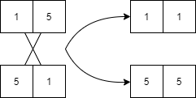

Using nature/natural occurences to inform the design of algorithms. Additionally using natural substrates to process and execute computation (such as DNA, atoms etc.).

## Genetic Algorithms

Genetic algorithms solve optimization and search problems - inspired by Darwins' theory of evolution by natural selection. ~ 100 years after Darwins' theory of natural selection (which was unable to explain the cause of genetic variation) the discovery of DNA explained that random favourable mutation in genes caused by the environment resulted in a large population of offspring inheriting the variation - making it "normal" (survival of the fittest).

Genetic algorithms are probabilistic search algorithms wher a set (population) of data structures (chromosomes) are iteratively transformed via crossover and mutation operations. Based on the values within a datasturcture a fitness value is calculates which allows the population to be pruned and eventually and optimal solution to be found.

- Chromosome: Datasturcture representing a solution to a problem. Often arrays of bits, but could also be thought of as a class made of fields contributing to a solution.
- Gene: A bit(s) (container) holding a value, a variable.
- Genotype: A set of genees for an instance of a chromosome.
- Phenotype: Sematics, how bits represent values (decription of encoding).
- Allele: A value stored in a gene (value of a gene variable).
- Fitness: Evaluation of a solution proposed by a chromosome.
- Mutation: A random change to a solution (state of a chromosome), producing a new genotype and generation.

Genetic algorithms can decrease the computational complexity of searching greatly compared to classical approaches, however they do not guarantess they find the global optimum.

## Pruning

Wihtout pruning a population the set of chromosomes will grow too large to maintain a low computational complexity and reasonable memory usage. As such a population is "pruned" via a pruning policy. It is not always effective to keep only the most fit chromosomes as you alwasy loose information about traits of a solution when they are pruned, an appropriate pruning startegy is required to optimize the search.

Chromosomes can be ranked by fitness through expressing its qulaity (individual fitness) proportional to the total quality of the population:

> The fitness of a chromosome is determined by the amount of quality it provides to the overall quality of the population.

$$
f_i = \frac{q_i}{\sum_j{q_j}}
$$

|\\(q_i\\)|Allele 1|Allele 2|\\(q_i \div \sum_j q_j\\)|
|5|1|4|\\(5/10 = 0.5\\)|
|3|3|1|\\(3/10 = 0.3\\)|
|2|1|2|\\(2/10 = 0.2\\)|

### Mutation

Mutation is a process which randomly changes a chromosome, producing another solution which can be evaluated to be better/worse than the current population. To optimize a solution we can produce many generations until a stop condition is met (e.g. fitness has not increased for 10 generations).

Consider the chromosome with two genes:

$$
\begin{bmatrix}
1 & 1
\end{bmatrix}
$$

Mutation provides randomized answers to decisions that alter the chromosome, in this case a random decision for:

1. Mutate left or right gene?
2. Mutate gene up or down?

A possible mutation would then be `{left, up}`:

$$
\begin{bmatrix}
1 & 1
\end{bmatrix}
\rightarrow
\begin{bmatrix}
2 & 1
\end{bmatrix}
$$

Mutation can be effective at optimizing a search space without "moats" (the optimal solution is unimodal, it is not surrounded by unoptimal solutions) without the need for crossover, an example search space:

$$
\begin{bmatrix}
1 & 2 & 3 & 2 & 1 \\
2 & 3 & 4 & 3 & 2 \\
3 & 4 & 5 & 4 & 3 \\
2 & 3 & 4 & 3 & 2 \\
1 & 2 & 3 & 2 & 1 \\
\end{bmatrix}
$$

- Their are two genes in the chromosome (2 dimensions)
- Their are 5 possible alleles in the search space (5 indexes per dimension)
- The optimal fitness is `5`, at `(3,3)` meaning the chromosome with the alleles 3 and 3 is a global maximum.
- Note that the fitness increases in all directions towards the center, meaning the graph of the change in fitness we would be unimodal.

### Crossover

Combining two chromosomes to create new generations corssover provides another means to alter the solution and hence fitness. However, it is computationally expensive over chromosomes with lots of genes. Crossover creates a new offspring by permuting the genes of two parents:



Crossover is effective at optimizing a search space with "moats" - where the optimal solution is surrounded by uncoptimal solutions.

$$
\begin{bmatrix}
1 & 2 & 3 & 2 & 1 \\
2 & 0 & 0 & 0 & 2 \\
3 & 0 & 5 & 0 & 3 \\
2 & 0 & 0 & 0 & 2 \\
1 & 2 & 3 & 2 & 1 \\
\end{bmatrix}
$$

- Note the "moat" of 0 around 5, mutation is less effective at finding such solutions as the mutation rate may struggle to "jump" the "moat" (either over or undershooting).

## Generitic Algorithm Considerations

- Starting population: How many random chromosomes to start with? Too low; identical genes (inbreeding). Too high; computationaly expensive.
- Mutation rate: How many genes to mutate, and by how much? Too low; slow development; Too high; chance of missing optimal quality.
- Duplication policy: Keeping duplicate chromosomes adds computational expense, but pruning them may remove future crossover information.
- Stop criteria: When to stop, e.g. Stop if no improvement in `x` generations. Or stop if quality between `x` and `y`.

The general pseudocode for a gentic algorithm:

```
generate random population;
while criteria not met:
    calculate each chromosomes fitness;
    prune the least fit;
    generate a new population with survivors;
    introduce random variation within population;
```