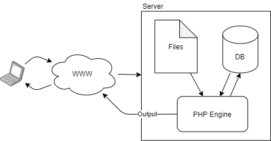

PHP hypertext processor is an embedded scripting language heavilly used on the web. It runs server-side (never on the client) embedded within a document. Running through the PHP engine scripts are outputted as text, returned as parts of an html document.

We can include multiple PHP files within one another, similar to packages or header files. We can do so using the `require` and `include` methods:

- `require("myfile")` - includes `myfile` and crashes early if it is not found.
- `include("myfile")` - includes `myfile` and raises a warning if not found.
- `require_once("myfile")` - includes `myfile` only once throughout the file to avoid duplicated definitions, crashing if not found.



## Fundamentals

PHP can be embedded within a document using:

```html
<?php ... ?>
```

```html
<script language="php"> ... </script>
```

- PHP is generally c-sytanx like, php statements are delimited with `;`
- Comments are applicable with `//` or `#` or `/* ... */`
- PHP has a unique contains a unique string concatenation operator `.`

## Datatypes

All variables in php other than constants start with a `$`. PHP is dynamically typed and are not declared without initialization (this allows the initial type to be set). Constants are defined with the `define` method:

```php
define("NAME", "test");
define("AGE", -1);
define("ALIEN", false);

echo NAME." is ".AGE." and is an alien? ".ALIEN;
```

Strings in php can substitute varaibles without concatenation, `'` delimit literal strings whilts `"` delimit standard strings:

```php
$x = 100;

echo "x is $x"; //x is 100
echo 'x is $x'; //x is $x
```

PHP supports primitive and complex types. Reference support allows PHP to create objects and other data strcutures such as arrays. Arrays are a built in construct:

```php
$my_array = array(1,2,3);
$my_cool_array = [4,5,6];
$my_fake_array = ["a"=>7,"b"=>8];
$my_concatenated_array = $my_array + $my_cool_array;

for($i = 0; $i < count($my_array); ++$i) { echo $my_array[$i]." "; }

foreach($my_cool_array as $i) {  echo "$i "; }

echo $my_fake_array["a"]." ".$my_fake_array["b"];
//prints: 1 2 3 4 5 6 7 8
```

Additionally PHP contains pre-defined varaibles such as `$_GET` and `$_POST`. 

### Primitives

|Type|Description|
|----|-----------|
|String|Text|
|Integer|Numeric data|
|Float|Double floating point numeric data|
|Boolean|True and false|
|NULL|Absence of data|

## Functions

Functions in PHP do not need to define a return type:

```php
function my_function ($my_param) {
    echo $my_param;
    return $my_param;
}
```

## Operators

Since PHP is dynamically typed equality can be either strict or not:

- Strict equality: operands are of equal value and type `1 === 1`
- Non-strict equality: operands are of equal value `"1" == 1`

## Arrays

PHP has a variety of inbuilt features to work with arrays.

|Array function|Description|
|--------------|-----------|
|`array_shift()`|dequeue|
|`array_unshift()`|enqueue|
|`array_pop()`|pop|
|`array_push()`|push|
|`array_splice()`|replace a range of elements|
|`in_array()`|contains|
|`array_search()`|finds the index of a value|
|`array_key_exists()`|contains key|
|`array_slice()`|returns a range of an array|
|`sort()`|sort|
|`rsort()`|reverse sort|
|`ksort()`|sort map|
|`krsort`|reverse sort map|

* Multidimensional arrays can be constructed as in c style languages, by nesting multiple arrays. They are indexed traditionally as well. 
* Associative arrays (maps) are constructed like: `["key"=>"value"]` and indexed by key (`["key"]`)

Iterating associative arrays:

```php
foreach($map as $key=>$value) {
    echo $key.", ".$value;
}
```

PHP also exposes unique associative arrays called superglobals containing various environment variables, including but not limited to:

* `$_GET`
* `$_POST`
* `$_ENV`
* `$_COOKIE`

## Strings

Strings are integral to PHP as philosophically it is a text processor. There are no character data types other than strings.

* String operators, such as `.`, also have assignment operators such as `.=`.
* Strings can explicity include varaibles by encompassing them in `{}` parenthesis.

```php
$vegetable = "carrot";

#error
echo "I like $vegetables";

#ok
echo "I like {$vegetable}s";
```

Strings also contain many utility functions:

|String function|Description|
|---------------|-----------|
|`strcmp`|string comparison, such as strcmp in c|
|`strcasecmp`|case agnostic string comparison|
|`strlen`|string length|
|`strpos`|returns index of substring|
|`substr`|returns a substring of the given string|
|`str_replace`|replaces a substring with another|
|`strtok`|creates a string tokeniser, returning the first token|
|`explode`|create array from string characters|
|`implode`|concatenate arrays into a string|
|`str_split`|delimit a string into an array|

## Regular Expressions

> Defining patterns of text.

PHP uses perl compatible regular expressions. A regular expression is enclosed in a string like so `"/.../"`. The `preg` prefix identify php regular expression functions, such as:

- `preg_match` to match expressions
- `preg_replace` to replace based on expressions
- `preg_split` to delimit based on expressions

Some regular expression tokens include:

|Token|Description|
|-----|-----------|
|`\w`|`[A-Za-z0-9]`|
|`^`|Start of string|
|`$`|End of string|
|`?`|Match 0 or 1 character|
|`+`|Match 1 or more characters|
|`*`|Match 0 or more characters|
|`(a|b)`|a or b|
|`(...)`|Group of tokens|
|`[abc]`|Match any of a, b, or c|
|`[^abc]`|Not any of a, b, or c|
|`[a-z]`|Match range|
|`\d`|Match a digit|
|`\s`|Match a space or tab|
|`{3}`|Match 3 times|
|`{3,}`|Match 3 or more times|
|`{3,6}`|Match 3 to 6 times|
|`!()`|Negate group - do not match|

## A Note on MYSQL Databases

PHP provides a n API to connect to MYSQL databases in the standard library named [mysqli](https://www.php.net/manual/en/book.mysqli.php)

## Managing State Information

> State information: information about a visit to a web site shared over a set of user-server interactions.

HTTP is stateless, web browsers store no persistent data about visists by themselves. Maintaining state requires temporary/persistent storage of user data which can be sent between a client and server.

### Hidden Form Fields

A type of temprary storage where hidden form fields embed state information. Once the form is submitted the request to the server will contain the embedded parameters. This invovles a server preparing a form by placing information in inputs of the `hidden` type and then processing them when the user resubmits them.

A form will resubmit the exact same information embedded into them, hence the server must process the state before placing them in the form.

```
<input type="hidden"/>
```

### Query Strings

A form of temporary storage where state information is stored as HTTP paramaters in a GET request. A server will rewrite URLs included in a web page to contain the state information. PHP provides `http_build_query` to build a query string from an array of properties.

### Cookies

Cookies are persistent storage capable of storing state beyond a single session. Cookies are stored on the client and it is advised to keep their size under 4KB (browsers usually limit cookie sizes based on RFC 6265). Additionally a browser can usually accomodate 50 cookies per site.

```php
set_cookie(...);
$_COOKIE['my property'];
```

A cookie with no expiration time is temporary which are not stored beyond the user session.

### Sessions

Sessions are high-level concepts that provide a period of time where state is stored on the server. PHP will apply the previously discussed methods to provide session storage, and are generally helpful to abstract away the implementation of persiting state information. A session is identified by a session ID.

```php
session_start(); //start/continue
$_SESSION['my property'];
$_COOKIE['PHPSESSID'] //session ID stored in cookie for us
session_destroy(); //kill
```

## Objects

PHP is an object oriented language. Classes are defined by the `class` keyword:

```php
class MyClass() {
    // class...
}
```

Objects are instantiated with the `new` keyword, which returns a pointer to the instance. Instances are dereferenced with the `->` operator. Within a class to access the instance state, such as methods or variables defined as non-static within the class, the `$this` pointer must be dereferenced.

Methods such as the constructor, destructor, toString etc. are denoted as 'magic methods' and are prefixed with `__` (two underscores).

```php
class MyClass {

    public function __construct() {
        //constructor
    }

    public function __destruct() {
        //destructor
    }

    public function __sleep() {
        //serialize --> called with instance->serialize()
    } 
```

Some helpful methods include:

```
isinstance
get_class (returns class name)
unset (delete instance)
serialize
unserialize
```