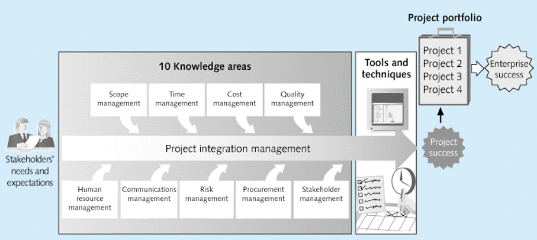
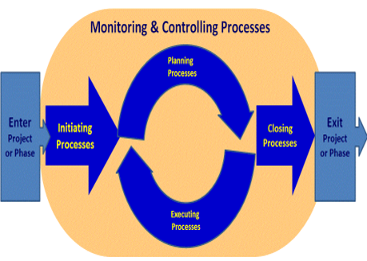
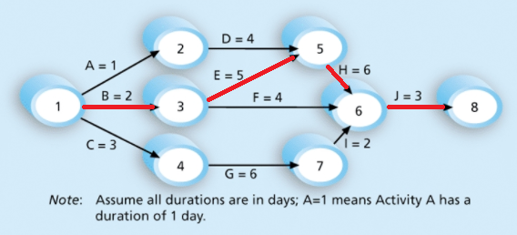

IT project management following PMP (Project management professionals) standards.

## Project Management & Project types
> The application of knowledge, skills, tools and techniques to project activities to meet project requirements

Project managers work with project sponsors, project team, and other people involved in a project to meet project goals. They strive to meet the **triple constraint** and facilitate the process between these people.

All project management follows a process, what should be done in a process is determined by a **standard**, how it should be done is determined by a **methodology** (Agile, PRINCE2, etc.).

### Projects
> A project is a fixed term endeavour to deliver an outcome.

Projects:
- Have a fixed term
- Involves Uncertainty
- Have a unique purpose
- Are funded and guided by a primary customer/sponsor

Uncertainty is the unknown present after the completion of a project. For instance it is uncertain how the outcome of a project will stand the test of time. However uncertainties related to the domain of expertise of the project developers can be accounted for.

Programs are a group of related projects, subsidiary programs, and program activities managed in a coordinated manner to obtain benefits and control not available from managing them individually. On the contrary every organisation has a portfolio that encompasses all projects, programs, and bodies of work they perform. Regardless of their relation to one another.

## Performance metrics
> Metrics to determine the quality of a software project

- Scope (What needs to be done to deliver the project meeting its requirements)
- Time (When things need to be done to deliver the project on time)
- Cost (How much developing the project should cost)

The combination of meeting project requirements, budgets, and time is known as the **triple constraint**. Not meeting any of the three will mean a project will fail. Additionally the satisfaction of stakeholders is significant in determining whether a project is successful.

Time constraints are directly related to budget constraints, as such the time management of a project is a pre requisite to budgeting. As the time is informed by the scope of a project we must identify the scope before time constraints.

## Knowledge Areas
> Factors that affect the success of a project, and a project manager should be aware of

Below we can see what knowledge areas are **integrated** throughout a projects lifetime.

> It is important to understand a strategy to share knowledge about the project to different people. And how different people will be presented relevant information. This is known as the communication knowledge area.

## Project Management Tools & Techniques
> Assisting managers and their teams in various aspects.

Tools to organize a team regarding the scope and triple constraints of a project. 

Techniques for scope constraints:
- Project charter
- Scope statement: Lists all the (functional/non-functional) requirements.  
- Work Breakdown Structure: Lists all the activities to complete to fulfil the scope, and how they relate to each process. 

Techniques for time constraints:
- Gannt charts
- Network diagrams
- Critical path analysis
- Critical chain scheduling

Techniques for cost constraints:
- Cost estimates

The term **super tools** is used to describe tools that have high use and potential of improving project success. Such as Gannt charts, progress reports etc.   

## Project Management Processes
> A process is a series of actions directed towards a particular result.

Project management can be seen as a series or interlinked processes. Such processes can be categorised by:
- initiating processes
- planning processes
- executing processes
- monitoring and controlling processes
- closing processes

These processes are largely sequential, and will involve the application of some process across each knowledge area. *i.e during the initiation process each knowledge are will need to be initiated in it's own way.* Additionally we may review the deliverables of each stage with project requirements, these are known as phase gates.

|Process|Description|Deliverables|
|---|---|---|
|Planning|Plan and guide the execution process, including identifying and ranking risks based on their impact and probability of happening|Team Contract, WBS|
|Executing|Implementing the project deliverable, this process has the highest resource consumption|Milestone Report, Project product|
|Closing|Approving the termination of a project, which requires the stakeholder to accept the deliverable and a lessons learned report created.|Lessons learned report|
|Monitoring & Controlling|Initiating other processes to realise the project based on the current performance data, state of deliverables, and any changes requested| |

- The progress of the execution phase is recorded in the milestone report, which should be developed before starting execution.
- Performance is measured against the baseline (the time schedule to complete a task by plus any allocated extra time) during monitoring and controlling phases. Corrective action based on this is also initiated during this phase.

## Project Preinitiation
> Work to prepare a project before the start of a project.

Initiating a process includes recognizing and starting a new project phase by first preparing processes for each knowledge area.  

There are in general 4 situations that initiate a project:

- Meet legal or social requirements.
- Create, improve, or fix existing products.
- Implementing or changing business technology strategies.
- Satisfying stakeholder needs and requirements.

Preinitiation activities are not apart of the project itself.  Project preinitiation includes creating a business case to identify the needs of a project before staring it, creating a project charter, and identifying stakeholders.

|Deliverable|Description|
|---|---|
|Business Case|A preliminary investigation of a project, detailing the specifics of the project|
|Financial analysis| A part of the business case used to asses a project before undertaking it|
|Project charter|A project charter is used to define the project objectives, scope, timeline, responsibilities, and approach.|

## Financial analysis
> A financial analysis estimates the return on investment each year of the projects lifetime.

Each year a discount factor is calculated, and the total costs are multiplied by this discount factor. 

$$
Discount \space factor = 1 \div (1 + r)^{t}\\
Discounted \space cost = cost \times discount \space factor  
$$

- `r` is the discount rate
- `t` is the year in which we are calculating the discount factor e.g. 0, 1, 2, 3...
- Year 0 is the time it takes to develop the project, this could be less than a year or take multiple years

**Terms:**
|Term|Description|
|---|---|
|NPV| Net present value, the monetary value of the benefits - costs at the present time (usually the last year of the project lifetime) |
|ROI| Return on investment, the amount of monetary value received at the end of a project lifetime, expressed as a percentage of the investment made|   

A project should be undertaken if the payback period and ROI is sufficient. But also consider other value provided to the business such as brand value etc. A project should align with the business strategy. Methods to select projects include:

- Focusing on business needs
- Categorizing projects
- Financial analysis
- Balanced scorecard

A balanced scorecard or weighted scoring is a tool that scores a project based on many factors, the higher the better.

## Stakeholders
> The people involved in or affected by the project activities.

Every project must have a stakeholder but probably have many different stakeholders, all with different needs. A stakeholder or project sponsor should guide the needs of a project and provide funds to create the project. Managing stakeholders is critical to project success.

Stakeholder management involves identifying stakeholders and analysing their expectations. It occurs over all processes in a project. 

- Stakeholders are recorded in a stakeholder register
- Stakeholders engagement and power is assessed in a stakeholder analysis table

## Project Integration Management
> Ensuring all elements of a project come together at the right time and coordinating all knowledge areas during a project lifecycle.

Project integration involves:

- Developing project charters
- Developing management plan
- Executing the management plan
- Performing changes
- Closing project phases (ensuring all activities are complete and delivering the deliverables to the right people)

Project integration management enables development to progress efficiently, and decisions to be made quickly. 

A project management plan is developed to coordinate all project planning documents and help guide a project’s execution and control

- i.e. plans and documents based on the other 9 knowledge areas are developed 

Additionally change management only initiates a change that is beneficial. Integration management will determine when a change is complete, and manages them as they occur. A change control system is a formal documented process which allows this.

## Scope Management
> The scope refers to all the work done to create the product, and also the processes to do this.

Scope is one of the triple constraints. Scope management includes the processes defining and controlling what is included in the process to prevent scope creep. These process include:

- Collecting requirements
- Defining Scope (Defines the total amount of work)
- Creating a WBS
- Validating scope (acquiring confirmation on what should be done)
- Controlling the scope (controlling changes to the scope over the project lifetime)

Requirements for the scope include functional (what the project will do) and non functional (performance, security etc) requirements. They are generally collected through interviews, surveys, prototyping, and benchmarking. Benchmarking assesses whether a product that meets their requirements already exists and developing requirements from it. **Requirements are stored in a requirements traceability matrix**.

## Work Breakdown Structure
> The WBS is the first deliverable after collecting requirements. It is a tree graph of the project deliverables.

A WBS is a deliverable-oriented grouping of all the work required by the project. It provides the fundamental means to manage and plan schedules, costs, resources and changes. **A WBS graphs all deliverables of a project, and can be subdivided into smaller deliverables known as decomposition**.

- A scope baseline includes the approved project statement and the WBS. 
- A deliverable at the lowest level of the tree is known as a work package.
- A WBS is usually organized by phase at the topmost level.

In general a WBS is created top-down (identifying largest bodies of work first) or bottom-up (identifying work packages first).

Although a WBS lists all deliverables it **does not** define what this deliverable is. This **needs to be defined** in a WBS dictionary.

## Time management
> Scheduling units of work to complete a project within a given time frame.

Time is one of the triple constraints. Time management refers to scheduling each deliverable / unit of work to complete a project within a given time frame. This involves:

- Planning the schedule management
- Defining units of work
- Sequencing units of work
- Estimating resource consumption & unit duration
- Developing the schedule
- Controlling the schedule

An activity is a work package containing a duration, cost, and resources. Sequencing these activities involves identifying the dependencies of each work package, and defining each activity. Schedules can be developed by critical path/chain analysis or milestones and contain units (days, weeks, hours), control thresholds, rules for performance measurement, report formats, and process descriptions.

|Dependency|Description|
|---|---|
|Mandatory|Unavoidable|
|Discretionary|Imposed by the team|
|External|relationship between project and non-project activity|

Control thresholds allow for variance from the baseline when monitoring performance. Often earned value management (EVM) is used to measure performance. 

- Defining activities involves developing a more detailed WBS **explaining** all the work to be done. These can be tabulated in an activity list with activity names, IDs, and descriptions.
- An activity can have additional attributes such as predecessor and successor.
- A milestone usually takes multiple activities to complete and has no duration. These should be: **S**pecific, **M**easurable, **A**ssignable, **R**ealistic, **T**ime-framed.

|Process|Document|
|---|---|
|Activity identification|WBS|
|Activity definition|Activity list|
|Sequencing|Gantt chart|
|Path analysis|Network Diagram|

## Network Diagrams
> Logical display of relationships between activities and their sequencing

Within a network diagram there are multiple paths to complete a project. Of these paths the critical path is the shortest path that allows enough time for all activities to be completed. A critical path represents the earliest time a project can be completed. 

In a network diagram there are many types of dependencies, including:

|Dependency|Description|
|---|---|
|Finish-to-Start|Successor depends on a predecessor|
|Start-to-Start | A parallel task|
|Finish-to-Finish| A task which may start at different times but rely on one another to finish|
|Start-to-Finish| A task must start before another can finish| 

## Estimation
> Techniques to identify the required resources, time etc.

During project management we aim to estimate the resources, duration ... it will require to complete the project. 

When an activity can be delayed without impacting the following activity we call this slack or float. Activities on a critical path have no slack, and therefore can not be delayed.

### Resources

Resources are estimated in a resource breakdown structure. A tree like diagram representing the categories, and instances of resources similar to a WBS for resources. For example my resources could be categorised as people and materials. Of these I may have instances of people such as engineers or accountants.

### Duration & Effort:

Duration is the amount of elapsed time from starting to finishing an activity. Effort is the number of workhours spent on the task. For example if I estimate 2 months to read a book this would be the duration, but of these 2 months I may only spend 20 hours reading (effort). Usually we conduct a three point estimate, where we estimate the likely, pessimistic, and optimistic durations. We can then perform PERT averages.

Sequencing these estimates occurs in a Gannt chart. Gannt charts show:

- Summary tasks: Bold durations
- Activities: Regular durations
- Dependencies: Arrows
- Milestones: Diamonds (filled: met, empty: slipped)
- Current performance: Durations underneath an activity showing when we actually started and finished the task.

## Project Quality Management
> Ensuring a project satisfies the needs for which it was undertaken and to prevent defects.

Quality is the degree to which a set of inherent characteristics fulfils project requirements, hence the quality depends on the customer. Quality can also be defined by its ability to be used as intended and meet written specifications. 

The **cost of quality** = cost of conformance + cost of non-conformance.

- Conformance relates to delivering products that meet project requirements.
- Cost of non-conformance is the cost of taking responsibility for quality failures.

Project quality management is performed in the planning, execution, and monitoring phases. In the planning stage we plan quality management, then we execute quality assurance, and we perform quality control constantly.

### Quality Assurance

Quality assurance seeks continuous quality improvement by using the lean process, benchmarking, and quality auditing. It aims to identify ways to improve quality. 

|Action|Description|
|------|-----------|
|Lean Process|maximizing customer value and minizine waste|
|Benchmarking| Comparing competition |
|Quality Audit| Review of quality management activities to identify lessons learned|

### Quality Control

Quality control results in acceptance decisions, rework, and process adjustments. Quality control aims to identify issues Tools to accomplish this include:

- Cause-and-effect diagrams. This diagram tries to identify the root cause of an issue. 
- Checksheets. A tool to collect data, analysing this data can alert us to errors.
- Scatter diagrams. Mapping one variable to another.
- Histograms. Mapping the frequency of events.
- Pareto charts. Prioritized histograms.
- Run charts: Mapping possible sources over time to identify strange behaviour.

Throughout quality control testing is performed to ensure quality, usually through user-acceptance, unit, integration, and system testing. 

## Cost Management

Cost is a resource sacrificed to achieve a goal. Cost management is the process of ensuring a project is completed within an approved budget. This involves: 

- estimating the costs of the required resources.
- determining a budget by allocating a cost to each work unit.
- controlling costs by controlling changes to the budget. 

| Term | Definition |
|---|---|
|Profits|revenues minus expenditures|
|Profit margins| the ratio between revenue and profit|
|Cost of ownership| The cost to maintain a project (development plus support costs)|
|Cash flow analysis| estimated annual costs and benefits resulting in an annual cash flow|

| Types of cost/benefit | Description|
|---|---|
|Tangible | Can be easily measured in dollars|
|Intangible| Can not be easily measured|
|Direct| Costs directly related to developing the project|
|Indirect| Costs not directly related to developing the project|
|Sunk| Costs spent before accepting a project|

The costs of developing a project shrinks the more times you produce the product (known as learning curve theory). Additionally reserves can be included in a budget to mitigate cost risks. Contingency reserves mitigate planned risks, management reserves mitigate unplanned risks. Estimates increase in accuracy the closer they are made to the project finish. Estimates can be made using analogous, bottom-up, or parametric modelling.

Budgets are only supplied by sponsors as the project progresses. Controlling these costs uses a technique called earned value management which compares the current project against the cost baseline. An EVM consists of a plan value (the budget), an actual cost (total direct and indirect costs incurred by a work unit), and earned value (an estimate of how much work has been done). By using this we can calculate the ratio of performance which is the ratio of work completed compared to the amount of worked planned to be completed at any one time.

|EVM variable|Formula|
|---|---|
|Earned value (EV)| Planned value $\times$ ratio performance|
|Cost variance (CV)| EV - actual cost|
|Schedule Variance (SV)| EV - planned value|
|Cost Performance Index (CPI)| (EV $\div$ actual cost) $\times$ 100|
|Schedule Performance Index (SPI))| (EV $\div$ planned value) $\times$ 100|
|Estimated Final Cost (EAC)| Final budget $\div$ CPI|
|Estimated Final Time| Original estimate $\div$ SPI|

## Risk Management
> Identifying, analysing, and responding to risks over a projects lifecycle in the projects best interest.

Risks can be negative or positive. Negative risks are potential problems that impede a project whereas positive risks are unexpected opportunities. Risk utility or tolerance is known as the potential payoff a risk. Risks can be:

- Market risks
- Financial risks
- Technology risks
- People risk
- Structural/process risk

Risks can be prioritized by qualitative (assessing the likelihood and impact of a risk) or quantitative analysis. Responding to risks are defined by the contingency pans and fallback plans. A fallback plan is used to define how to respond to risks that can not be reduced initially. Risks are identified in the risk breakdown structure, and can be discovered using:

- Brainstorming
- The Delphi technique (using rounds of questioning to identify a common consensus)
- Interviewing
- SWOT analysis

**Quantitative** risk analysis maps the best responses (decisions) to risks, and the likelihood of risks occurring. A decisions decision tree diagrams the best course of action to take. EMVs (expected monetary value) are the product of a risks probability and the monetary impact of that risk. 

There are two additional types of risk:

- Residual risks (*risks present after all responses have been performed*)
- Secondary risks (*risks created by responding to another risk*)

[Top](#Project-Management)