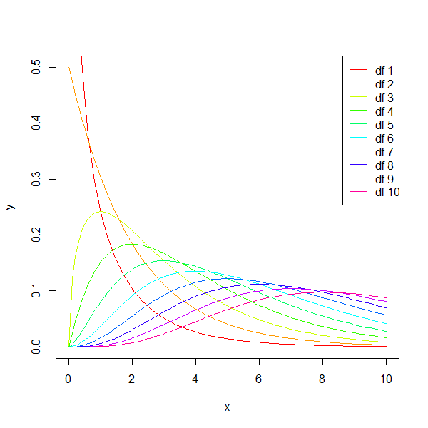
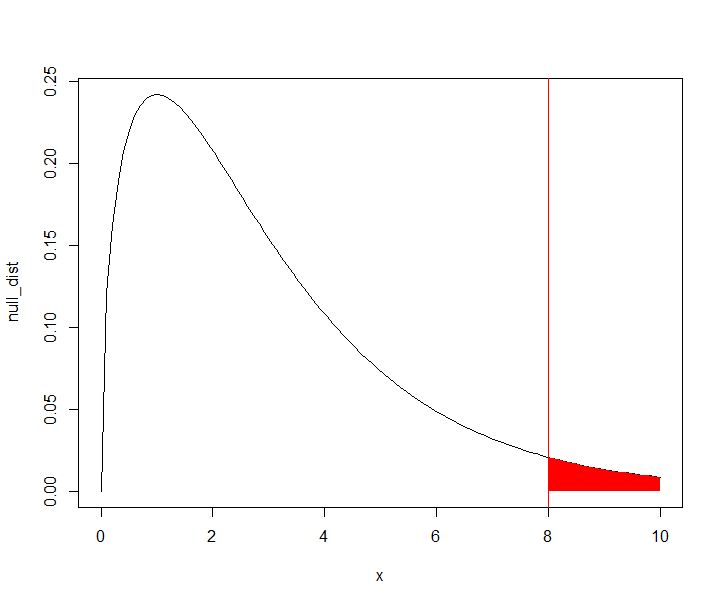

A reference of statistical mathematics. All code snippets are performed in R unless otherwise stated.

## Summary Statistics

To investigate data we consider the centre, dispersion, and distribution. Known as summary statistics

### Central Tendency
The central tendency represents the expected value of a population and can be calculated by two averages:

- Mean
  - Effected by outliers
- Median
  - Less effected by outliers

### Dispersion (Spread)

The dispersion of data, also known as it's spread, can be represented by the following values.

- Maximum 
- Minimum
- Range
- Standard deviation

This can be calculated in R easily:

```R
summary(data)
```

### Distribution

Graphing represents the distribution of data. 

| Type of Data | Appropriate Graph     |
| ------------ | --------------------- |
| Categorical  | Box plot or bar chart |
| Continuous   | Scatter plot          |
| Discrete     | Histogram             |


## Set Theory

The following are common notations for set operations:

$$
\begin{align*}
Union: \cup \\
Intersection: \cap \\
Symmetric \space Difference: \Delta \\
Compliment: \bar{x} \\
Empty \space Set: \emptyset \\
\end{align*}
$$

### General Theory

- An entire **Venn diagram's** probability is `1`, these are populated with sets (circles)
- `{1,2,3,4,5}` is a sample space, a set is a set of results (results that fit a category) from within a sample space
- In the sample space `{1,2,3}` `1` is an element
- Sets represent an event (e.g. I roll tow identical numbers on a dice)

### Sample Space Probability
A particular value in a sample space is known as an event.

- `n(A)` : the number of elements in `A`

- `p(A)` or `pr(A)` : the probability of the event `A`

- The compliment of (X ⋃ Y) = X̅ ⋂ Y̅

- If the sample space consists of elements that have equal likelihoods (like a dice) then:

$$
\begin{align}
& p(A) = n(A)/n({Sample Space}) \\
& 0 ≤ p(A) ≤  1
\end{align}
$$

#### Sample Space Formulae

$$
\begin{align}
& p(\bar{x}) = 1 - p(x) \\
& p(A \cup B) = p(A) + p(B) - p(A \cap B)\\
& p(A \cap B) = p(A)p(B)
\end{align}
$$

### Conditional Probability
- `p(A|B)` : probability of `A` given `B`

$$
p(A|B) = p(A \cap B) / p(B)
$$
  
- If `p(A) = p(A|B)` then the two events are independent.

### Probability Tree Formulae

Note: `E[x]` refers to the expected value of the event `x`  

$$
\begin{align}
& E[x]= sum(x_{i} ∗ P_i) \\
& E[x^2 ]= sum(x_{i}^2∗ P_i) \\
& VAR[x]= E[x^2 ]− (E[x])^2 \\
\end{align}
$$

- The probability of a set of results occurring is equal to the product of each event's probability:

$$
\begin{align}
& p = p(T) = 0.5\\
& Events = TTFFF\\
& p(Events) = p \cdot p \cdot (1-p) \cdot (1-p) \cdot (1-p)   
\end{align}
$$
  

## Binomial Distributions

\\(Bin(n, p)\\)

- A `binomial distribution` plots `discrete` data
- The simplest form of binomial distributions are called `Bernoulli trials`, which have two outcomes.
  - This can be simulated by the probability one will occur.
- Binomial distributions are distributions of tabulated data.

$$
\begin{align}
& n = number\space of\space trials \\
& r = target\space number\space of\space successful\space results\\
& p = probability\space of\space one\space successful\space trial\\
&  bin(10,.3)\space denotes\space n = 10\space and\space p = .3
\end{align}
$$

| Property           | Formula          |
| ------------------ | ---------------- |
| Mean               | \\(np\\)             |
| Variance           | \\(np \cdot (1-p)\\) |
| Standard Deviation | \\(\sqrt{np(1-p)}\\) |

 In a situation with multiple `n` we sum the individual `mean` of each trial.

For example the chance I receive \$10, \$5, or \$1 from a lottery ticket. As we know we take two outcomes. With binomial distributions we are saying the chances of getting \$10 or \$0, \$5 or 0, and so on. Therefore we add `(3)np + (5)np + (1)np` to find the overall `E[x]`.

The probability of `x` successes from `n` trials (`dbinom`) is calculated from:

$$
\frac{n!}{x!(n-x)!} \cdot p^x \cdot (1-p)^{n-x}
$$

**Note** \\(\frac{n!}{x!(n-x)!} \equiv\\) `choose(n, x)`


## Normal Distributions

> \\(X \sim N(\mu, \sigma)\\)

A Normal distribution, or Gaussian distribution, is a model in which data is symmetrical about the mean.

As `n` (the number of observations) approaches infinity the gaussian distribution approaches 0.

| Name               | Formula                   |
| ------------------ | ------------------------- |
| Mean               | \\(np\\)                      |
| Standard Deviation | \\(\sqrt{np*(1-p)}\\)         |
| Standard Error     | \\(\frac{\sigma}{\sqrt{n}}\\) |

### Formulae

`x` represents the observation, `mu` represents the mean value, `sd` represents the standard deviation

The probability of obtaining the observation or below in the distribution:

```R
pnorm(x, mu, sd)
```

The probability of obtaining the observation:

```R
dnorm(x, mu, sd)
```
$$
\frac{1}{\sqrt{2\pi} \cdot \sigma} \cdot e^{-\frac{(x - \mu)^2}{2\sigma^2}}
$$
Generate `count`amount of random variables along the distribution:

```
rnorm(count, mu, sd)
```

The associated value with the given probability:

```
qnorm(prob, mu, sd)
```

### Normal Approximation

Binomial distributions are approximately normal distributions with a large amount of observations (`n`).

### Random Variance

The mean value of a sample does not in practice account for the entire population and is a representation of the population mean only.

The mean value of a sample (the sample mean) varies between samples (known as random variance), it turns out that the distribution of these values should be normally distributed. **As such the distribution of a sample mean is:**

$$
x_i \sim N(\mu, \frac{\sigma}{\sqrt{n}})
$$

The standard deviation of the mean sample is the **standard error of the mean**. The true population mean lies between \\(\mu \pm SEM\\) 


## Null Hypothesis

A null hypothesis is a hypothesis that represents the opposite of what you wish to investigate in a sample space. We can use this to prove a trend in data. 

### The P-Value

The probability if \\(H_o\\) is true of obtaining an observation equal to or greater than the observation

- Define a null hypothesis \\(H_o\\)
- Decide what the observation is \\(X_i\\)
- Create the distribution of \\(X_i\\)
- Calculate the `p-value`
  - If this is < 5% then we reject \\(H_o\\)
  - If this is ≥ 5% we can not reject \\(H_o\\), this does not mean it is true, but we have no evidence to disprove it
  - If we reject the \\(H_o\\) we accept the original Hypothesis

The smaller the p-value the stronger the evidence against the null becomes.

### Z-Scores

Z-scores represent the amount of standard deviations we are away from the mean. We can calculate the z-scores of values using:
$$
z =\frac{x_i − \mu}{SEM}
$$
These transformed values are distributed in a standard normal distribution \\(\sim N(0,1)\\). 

### Critical Regions
The critical regions are the value we calculate to attempt to reject the null hypothesis.

The critical region is specified before hand to determine the strictness of the test, for example 5%.
**If our observation is within this region we reject the null hypothesis.**

### Notes

- When we have a small sample size the variance in the standard deviation is significant and we use the student t-test method.
- The null hypothesis distributes the average values (mean) over a normal distribution.

## Student T-Test

With normally distributed data if our sample size is small and we have not been given the standard deviation, we do not have enough samples to calculate an accurate estimate of \\(\sigma$ and we must use a t-test instead of standard null hypothesis tests. 

With a large amount of samples (n > 30):
$$
x_i − x_n \sim n(\mu, \sigma) \\
$$
This $p_{value}\\) can be calculated as:

```R
p = 1 − pnorm(mean(x), Ho, sd(x)/sqrt(n))
```

With a small amount of samples (n < 30) we use an estimated \\(\sigma$ . We need to translate our `x` axis with:
$$
\frac{\mu−H_o}{SEM}
$$
#### One or Two sided tests

We use a one sided test when we have reason to believe the effect is biased to being positive or negative, otherwise we conduct two sided tests. 

### T-Test Formulae

The $t_{value}\\), which has the same purpose as the $p_{value}\\), is derived from:
$$
T =\frac{x − H_o}{SEM}
$$

## Confidence Intervals

A confidence interval is the range of values a mean could be considered accurate.

If our null mean falls within such a confidence interval we consider it to be consistent with our population in some way, and hence would fail to reject it. 

- Standard error = \\(\frac{\sigma}{\sqrt{n}}\\)
- Margin of error = \\(\frac{\sigma}{\sqrt{n}} \cdot z$
- $z$ is the `qnorm` of any percent on a standard distribution
- Upper limit = \\(\mu + \frac{\sigma}{\sqrt{n}} \cdot z$
- Lower limit = \\(\mu - \frac{\sigma}{\sqrt{n}} \cdot z$

### Interval Formula

The complete interval which consists of the upper and lower limit can be found with:
$$
\mu \pm \frac{\sigma}{\sqrt{n}} \cdot z
$$
To find intervals of proportions the following formula is used instead 
$$
\mu \pm z \cdot \sqrt{\frac{p\cdot(1−p)}{n}}
$$
### Refinements

To refine intervals there are some common steps we can take.

**The finite population factor:**
$$
\sqrt{\frac{N − n}{N−1}}
$$

- Narrows the confidence interval
  - \\(n$ = total population
  - \\(n$ = sample population
  - The resultant factor of this equation can multiply the margin of error, meaning your range is now smaller

*For example:*

If we observe a point estimate of $803$, and our interval is between $801.6$ and $804.4$. Our margin of error is therefore \\(\pm 1.4$. If our population factor was $.64$ our confidence would be $803 \pm 1.4\cdot0.64$.

This equals $802.1 < 803 < 803.9$ , now a tighter margin.

Calculating the required sample size for a given margin of error:

```R
pFactor = ((qnorm(confidence)∗ sigma)/marginOfError)^2
```

## Type I and Type II errors

| Error   | Description                                            |
| ------- | ------------------------------------------------------ |
| Type I  | Rejecting the null hypothesis when it is true          |
| Type II | Failing to reject the null hypothesis when it is false |

The probability of rejecting the null when it is true is known as the size (\\(\alpha$) of the test. i.e. the probability of getting a type 1 error is \\(\alpha$ . 

The probability of a type 2 error is denoted as \\(\beta$. **When the size (\\(\alpha$) decreases the size of \\(\beta$ increases.**

The power of a test is equal to $1 - \beta$. In general \\(\beta$ decreases the further away the alternative is from the null.

When choosing the desired size of \\(\alpha$ or \\(\beta$ , \\(\alpha \leq 0.05$ must be true.

## Linear Regression

Linear regression can find relationships between variables. This can be used to draw a line on a scatter plot, used to predict values. Variables are categorized as either response (unknown) or independent (known).

The equation of a regression line is given by:
$$
y_i = A+B_{x_i }+ϵ_i
$$

| Variable | Description                                      |
| -------- | ------------------------------------------------ |
| A        | The Y intercept                                  |
| B        | The gradient also known as the model coefficient |
| ϵ        | The error also known as the residual             |

| R Function      | Description                                                  |
| --------------- | ------------------------------------------------------------ |
| `lm(y~x, data)` | Gives the equation of the line                               |
| `abline()`      | Plots the equation of a line on a graph                      |
| `summary(x)`    | Gives the summary of an equation of a line `x`, including the p-value |

The \\(\sum{\epsilon^2}\\) is the badness of our regression. To minimize this we need to optimise $A$ and \\(B$. This means minimizing \\(\sum{(y_i - (A + Bx_i))^2}\\)

### Correlation

Correlation is measured by the variable `r`, this is usually a value between -1 and 1 and represents the strength of the model coefficient. $-1$ would display a perfect negative correlation, whilst $1$ is a perfect positive correlation, $0$ would have no correlation.

We often use hypothesis tests on correlation, where we might say \\(H_o\\) is `r = 0`, where the alternative would be there is a correlation.

*Always draw a scatter plot first.*

### Scatter Plots
When describing a scatter plot describe the relationship, and its strength, as well as the range of both variables.

### Multiple Regression

When a response variable can be effected by multiple variables we can plot the regression on a plane instead of a line.

The regression equation becomes: 
$$
Y_i = A + B_{x_{i_1}} + B_{x_{i_2}} + \in_i
$$
This can be generated with:

```R
lm(y~x1+x2, data)
```

**Predictions must be to the same accuracy as the original data**

### Coefficient of Determination

The coefficient of determination is equal to $r^2$. This number represents the percentage of the variation in the response variable attributed to the independent variable.

### Assumptions of Linear Regression

We can only use linear regression assuming (LINE):

- The data must be **linear**
- The variables must be **independent**
- The data must be **normally distributed**
- The data must have **equal variance**

1. **Pair data:**
    a. `par(mfrow=c(2,2))`
    
2. **Check Linearity:**
   

  a. `plot(x, y)`

  b. `abline(lm(x~y))`

3. **Check Independence:**

     a.  `plot(x, rstandard(lm(x~y)))` 

     b. `abline(h=0)`

4. **Check normality:**

     a. `hist(lm(x~y)\\)residuals)`

5. **If the data follows this main line it could be normal:**

     a. `qnorm(rstandard(lm(x~y)))`

     b. `abline(0,1) `


### Calculating The Standard Deviation
To calculate statistics of the distribution we can use the t value. $T = \frac{x-\mu}{SEM}\\) .

*The t-score gets smaller when the sample size grows.*

## Analysis of Variance

Analysis of variance compares three or more means to test if the degree at which they differ is significant.


```R
aov(function, data)
```

If the p-value in this test is significant, the variance between means is important and could indicate a test bias.

## Odds

> A different measure of probability. Useful for working with measurements not bound between 0 < p < 1, making odds ratios the go-to tool for comparing the probabilities.

An odd is equal to the probability of the event divide by it's complement:
$$
\frac{p}{1-p}
$$

- This can be reasoned to be the same as  $p(success) \div p(failure)\\)
- Odds are bound between 0 and 1, i.e. $0 \leq p \leq 1$

Probabilities themselves are not that suitable to compare to one another, Instead we use an odds ratio.
$$
\frac{p_1(1-p_2)}{(1-p_1)p_2}
$$

- Above we can compare the probabilities $p_1$ and $p_2$ and be assured there are no issues.
- Odds ratios also allow us to express the equality of two events as equal to 1. i.e. $p_1 = p_2 \equiv odds\space ratio\space of\space 1$ 

> Tip: Use a 2x2 contingency table to work with odds

## Fischer Test

Fischer's test deals with frequencies rather than measurements (discrete data) to test ratios between categorical data, this means we create a **contingency table:**

| T      | Full time | Part time |        |
| ------ | --------- | --------- | ------ |
| Male   | 10        | 15        | **25** |
| Female | 14        | 13        | **27** |
|        | **24**    | **28**    | **52** |

**This allows us to calculate the odds (10 to 15, and 14 to 13)**

We can use Fischer's test to check if one class is more likely to exhibit a certain attribute, using p-values. We can manually calculate this using density formulae, but we can also just use:

```R
fisher.test(x) # x => the contingency table as a matrix

# we can change the alternative hypothesis to one sided
fisher.test(x, alternative="greater")
fisher.test(x, alternative="less")
```

- Fishers test, tests the equality of odds ratio. This is actually testing the independence of the classes.

 ### Hypergeometric distribution

> When you sample without  replacement (take a ball out a bag without putting it back) the samples are distributed hypergeometrically rather than binomially. Instead of using `dbinom` we would then use `dhyper`

- If a p-value is insignificant we could conclude there is no difference between the two classifications and has no effect on the frequency.

## Bayes's Theorem

> Bayes's theorem denotes the probability of one event given another, we can use this to assert the plausibility of hypothesis'. 

$$
p(A|B) = \frac{p(B|A)p(A)}{p(B)}​
$$

- We can suppose that $A$ becomes an hypothesis, and \\(B$ a distribution of data. We can use this to calculate the probability of our hypothesis given what our samples depict:

$$
p(H|D) = \frac{p(D|H)p(H)}{p(D|H)p(H) + p(D|\overline{H})p(\overline{H})}
$$

Note: $P(x|y)\\) can be simulated using `xbinom`:

- Suppose we have a sample where 7 of 10 people like burgers. Person A hypothesizes 90% of the population likes burgers whilst Person B says  it is actually 50%. We can use Bayes's theorem to assert which is more plausible.

```R
(dbinom(7, 10, .9)*.9)/(dbinom(7, 10, .9)*.9 + dbinom(7, 10, .5)*.5) # <-- less plausible
## 0.4685365
> (dbinom(7, 10, .5)*.5)/(dbinom(7, 10, .9)*.9 + dbinom(7, 10, .5)*.5) # <-- more plausible
## 0.5314635
```

In Bayesian statistics we have two important probabilities, a prior and posterior. 

| Name      | Description                                                  | Notation |
| --------- | ------------------------------------------------------------ | -------- |
| Prior     | The probability of our hypothesis or event                   | $p(H)\\)   |
| Posterior | The probability of our hypothesis or event after accounting for our data | $p(H|D)\\) |

The posterior is equal to:
$$
P(H_1|D) = \frac{P(H_1|D)p(H_1)}{P(H_1|D)P(H_1) + P(H_2|D)P(H_2)...}
$$

- This means the posterior of a hypothesis is equal to $P(H|D)P(H)\\) divided by the sum of all other hypothesis or events.
  - For example if \\(H_1 = p(sunny)\\), then \\(H_2=p(rainy)\\) and \\(H_3 = p(snow)\\)

This can be rewritten as:
$$
P(H_y|D) \propto P(H)P(D|H_y)\\
P(H|D) \propto P(H)^{successes + \alpha - 1} \times (1 - P(H))^{failures + \beta - 1}
$$

- Note that \\(\propto\\) means proportional to
- Note that our posterior $P(H|D)\\) tells us our successes and failures, as this is our data. Therefore our prior will be proportional to the same distribution minus the successes and failures.

$$
P(H) = P(H)^{a-1} \times (1- P(H))^{\beta-1}
$$

**THIS DISTRIBUTION IS CALLED A BETA DISTRIBUTION**

## Point Estimation

> Estimating unknown measurements of distributions from the given data

Often in practice we are not going to be told the variance or population mean of our sample.  So we use point estimation to estimate these using our sample data to keep estimations sane.

Say we had 100 observations with 35 successes, our sample probability is 35%, but due to variance if our population probability really was 35% it is unlikely we get exactly 35 successes. 

```R
rbinom(20, 100, 0.35)
## [1] 37 38 30 41 31 28 34 42 30 32 35 41 38 36 31 40 30 28 38 3
```

Here we need to estimate the likelihood of our predicted probability, that is how likely is it that our estimated probability is the real probability. Obviously 35% has the highest likelihood, but we may not be able to reject the notion it is 37%. We can safely reject 99% though, assuming our samples were not obscure. 

## Likelihood

> A measurement useful for asserting the plausibility of a theoretical distribution by observing how likely our data occurs given the theoretical parameters. (Parameters may be mean, standard deviation, probability, etc.)

Given a theory, which may be that the population mean is 10, we can check the density of our actual data given this distribution. If it is low, it is unlikely we can actually observe the data we did, meaning this theory is inconsistent with real life.

- We want to understand the density of our observation on the theoretical distribution. Therefore the general practice is to calculate the density given the theoretical parameters, and check which parameter has the highest density.

### Binomial Probability

The likelihood represents how consistent the probability of a success is with the amount of observed successes in our data.

- **The likelihood is equal to** $P(A|B)\\), **That is the probability of the known given the unknown variable**.

$$
likelihood = c \times p^{no.\space successes}(1 - p)^{no.\space failures}
$$
- C is an arbitrary constant number used to change the scale of this distribution.
- A high likelihood suggests our probability is consistent with our data
- Note this will use Bayes's theorem, hence the likelihood uses the density function of your chosen distribution. Above is `dbinom`.

Often we may want to use the support of our likelihood, rather than direct likelihood, as it changes the distribution in a way that allows us to more easily identify a suitable range of probabilities. A high support suggests our likelihood is consistent with what we actually observed.
$$
support =log(likelihood)
$$
The point of maximum likelihood and support is the same, this is he probability of our sample data.

If we choose a probability far from the maximum likelihood it is unlikely we really will see the observed number of successes.

- If we hypothesize that a certain probability is 1/2, and then plot the likelihood, if our support for this value of p is close to the maximum likelihood we cannot reject the hypothesis.
- In contrast to normal statistics likelihood fixes the data, and varies the probability. (Usually the probability remains the same, and you could under or overachieve)

```R
p = seq(0, 1, len = 20) #0, 0.05, 0.1
plot(p, dbinom(35, 100, p)) #P(35|p = some prob) <-- likelihood
plot(p, log(dbinom(35,100,p))) # <-- support
```

### Gaussian likelihood

If data is normally distributed we still use likelihood to estimate the parameters of our distribution. Instead of the  probability of a success varying, we can vary the deviation and mean.
$$
likelihood = \prod denisty(d_i)\\
support = \sum \log density(d_i)
$$

- The gaussian likelihood function is equal to the product of the density for each observation given our theoretical distribution.  Our distribution is going to use our estimated mean and deviation, and we will take the product of each samples density on this distribution.

```R
D = c(1,2,3) #observations --> mean = 2
prod(dnorm(D, 1, .1)) #likelihood of observing our samples given estimated mean and devitaion 
m = seq(1,3,by=.2) #estimated means

#gaussian likelihood function
l = function(m) {prod(dnorm(D, m, .1)}

plot(m, sapply(m,f)) ##likelihood for each estimated mean 
                      
#gaussian support function
s = function(m) { sum(dnorm(D, m, .1, log=TRUE)) }
```


## Poisson Distribution

> A distribution with a large number of samples `n` and small `p` for every `n`. 

The Poisson distribution is a discrete distribution. It distributes the expected number of successes, where a large number of samples will decrease the probability of success per sample. 

- As `n` increases `p` decreases, therefore the mean stays constant. 
- As \\(n \rarr \infin$ The variance \\(np(1-p)\\) also appears constant.

The Poisson distribution models many practical relationships. For example:

- If it were raining, the probability of one drop hitting your hand. There are many rain drops, and very few hit your hand. Hence a large `n` and small `p`. As `n` increases `p` decreases.

The inverse relationship between `n` and `p` results in the mean staying the same regardless of `n`. This is denoted as \\(\lambda$.

| `n`   | `p`   | \\(\lambda $ |
| ----- | ----- | ---------- |
| 10    | .1    | 1          |
| 100   | .01   | 1          |
| 1000  | .001  | 1          |
| 10000 | .0001 | 1          |

We apply the Poisson distribution much like any other, where the density of a certain number of successes is the probability of that many successes occurring.

```R
dpois(integer, lambda)
rpois(num_results, lambda)
ppois(quantile, lambda)
qpois(prob, lambda)
```

The Poisson distribution, as it deals with frequencies, can not go below 0. This means it is not symmetrical, however:

- If \\(\lambda$ is large, the Poisson distribution is approximately gaussian.

The Poisson density function is:
$$
e^{-\lambda}\frac{\lambda^x}{x!}\\
$$

- `x` is the number of successes

## Chi-squared Distribution
> The chi-squared distribution, denoted as \\(\chi^2$, contains no parameters. The constraints on the distribution are called degrees of freedom.



We can see as the degrees of freedom increase the distribution moves right.

- The degrees of freedom varies based on your data and tests, in general it will equal the length of your data minus each parameter calculated from the data.

## Pearson's Chi-square (Test)
> A way to measure the difference between observations and expectations when only data is supplied.

Often hypothesis do not express an obvious distribution. A hypothesis usually consists of a theory and not necessarily "x is distributed normally with a mean of y".

- This hypothesis informs what our expected data is.
- We must interpret the hypothesis to generate the expected values for our data.

Without two obvious distributions to calculate a p-value we can employ a chi-square test (AKA Pearson's chi-square) to measure the deviation of our expected data from our observed data.

The measure of this deviation is known as the badness of fit:
$$
B = \sum_i \frac{(e_i - o_i)^2}{e_i}
$$
- `e` : the expected value
- `o` : the observed value
- small \\(B$ reflects consistency between expectations and observations
- large \\(B$ reflects an inconsistency. 

Given a reasonable amount of data (Common practice is |data| > 5) and if the null is true, \\(B$ is distributed as a chi-squared distribution. Hence we can calculate the p-value of \\(\hat{B}\\).

Consider \\(\hat{B} = 8$ and $D_f = 3$, we can calculate a p-value to test the null:

```R
x = seq(0,10,len=100)
null_dist = dchisq(x, 3)
plot(x, null_dist, type="l")

abline(v=8,col="red")
polygon(c(8, seq(8,10,len=21), 10), 
        c(0,null_dist[80:100], 0), 
        col="red", border=NA)
```



```R
pchisq(8, 3, lower.tail=FALSE)
# [1] 0.04601171
```

Hence we have evidence to reject the null.

---

[Top](#Statistics)

