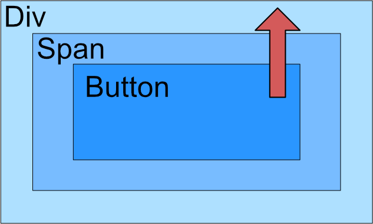
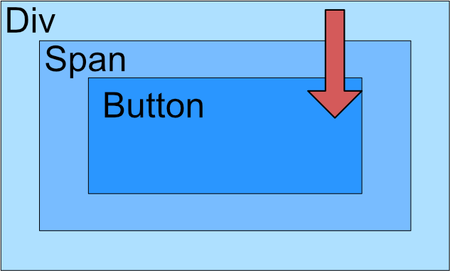

This topic covers the workings of the world wide web in the context of building web applications as a layer ontop of the internet. *WWW is used in place of "World Wide Web".*

## The Internet & The World Wide Web

> The internet encompasses a connected network of computer systems, as well as the physical mediums used to transfer data - and the protocols in which to do so.

The WWW is first a layer of applications supported by the internet, sending the http protocol through the TCP and IP protocols. This forms a complex topological structure connecting many machines, containing a small number of hub nodes.


### Simple Internet Protocols

The following is a short list of basic internet protocols

|Name|Description|
|----|-----------|
|TCP|End to end reliable messaging (ensuring complete delivery)|
|IP|Internet Protocol, used to provide addresses identifying resources. Used in the delivery of messages|
|DNS|Domain Name Server, used to translate domains to IP addresses.|

## HTTP

> Hyper Text Transfer Protocol

HTTP contains mulitple methods to send to a server, invoking different actions.


|Attribute|GET|POST|
|---------|---|----|
|Description|Retrieves data from a URL|Sends data to a server|
|Size| Max length of URL: 2048 Characters| Unlimited|
|Type| ASCII| No restrictions|
|Security| Data can be accessed from URL| Data not included in URL|
|Caching|Yes|No|

POST encoding types:

```
application/x-www-form-urlencoded -> encodes data
multipart/form-data -> unencoded (binary)
```

## HTML

> Hyper Text Markup Language, the common document language of the WWW.

HTML is rendered in client-side technologies and is made of elements. The information enclosed by the element is known as it's content.

$$
Element = tag_{open} + content + tag_{close}
$$

$$
Tag = < + name + (attribute = "value")... + >
$$


- An element with block will always start on a new line
- An element with inline will always start on the current line

## Architectures

Web applications all contain a client aspect to display a page and usually execute Javascript as well. However when it comes to server-side logic there are differning architectures to deliver a service on the WWW.

Three-tier:


Javascript based:


Micro-services:


## Web 2.0

Web 2.0 represents a move from a server dominated web to a platform for computing where the server and client can communicate dynamically, allowing the client to provide computational resources.

Traditionally web application models are synchornous, and changes in state require a whole page to reload which degrades pefromance. New application models, such as the Ajax application model, are asynchronous and can reload parts of the DOM - providing better performance and fluent user interactions.

Limitations of traditional models are cuased by:

- Synchoronous limitations
- Large responses required to update the client (reload an entire page)
- An inability to interact with the user wihtout forms etc.

## AJAX

AJAX (Asynchronous JavaScript and XML) referes to a collection of technologies to allow dynamic changes to part of the DOM whilst the server processes requests sent from the client - allowing a user to continue interacting with the client.

The AJAX application model can be described as:

1. Interface displayed in browser (client)
2. Javascript client-side engine sends messages ansynchornously to a server requesting a service.
3. Results sent back from server as XML, JSON, etc...
4. Javascript client-side engine interprets response and updates the DOM.

Ajax is generally implemented with XMLHttpRequest objects (XHRs), which are native JavaScript objects. It can facilitate JSON/XML asynchronous communication with another host. XML and JSON are used to describe a data sturcture to exchange data over the internet, they encode data into a structure. In general JSON is more concise and lightweight than XML.

Partial screen updates are effected through a *dynamic change* to the representation of the document (interface) displayed on the client. This representation is refered to as the DOM (document object model). 

AJAX requests are event driven, and threads are implicit (not explicitly provisioned by developer).

- AJAX is increasingly adopting JSON as a means to transfer data.
- An XHR can be instantiated as any other object: `new XMLHttpReuest();`

## Javascript

Javascript is a dynamically typed, object-oriented scripting language. A browser exposes the current context and DOM of the client to the javascript engine to enable client side processing and facilitate the Web 2.0 design model. Javascript is often executed in an event driven architecture.

Javascript follows a C-like syntax, many of the lnaguage nuances are related to its dynamic typing:

- A variable which is not a reference and has no value is siad to be `undefined` (`print(x) //undefined`).
- A reference is `null` when it points to no object. 
- A variable is strictly equal when it has the same value and same type, using the `===` operator.
- A variable is not strictly equal when either its value or type differs from another operand, using the `!==` operator.
- Functions can be anonymous, or lambdas, and pointed to by a reference. Functions can be passed as any other object.

```javascript
var x = function() {
    //anonymous function
};

var y = () => {
    //lambda function
};
```

Objects in javascript are defined via a construcotr and prototype. A prototype is a member of a certain class, and assigning a member to a prototype will assign it to all class instances. Hence a prototype can be used to define a classes' interface. A constructor is invoked with the `new` keyword.

```javascript
//constructor
function MyClass(x) {
    //access to self must be used
    this.x = x; 
    this.print()
}


MyClass.prototype.print = function() {
    print("MyClass x: " + this.x);
}
```

Javascript objects can also be expressed via javascript object notation or JSON. JSON can be deserialized into a native javascript object or be used to construct an object literal. JSON is a very convenient way to communicate between javscript clients and servers, providing a consistent data description language. 

```javascript
var x = {   //object literal
    "a": 1,
    "b": 2
};

JSON.parse('{"greeting": "hello"}');
```

Javascript is given access to the following objects natively by the browser:

- `navigator`: browser navigation
- `window`: browser window
- `frame`(s): a frame contains a DOM
- `document`: the current DOM
- `history`: browser history
- `location`: the location of the client (current URL etc.)
- `screen`: the screen of the client

### Events

Events are bound to an event handler which is invoked when the event is triggered. Events are propogated through the DOM tree in one of two fashions: bubbling or capturing. 

|Bubbling|Capturing|
|--------|---------|
|||

Event handlers passed an `Event` object to a listeners' first parameter. They can be assigned through object properties or with `addEventListener(name, callback)` or `removeEventListener(name, callback)`.

## The Document Object Model

The Document Object Model provides an API (object model) to manipulate HTML documents as sets of objects. This model defines the attributes associated with these objects and methods to interact with them. The DOM also encapsulates the client, providing interfaces to the browser window, history, and location (URL etc.). DOM supports all CRUD operations.

A DOM is a **tree** data structure, it contains many APIs to manipulate this tree but commonly the DOM API refers the core and HTML APIs. This is an important philisophical design, as such every element or component of a document is a node in a tree, and can be operated on as such. 

## XML

XML, like JSON, is a structured data model - known as a data description/representation language. XML is a standard way to structure data communicated between processes over the web, data contained within an XML document is hierarchal and describes a **tree** data structure. 

XML is very versatile and has many uses outside of web development, however this makes it "heavier" than JSON. XML documents contain three main components:

1. Content: data contained within the document
2. Schema: defining a valid document structure and tag names
3. Presentation: controls rendering of information

XML is well formed when conforms to the syntax of XML and valid when it coforms to the DTD given in the document. A DTD (Document Type Definition) validates an XML document with constraints such as:

1. What elements are required
2. The order elements are allowed to appear in
3. The cardinality of the relationship between one element and another
4. Any attributes contained within a specific element

XML documents first include a decloration in their head, followed by the DTD:

```xml
<?xml version="1.0" encoding="uitf-8"?>
<!DOCTYPE Persons SYSTEM "persons.dtd"> <!--!DOCTYPE {name} SYSTEM {dtd file}-->
```