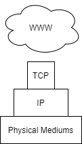
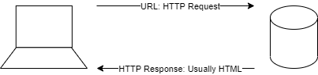
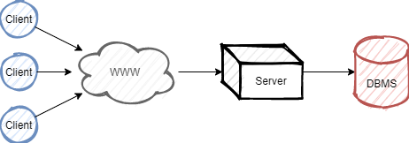
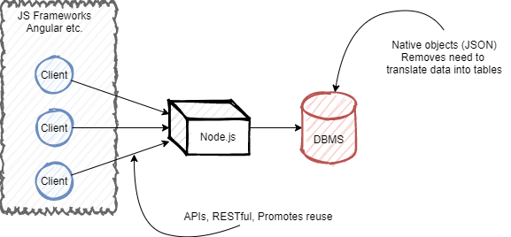
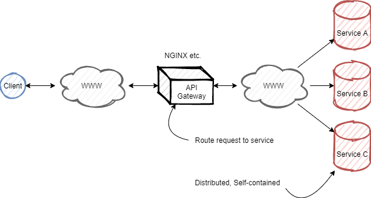

This topic covers the workings of the world wide web in the context of building web applications as a layer ontop of the internet. *WWW is used in place of "World Wide Web".*

## The Internet & The World Wide Web

> The internet encompasses a connected network of computer systems, as well as the physical mediums used to transfer data - and the protocols in which to do so.

The WWW is first a layer of applications supported by the internet, sending the http protocol through the TCP and IP protocols. This forms a complex topological structure connecting many machines, containing a small number of hub nodes.



### Simple Internet Protocols

The following is a short list of basic internet protocols

|Name|Description|
|----|-----------|
|TCP|End to end reliable messaging (ensuring complete delivery)|
|IP|Internet Protocol, used to provide addresses identifying resources. Used in the delivery of messages|
|DNS|Domain Name Server, used to translate domains to IP addresses.|

## HTTP

> Hyper Text Transfer Protocol

HTTP contains mulitple methods to send to a server, invoking different actions.



|Attribute|GET|POST|
|---------|---|----|
|Description|Retrieves data from a URL|Sends data to a server|
|Size| Max length of URL: 2048 Characters| Unlimited|
|Type| ASCII| No restrictions|
|Security| Data can be accessed from URL| Data not included in URL|
|Caching|Yes|No|

POST encoding types:

```
application/x-www-form-urlencoded -> encodes data
multipart/form-data -> unencoded (binary)
```

## HTML

> Hyper Text Markup Language, the common document language of the WWW.

HTML is rendered in client-side technologies and is made of elements. The information enclosed by the element is known as it's content.

$$
Element = tag_{open} + content + tag_{close}
$$

$$
Tag = < + name + (attribute = "value")... + >
$$


- An element with block will always start on a new line
- An element with inline will always start on the current line

## Architectures

Web applications all contain a client aspect to display a page and usually execute Javascript as well. However when it comes to server-side logic there are differning architectures to deliver a service on the WWW.

Three-tier:



Javascript based:



Micro-services:



## Web 2.0

Web 2.0 represents a move from a server dominated web to a platform for computing where the server and client can communicate dynamically, allowing the client to provide computational resources.

Traditionally web application models are synchornous, and changes in state require a whole page to reload which degrades pefromance. New application models, such as the Ajax application model, are asynchronous and can reload parts of the DOM - providing better performance and fluent user interactions.

Limitations of traditional models are cuased by:

- Synchoronous limitations
- Large responses required to update the client (reload an entire page)
- An inability to interact with the user wihtout forms etc.

## AJAX

AJAX (Asynchronous JavaScript and XML) referes to a collection of technologies to allow dynamic changes to part of the DOM whilst the server processes requests sent from the client - allowing a user to continue interacting with the client.

The AJAX application model can be described as:

1. Interface displayed in browser (client)
2. Javascript client-side engine sends messages ansynchornously to a server requesting a service.
3. Results sent back from server as XML, JSON, etc...
4. Javascript client-side engine interprets response and updates the DOM.

Ajax is generally implemented with XMLHttpRequest objects (XHRs), which are native JavaScript objects. It can facilitate JSON/XML asynchronous communication with another host. XML and JSON are used to describe a data sturcture to exchange data over the internet, they encode data into a structure. In general JSON is more concise and lightweight than XML.

Partial screen updates are effected through a *dynamic change* to the representation of the document (interface) displayed on the client. This representation is refered to as the DOM (document object model). 

AJAX requests are event driven, and threads are implicit (not explicitly provisioned by developer).

- AJAX is increasingly adopting JSON as a means to transfer data.
- An XHR can be instantiated as any other object: `new XMLHttpReuest();`

### The Document Object Model

The Document Object Model provides an API (object model) to manipulate HTML documents as sets of objects. This model defines the attributes associated with these objects and methods to interact with them.

The DOM also encapsulates the client, providing interfaces to the browser window, history, and location (URL etc.). DOM supports all CRUD operations.